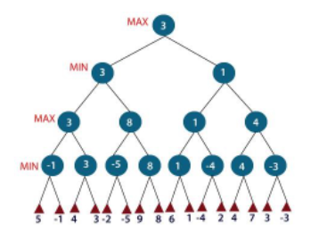
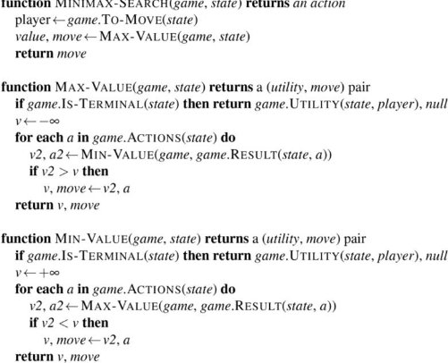
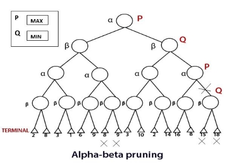
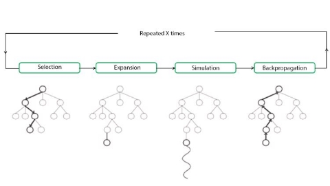

# Unit III: Adversarial Search and Games

## Game Theory

For MCQs:

States where the game has ended are called **terminal states.**

"zero-sum” means that what is good for one player is just as bad for the other:
there is **no “win-win”** outcome. A **utility function** is also called an
**objective function or payoff function.**

Chess is considered a “zero-sum” game,

Game tree is also known as Search tree or space graph

Notes:

Definition

Game Theory tries to understand the strategic moves of the players and deicide
the optimal move from the set of all possible moves. To achieve this it makes
use of game tree. A game tree is a recursive search function that examines all
possible moves and their results and then decide the optimal move.

Working:

Start at the current board position,

Check all the possible moves the player can make

From each possible move predict which move the opponent will play

Decide the optimal move based on opponents move and results.

The two players and usually named as MAX and MIN.

MAX moves first, and then the players take turns moving until the game is over

At the end of the game, points are awarded to the winning player and penalties
are given to the loser

A game can be formally defined with the following elements:

**Initial state**, which specifies how the game is set up at the start.

**TO-MOVE** : The player whose turn it is to move in state

**ACTIONS** : The set of legal moves in state

**RESULT** : The transition model, which defines the state resulting from taking
action

in state .

**TERMINAL** : States where the game has ended are called terminal states.

**UTILITY FUNCTION** : A utility function defines the final numeric value to
player when the game ends in terminal state

MCQs to solve:

[https://engineeringinterviewquestions.com/mcqs-on-game-theory-and-answers/
](https://engineeringinterviewquestions.com/mcqs-on-game-theory-and-answers/)<https://www.sanfoundry.com/artificial-intelligence-mcqs-game-theory-1/>

Videos to watch :

[Introduction to Game Playing in Artificial Intelligence | Learn Game Playing
Algorithms with Example](https://www.youtube.com/watch?v=FFzdXJ49KAI)

## Optimal Decisions in Games

MIN MAX ALGO

In artificial intelligence, minimax is a**decision-making** strategy under**game
theory,** which is used to minimize the losing chances in a game and to maximize
the winning chances. This strategy is also known as ‘**Minmax,’ ’MM,’ or ‘Saddle
point.’**

We can easily understand this strategy via **game tree**- where the *nodes
represent the states of the game and edges represent the moves made by the
players in the game*. Players will be two namely:

*   **MIN:** Decrease the chances of **MAX** to win the game.
*   **MAX:** Increases his chances of winning the game.

They both play the game alternatively, i.e., turn by turn and following the
above strategy, i.e., if one wins, the other will definitely lose it.

In minimax strategy, the result of the game or the utility value is generated by
a**heuristic function** by propagating from the initial node to the root node.
It follows the**backtracking technique** and backtracks to find the best choice.
MAX will choose that path which will increase its utility value and MIN will
choose the opposite path which could help it to minimize MAX’s utility value.

MINIMAX algorithm is a backtracking algorithm where it backtracks to pick the
best move out of several choices. MINIMAX strategy follows the **DFS (Depth-
first search)** concept. Here, we have two players **MIN and MAX,** and the game
is played alternatively between them, i.e., when **MAX** made a move, then the
next turn is of **MIN.** It means the move made by MAX is fixed and, he cannot
change it. The same concept is followed in DFS strategy, i.e., we follow the
same path and cannot change in the middle. That’s why in MINIMAX algorithm,
instead of BFS, we follow DFS.

*   Keep on generating the game tree/ search tree till a limit **d.**
*   Compute the move using a heuristic function.
*   Propagate the values from the leaf node till the current position following
    the minimax strategy.
*   Make the best move from the choices.

For example, in the above figure, the two players **MAX** and **MIN** are

there. **MAX** starts the game by choosing one path and propagating all the
nodes of that path. Now, **MAX** will backtrack to the initial node and choose
the best path where his utility value will be the maximum. After this,

its **MIN** chance. **MIN** will also propagate through a path and again will
backtrack, but **MIN** will choose the path which could minimize **MAX** winning
chances or the utility value.

***So, if the level is minimizing, the node will accept the minimum value from
the successor nodes. If the level is maximizing, the node will accept the
maximum value from the successor.***

**Note**: The time complexity of MINIMAX algorithm is **O(bd)** where b is the
branching factor and d is the depth of the search tree.

For example, in the above figure, the two players **MAX** and **MIN** are

there. **MAX** starts the game by choosing one path and propagating all the
nodes of that path. Now, **MAX** will backtrack to the initial node and choose
the best path where his utility value will be the maximum. After this,

its **MIN** chance. **MIN** will also propagate through a path and again will
backtrack, but **MIN** will choose the path which could minimize **MAX** winning
chances or the utility value.

***So, if the level is minimizing, the node will accept the minimum value from
the successor nodes. If the level is maximizing, the node will accept the
maximum value from the successor.***

**Note**: The time complexity of MINIMAX algorithm is **O(bd)** where b is the
branching factor and d is the depth of the search tree.

## Heuristic Alpha Beta Tree Search

Alpha-beta pruning is an advance version of MINIMAX algorithm. The drawback of
minimax strategy is that it explores each node in the tree deeply to provide the
best path among all the paths. This increases its time complexity. But as we
know, the performance measure is the first consideration for any optimal
algorithm. Therefore, alpha-beta pruning reduces this drawback of minimax
strategy by less exploring the nodes of the search tree.

The method used in alpha-beta pruning is that it **cutoff the search** by
exploring less number of nodes. It makes the same moves as a minimax algorithm
does, but it prunes the unwanted branches using the pruning technique

**Working of Alpha-beta Pruning**

Consider the below example of a game tree where **P** and **Q** are two players.
The game will be played alternatively, i.e., chance by chance. Let, **P** be the
player who will try to win the game by maximizing its winning chances.  **Q** is
the player who will try to minimize \*\*P’\*\*s winning chances. Here, **?**
will represent the maximum value of the nodes, which will be the value for **P**
as well. **?** will represent the minimum value of the nodes, which will be the
value of **Q**.

*   Any one player will start the game. Following the DFS order, the player will
    choose one path and will reach to its depth, i.e., where he will find

the **TERMINAL** value.

*   If the game is started by player P, he will choose the maximum value in
    order to increase its winning chances with maximum utility value.
*   If the game is started by player Q, he will choose the minimum value in
    order to decrease the winning chances of A with the best possible minimum
    utility value.
*   Both will play the game alternatively.
*   The game will be started from the last level of the game tree, and the value
    will be chosen accordingly.
*   Like in the below figure, the game is started by player Q. He will pick the
    leftmost value of the TERMINAL and fix it for beta (?). Now, the next
    TERMINAL value will be compared with the ?-value. If the value will be
    smaller than or equal to the ?-value, replace it with the current ?-value
    otherwise no need to replace the value.
*   After completing one part, move the achieved ?-value to its upper node and
    fix it for the other threshold value, i.e., ?.
*   Now, its P turn, he will pick the best maximum value. P will move to explore
    the next part only after comparing the values with the current ?-value. If
    the value is equal or greater than the current ?-value, then only it will be
    replaced otherwise we will prune the values.
*   The steps will be repeated unless the result is not obtained.
*   So, number of pruned nodes in the above example are **four** and MAX wins
    the

game with the maximum **UTILITY** value, i.e.,**3**

The rule which will be followed is: **“Explore nodes if necessary otherwise
prune the unnecessary nodes.”**

**Note:** It is obvious that the result will have the same **UTILITY** value
that we may get from the MINIMAX strategy.

## Monte Carlo Tree Search

It is a probabilistic and heuristic driven search algorithm

The basic MCTS strategy does not use a heuristic evaluation function. Instead,
the value of a state is estimated as the average utility over a number of
simulations of complete games starting from the state. A simulation (also called
a playout or rollout) chooses moves first

for one player, than for the other, repeating until a terminal position is
reached. At that point the rules of the game (not fallible heuristics)
determine who has won or lost, and by what score. For games in which the only
outcomes are a win or a loss, “average utility” is the same as “win
percentage.”

pure Monte Carlo search, is to do N simulations starting from the current state
of the game, and track which of the possible moves from the current position has
the highest win percentage.

It balances two factors:

exploration of states that have had few playouts, and exploitation of states
that have done well in past playouts, to get a more accurate estimate of their
value.

Monte Carlo tree search does that by

maintaining a search tree and growing it on each iteration of the following four
steps:

SELECTION: Starting at the root of the search tree, we choose a move (guided by
the selection policy), leading to a successor node, and repeat that process,
moving down the tree to a leaf.

EXPANSION: We grow the search tree by generating a new child of the selected
node; SIMULATION: We perform a playout from the newly generated child node,
choosing moves for both players according to the playout policy. These moves are
not recorded in the search tree.

BACK-PROPAGATION: We now use the result of the simulation to update all the

search tree nodes going up to the root.

**Advantages of Monte Carlo Tree Search:**

1.  MCTS is a simple algorithm to implement.
2.  Monte Carlo Tree Search is a heuristic algorithm. MCTS can operate
    effectively without any knowledge in the particular domain, apart from the rules
    and end conditions, and can can find its own moves and learn from them by
    playing random playouts.
3.  The MCTS can be saved in any intermediate state and that state can be used
    in future use cases whenever required.
4.  MCTS supports asymmetric expansion of the search tree based on the
    circumstances in which it is operating.

**Disadvantages of Monte Carlo Tree Search:**

5.  As the tree growth becomes rapid after a few iterations, it requires a huge
    amount of memory.
6.  There is a bit of a reliability issue with Monte Carlo Tree Search. In
    certain scenarios, there might be a single branch or path, that might lead to
    loss against the opposition when implemented for those turn-based games. This is
    mainly due to the vast amount of combinations and each of the nodes might not be
    visited enough number of times to understand its result or outcome in the long
    run.
7.  MCTS algorithm needs a huge number of iterations to be able to effectively
    decide the most efficient path. So, there is a bit of a speed issue there.

## Stochastic Games

Stochastic games are simulations of dynamic interactions in which the
environment changes in response to the activities of the participants. "In a
stochastic game, the play progresses by steps from position to position,
according to transition probabilities determined jointly by the two players,"
Shapley writes.

A group of participants participates in a stochastic game. At each stage of the
game, the action takes place in a specific state (or position, in Shapley's
terminology), and each player selects an action from a list of options. The
stage payoff that each player receives is determined by the collection of
actions that the players choose, as well as the current state, as well as a
probability distribution for the subsequent state that the game will visit.

Stochastic games apply von Neumann's model of strategic-form games to dynamic
settings in which the environment varies in response to the players' decisions.
They also use the Markov decision problem model, which was created by numerous
RAND Corporation researchers in 1949–1952, to competitive scenarios with
multiple decision makers.

The complexity of stochastic games arises from the fact that the players'
decisions have two, sometimes opposing, consequences. First, the players'
actions, in combination with the present state, determine the immediate payment
that each player receives. Second, the present state and the players' activities
influence the next state selection, which influences future reward
possibilities. Each player, in particular, must balance these factors when
deciding on his actions, which might be a difficult decision. Although this
dichotomy is also present in one-player sequential decision problems, the
presence of additional players who maximize their own goals adds complexity to
the analysis of the situation.

*   **Two player Games:** For modelling and analysis of discrete systems
    functioning in an uncertain (adversarial) environment, stochastic two-player
    games on directed graphs are commonly employed. As vertices, a system's and
    its environment's possible configurations are represented, and transitions
    correspond to the system's, its environment's, or "nature's" actions. An
    infinite path in the graph corresponds to a run of the system. As a result,
    a system and its environment can be viewed as two hostile players, with one
    player (the system) aiming to maximise the probability of "good" runs and
    the other player (the environment) aiming to maximise the chance of "bad"
    runs. Although there may be an equilibrium value for this probability in
    many circumstances, there may not be optimal solutions for both parties. We
    go over some of the fundamental notions and algorithmic concerns that have
    been studied in this field, as well as some long-standing outstanding
    difficulties. Then we'll go through a few recent findings.

*   **Application:** Economic theory, evolutionary biology, and computer
    networks all use stochastic games. They are generalisations of repeated
    games that correspond to the unique case of a single state.

*   **Key takeaway:** Stochastic games are simulations of dynamic interactions
    in which the environment changes in response to the activities of the
    participants. "In a stochastic game, the play progresses by steps from
    position to position, according to transition probabilities determined
    jointly by the two players," Shapley writes.

## Partially Observable Games

In deterministic partially observable games, uncertainty about the state of the
board arises entirely from lack of access to the choices made by the opponent.

For a partially observable

game, the notion of a strategy is altered; instead of specifying a move to make
for each possible move the opponent might make, we need a move for every
possible percept sequence that might be received.

Card games such as bridge, whist, hearts, and poker feature stochastic partial
observability, where the missing information is generated by the random dealing
of cards.

treat the start of the game as a chance node with every possible deal as an

outcome, and then use the EXPECTIMINIMAX formula to pick the best move.

## Limitations in game search algorithm

Alpha–beta search uses the heuristic

evaluation function as an approximation

Monte Carlo search computes an approximate

average over a random selection of playouts.

when the branching factor is high or it is difficult to

define an evaluation function, Monte Carlo search is preferred

One limitation of alpha–beta search is its vulnerability to errors in the
heuristic function.

A second limitation of both alpha–beta and Monte Carlo is that they are designed
to calculate (bounds on) the values of legal moves. But sometimes there is one
move that is obviously best (for example when there is only one legal move), and
in that case, there is no point wasting computation time to figure out the value
of the move

A third limitation is that both alpha-beta and Monte Carlo do all their
reasoning at the level of individual moves.

## Constraint satisfaction problems

Constraint satisfaction is a technique where a problem is solved when its values
satisfy certain constraints or rules of the problem.

The main idea is to eliminate large portions of the search space all at once by
identifying variable/value combinations that violate the constraints.

A constraint satisfaction problem consists of three components, and : X is a set
of variables, {X1,….Xn}

D is a set of domains, , {D1,.......Dn}, one for each variable.

C is a set of constraints that specify allowable combinations of values.

Where,

X is a set of variables.

D consists of a set of allowable values for each variable

For example, a Boolean variable would have the domain {true, false} .

C is constraint

Each constraint consists of a pair ,*(scope, rel)* where *scope* is a tuple of
variables that participate in the constraint and *rel* is a relation that
defines the values that those variables can take on.

An assignment of values to a variable can be done in three ways:

**Consistent or Legal Assignment:**

An assignment which does not violate any constraint or rule is called Consistent
or legal assignment.

**Complete Assignment:**

An assignment where every variable is assigned with a value, and the solution to
the CSP remains consistent. Such assignment is known as Complete assignment.

**Partial Assignment:**

An assignment which assigns values to some of the variables only. Such type of
assignments are called Partial assignments.

**Partial Solution is a partial assignment that is consistent.**

**Why formulate a problem as a CSP?**

1.  CSPs yield a natural representation for a wide variety of problems; it is
    often easy to formulate a problem as a CSP.
2.  Years of development work have gone into making CSP solvers fast and
    efficient.
3.  a CSP solver can quickly prune large swathes of the search space that an
    atomic state-space searcher cannot

MCQs

MCQs

The 8-queens problem can also be viewed as a finite-domain CSP. Constraint Types
in CSP

Unary Constraint :

restricts the value of a single variable. For example, in the map-coloring
problem it could be the case that South Australians won’t tolerate the color
green; we can express that with the unary Constraint.

Binary Constraint :

A binary constraint relates two variables. For example, is a binary constraint.
A binary CSP is one with only unary and binary constraints; it can be
represented as a constraint graph.

Global Constraints:

It is the constraint type which involves an arbitrary number of variables.

## Inference in CSPs

Inference is nothing but reaching conclusion or achieving result on the basis of
evidence and reasoning.

In local state-spaces, the choice is only one, i.e., to search for a solution.
But in CSP, we have two choices either:

We can search for a solution or

We can perform a special type of inference called constraint propagation.

Constraint propagation is a special type of inference which helps in reducing
the legal number of values for the variables. The idea behind constraint
propagation is local consistency.

If we treat each variable as a node in a graph  and each binary constraint as an
edge, then the process of enforcing local consistency in each part of the graph
causes inconsistent values to be eliminated throughout the graph. There are
different types of local consistency Namely

Node Consistency:

A single variable (corresponding to a node in the CSP graph) is node-consistent
if all the values in the variable’s domain satisfy the variable’s unary
constraints.

It is easy to eliminate all the unary constraints in a CSP by reducing the
domain of variables with unary constraints at the start of the solving process.

Arc Consistency:

A variable in a CSP is arc-consistent if every value in its domain satisfies the
variable’s binary constraints

The most popular algorithm for enforcing arc consistency is called AC-3 (see
Figure 6.3 ). To make every variable arc-consistent, the AC-3 algorithm
maintains a queue of arcs to consider.

Path Consistency:

When the evaluation of a set of two variable with respect to a third variable
can be extended over another variable, satisfying all the binary constraints. It
is similar to arc consistency.

k-consistency:

Stronger forms of propagation can be defined with the notion of -consistency. A
CSP is - consistent if, for any set of variables and for any consistent
assignment to those variables, a consistent value can always be assigned to any
th variable

## Backtracking search for CSPs

The minimum-remaining-values and degree heuristics are domain-independent

methods for deciding which variable to choose next in a backtracking search. The
least constraining- value heuristic helps in deciding which value to try first
for a given

variable. Backtracking occurs when no legal assignment can be found for a
variable. Conflict-directed backjumping backtracks directly to the source of the
problem.

Constraint learning records the conflicts as they are encountered during search
in order

to avoid the same conflict later in the search.

The complexity of solving a CSP is strongly related to the structure of its
constraint

graph. Tree-structured problems can be solved in linear time.

Cutset conditioning can reduce a general CSP to a tree-structured one and is
quite efficient (requiring only linear

memory) if a small cutset can be found.
