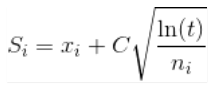

# Adversarial Search and Games

<!-- ## Adversarial Search -->

<!-- **Adversarial search is a search, where we examine the problem which arises when -->

<!-- we try to plan ahead of the world and other agents are planning against us.** -->

<!-- The environment with more than one agent is termed as multi-agent environment, -->

<!-- in which each agent is an opponent of other agent and playing against each -->

<!-- other. Each agent needs to consider the action of other agent and effect of that -->

<!-- action on their performance. -->

<!-- Searches in which two or more players with conflicting goals are trying to -->

<!-- explore the same search space for the solution, are called adversarial searches, -->

<!-- often known as Games. -->

<!-- Games are modeled as a Search problem and heuristic evaluation function, and -->

<!-- these are the two main factors which help to model and solve games in AI. -->

<!-- ## Game Theory -->

<!-- **Game theory is the study of mathematical models of strategic interactions -->

<!-- among rational agents. It has applications in all fields of social science, as -->

<!-- well as in logic, systems science and computer science.** -->

<!-- *   Types of Games: -->

<!--     1.  Zero-Sum and Non-Zero Sum Games -->

<!--     2.  Simultaneous and Sequential Games -->

<!--     3.  Imperfect Information and Perfect Information Games -->

<!--     4.  Asymmetric and Symmetric Games -->

<!--     5.  Co-operative and Non-Co-operative Games -->

<!-- ## Optimal Decisions in Games -->

<!-- **Games are usually intriguing because they are difficult to solve. Chess, for -->

<!-- example, has an average branching factor of around 35, and games frequently -->

<!-- stretch to 50 moves per player, therefore the search tree has roughly 35100 or -->

<!-- 10154 nodes (despite the search graph having “only” about 1040 unique nodes). As -->

<!-- a result, games, like the real world, necessitate the ability to make some sort -->

<!-- of decision even when calculating the best option is impossible.** -->

<!-- *   The optimal strategy can be found from the minimax value of each node, which -->

<!--     we express as MINIMAX, given a game tree (n). Assuming that both players -->

<!--     play optimally from there through the finish of the game, the utility (for -->

<!--     MAX) of being in the corresponding state is the node's minimax value. -->

<!-- *   [Optimal Decision in Gaming -->

<!--     example](https://www.geeksforgeeks.org/optimal-decision-making-in-games/) -->

<!-- ## Heuristic Alpha–Beta Tree Search -->

<!-- **Alpha-beta pruning is a modified version of the minimax algorithm. It is an -->

<!-- optimization technique for the minimax algorithm.** -->

<!-- *   The two-parameter can be defined as: -->

<!--     *   **Alpha**: The best (highest-value) choice we have found so far at any -->

<!--         point along the path of Maximizer. The initial value of alpha is **-∞**. -->

<!--     *   **Beta**: The best (lowest-value) choice we have found so far at any -->

<!--         point along the path of Minimizer. The initial value of beta is **+∞**. -->

<!-- *   The Alpha-beta pruning to a standard minimax algorithm returns the same move -->

<!--     as the standard algorithm does, but it removes all the nodes which are not -->

<!--     really affecting the final decision but making algorithm slow. Hence by -->

<!--     pruning these nodes, it makes the algorithm fas -->

<!-- *   The main condition which required for alpha-beta pruning is: **α>=β** -->

<!-- *   [Pseudo-code & Working](https://www.javatpoint.com/ai-alpha-beta-pruning) -->

<!-- ## Monte Carlo Tree Search -->

<!-- **Monte Carlo tree search is a heuristic search algorithm for some kinds of -->

<!-- decision processes, most notably those employed in software that plays board -->

<!-- games. In that context MCTS is used to solve the game tree.** -->

<!-- *   MCTS can be broken down into 4 steps: -->

<!--     1.  **Selection**: In this process, the MCTS algorithm traverses the current -->

<!--         tree from the root node using a specific strategy. The strategy uses an -->

<!--         evaluation function to optimally select nodes with the highest estimated -->

<!--         value. -->

<!--          -->

<!--         where: -->

<!--         *   Si = value of a node i -->

<!--         *   xi = empirical mean of a node i -->

<!--         *   C = a constant -->

<!--         *   t = total number of simulations -->

<!--     2.  **Expansion**: In this process, a new child node is added to the tree to -->

<!--         that node which was optimally reached during the selection process. -->

<!--     3.  **Simulation**: In this process, a simulation is performed by choosing -->

<!--         moves or strategies until a result or predefined state is achieved. -->

<!--     4.  **Backpropagation**: After determining the value of the newly added -->

<!--         node, the remaining tree must be updated. During the process, the number of -->

<!--         simulation stored in each node is incremented. Also, if the new node’s -->

<!--         simulation results in a win, then the number of wins is also incremented. -->

<!-- *   [More -->

<!--     Details](https://www.geeksforgeeks.org/ml-monte-carlo-tree-search-mcts/) -->

<!-- ## Stochastic Game -->

<!-- *   **In game theory, a stochastic game, is a repeated game with probabilistic -->

<!--     transitions played by one or more players. The game is played in a sequence -->

<!--     of stages. At the beginning of each stage the game is in some state.** -->

<!-- *   [Example with backgammon -->

<!--     game](https://www.geeksforgeeks.org/stochastic-games-in-artificial-intelligence/) -->

<!-- ## Partially Observable Games, -->

<!-- *   **A partially observable system is one in which the entire state of the -->

<!--     system is not fully visible to an external sensor. In a partially observable -->

<!--     system the observer may utilise a memory system in order to add information -->

<!--     to the observer's understanding of the system.** -->

<!-- *   Example: A card game in which some of the cards are discarded into a pile face -->

<!--     down. In this case the observer is only able to view their own cards and -->

<!--     potentially those of the dealer. -->

<!-- ## Limitations of Game Search Algorithms, -->
