# Unit IV: **Knowledge**

## Knowledge Based Agents

knowledge-based agents use a process of reasoning over an internal
representation of

knowledge to decide what actions to take. Knowledge-based agent uses some
task-specific knowledge to solve a problem efficiently.

Knowledge-based agents can accept

new tasks in the form of explicitly described goals; they can achieve competence
quickly by

being told or learning new knowledge about the environment; and they can adapt
to

changes in the environment by updating the relevant knowledge.

the representation of knowledge is done via logics.

There are three main components of logic, which are as follows:

Syntax: It is the sequence of a specific language which should be followed in
order to form a sentence. Syntax is the representation of a  language. Every
language has its own syntax.

For example, ax2+bx+c is a well-formed syntax of a quadratic equation.

Semantics: The sentence or the syntax which a logic follows should be
meaningful. Semantics defines the sense of the sentence which relates to the
real world.

For example, Indian people celebrate Diwali every year. This sentence represents
the true fact about the country and its people who are Indians.

Each sentence is expressed in a language called a knowledge representation
language and

represents some assertion about the world.

When the sentence is taken as being given

without being derived from other sentences, we call it an axiom.

A knowledge-based system comprises of two distinguishable features which are:

A Knowledge base

An Inference Engine

Knowledge base: A Knowledge base represents the actual facts which exist in the
real world. It is the central component of a knowledge-based agent. It is a set
of sentences which describes the information related to the world.

Note: Here, a sentence is not an English language sentence, but it is
represented in a language known as Knowledge representation language.

Inference Engine: It is the engine of a knowledge-based system which allows to
infer new knowledge in the system.

There must be a way to add new sentences to the knowledge base and a way to
query what is known. The standard names for these operations are TELL and ASK,
respectively.

When the agent solves a problem, it calls the agent program each time. The agent
program performs three things:

It TELLS the knowledge base what it has perceived from the environment.

It ASKS the knowledge base about the actions it should take?

It TELLS the action which is chosen, and finally, the agent executes that
action.

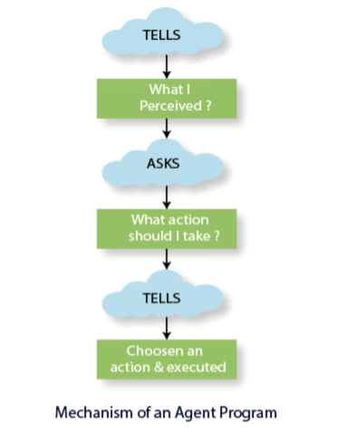

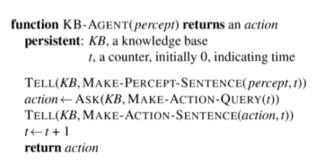

These functions create an interface between the two main components of an
intelligent agent, i.e., sensors and actuators.

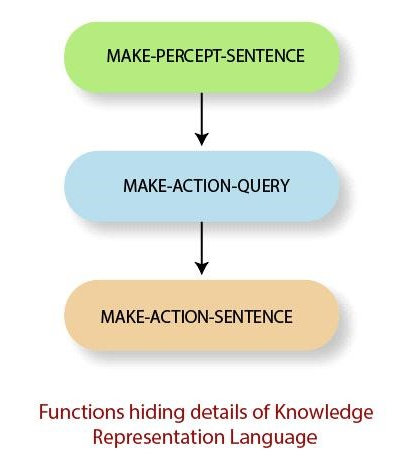

The functions are discussed below:

MAKE-PERCEPT-SENTENCE()

This function returns a sentence which tells the perceived information by the
agent at a given time.

MAKE-ACTION-QUERY()

This function returns a sentence which tells what action the agent must take at
the current time.

MAKE-ACTION-SENTENCE()

This function returns a sentence which tells an action is selected as well as
executed.

## Wumpus Word

The Wumpus world is a game playing which provides an environment to the
knowledge-based agent to showcase its stored knowledge. It was developed by
**Gregory Yob** in 1973.

About the game:

*   It is a single-player game.
*   It is a cave consisting of rooms which are connected with one-another via
    passways.
*   There is a beast or monster in the game named **Wumpus,** lurking somewhere
    the cave.
*   Wumpus eats everyone who tries to enter the cave.
*   The player needs to kill the Wumpus.
*   The player has only one arrow to shoot out the monster.
*   There are some rooms containing **bottomless pits** which may trap anyone
    whoever wanders in the room.
*   The goal of the game is **to search for a heap of gold**.

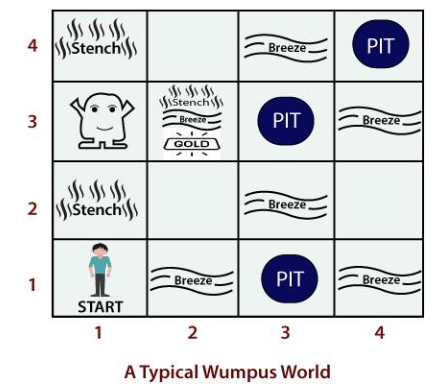

PEAS Description of the Wumpus World

*   **Performance Measure:** The player is awarded with the following utilities:
*   **(+1000):** It is for coming out of the cave safely with the gold.
*   **(-1000):** It is for falling into the pit or if eaten by the Wumpus.
*   **(-1):** It is for each action taken by the player.
*   **(-10):** It is for raising the arrow up.

The game ends if the player comes out of the cave safely or dies.

1.  **Environment:** The environment provided in the Wumpus world is as follows:

*   It is a 4X4 grid of rooms.
*   The player always starts in the square labeled \[1,1] and facing towards the
    right.
*   Location of the monster and the gold is choosen randomly in a uniform
    distribution.
*   Remember, the location chosen will never be the starting point.
*   Each square room other than the starting one can be a pit with 0.2

probability.

2.  **Actuators:** The player performs the following actions:

*   The agent can move forward or TurnLeft by 900 and TurnRight by 900.
*   The player dies if he enters a room having a pit or alive monster. It is
    safe to enter the room if the Wumpus is dead.
*   If the player will try to move forward and bumps into the wall, then the
    player will not move.
*   Using the action ***Grab***, the player can pick up the gold in the same
    room.
*   Using the action ***Shoot***, the player can shoot the monster with the
    arrow. Either the arrow will shoot the monster or will hit on the wall.
*   The action ***Climb*** is used to come out of the cave but only from the
    square

\[1,1].

3.  **Sensors:** The player is provided with five sensors, which gives a single
    bit of information:

*   The player will perceive a ***Stench***, if Wumpus is present in the room
    which is directly adjacent to the player.
*   The player will perceive a ***Breeze***, if in the square is directly
    adjacent to the pit.
*   The player will perceive a ***Glitter***, if in the square gold is present.
*   The player will perceive a ***Bump***, when the player walks into the wall.

When the player will shoot out the monster, it will emit a scary ***Scream***
which can be heard/perceived from anywhere in the cave.

in each case for which the agent draws a conclusion from the available

information, that conclusion is guaranteed to be correct if the available
information is correct. This is a fundamental property of logical reasoning

## Logic

A logic is a formal language that allows sound inference and has well defined
syntax and semantics. There are various logics that allow you to represent
various types of things and allow for more or less efficient inference.
Different varieties of logic exist, such as propositional logic, predicate
logic, temporal logic, and description logic. However, expressing something in
logic may not be natural, and conclusions may be ineffective.

*   Example of logic Language of numerical constraints:

*   A sentence: x + 3 ≤ z x, z - variable symbols (primitives in the language)

*   An interpretation: I: x = 5, z = 2

Variables mapped to specific real numbers

*   Valuation (meaning) function V: V (x + 3 ≤ z, I) is False for I: x = 5, z =
    2 Is True for I: x = 5, z = 10

*   Types of logic:
    *   Different types of logics possible
    *   Propositional logic
    *   First-order logic
    *   Temporal logic
    *   Numerical constraints logic
    *   Map-coloring logic

*   **Key takeaway:**
    *   A logic is a formal language, with precisely defined syntax and
        semantics, which supports sound inference.
    *   The logic may be different types like propositional logic, predicate
        logic, temporal logic, description logic etc.

## Propositional Logic: A Very Simple Logic,

**Syntax:** The statements given in a problem are represented via propositional
symbols. Each sentence consists of a single propositional symbol. The
propositional symbol begins with an uppercase letter and may be followed by some
other subscripts or letters. We have two fixed propositional symbols, i.e., True
and False.

Complex sentences are constructed from simpler sentences, using parentheses and

operators called logical connectives. There are five connectives in common use:

*   **not(¬):** It is known as the **negation** of a sentence. A literal can be
    a positive literal or a negative literal.
*   **and(^):** When a sentence is having **(^)** as the main connective. It is
    known

as **Conjunction,** and its parts are known as **Conjuncts**. For example, **(Y1
^ Y2) ? (Y3 ^ Y4) ? …(Yn ^ Ym),** such type of sentences are known as
**Conjunctive sentences**.

*   **or(V):** When a sentence is having **(V)** as the main connective. It is
    known as **Disjunction,** and its parts are known as **Disjuncts**. For
    example, **(Y1 ? Y2) V (Y3 ? Y4) V …(Yn ? Ym),** such type of sentences are
    known as **Disjunctive sentences**.
*   **implies(=>):** When **(Y1 V Y2) => Y3** is given, it is known as the
    **Implication of a sentence**. It is like **if->then** clause, where if this
    implies then it will happen. Implication is sometimes referred to as **Rules
    or if-then** statement. It can also be d**eno**ted as (      ) or (       ).
*   **if and only if (**ó**):** It represents implication at both sides where
    the expression is **(a1 V a2)**?**a3**,. Such type of connective is called
    **biconditional implication**. It returns true if both sides satisfy one
    another, else returns false.This can also be denoted as (?).

**Precedence Order of the Connectives**

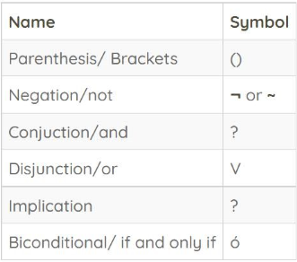

**There are following five rules regarding the semantics of the complex
sentences P and Q in a given model m :**

**¬P:** Its value will be false, iff it is true in the model m.

**(P ? Q):** Its value is true, iff both P and Q are true in m.

**(P v Q):** Its value is true, iff either P is true, or Q is true in m.

**(P=> Q):** Its value is true, iff the value of P is false, and that of Q is
true in m.

**(P ? Q):** The value will be true, iff P and Q value is either true or false
in the given **(P ? Q):** The value will be true, iff P and Q value is either
true or false in the given model m.

**Note:** Here, iff means if and only if.

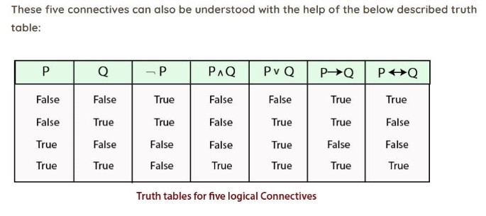

## Propositional Theorem Proving

Theorem proving—applying rules of inference directly to the sentences in our
knowledge base to construct a proof of the desired sentence without consulting
models.

Logical equivalence means two sentences and are logically equivalent if they are
true in the same set of models.

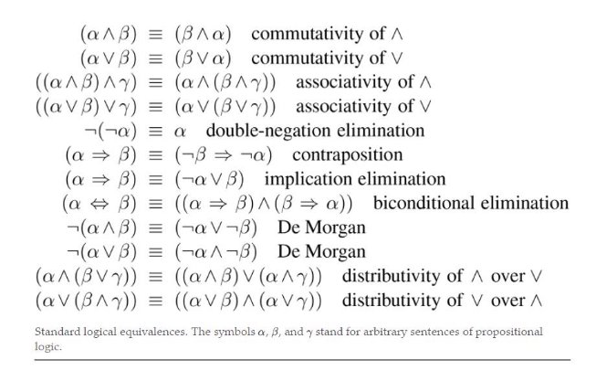

A sentence is valid if it is true in all models. For

example, the sentence P ∨ ¬P is valid. Valid sentences are also known as
tautologies—they are necessarily true.

A sentence is satisfiable if it is true in, or  satisfied by, some model.

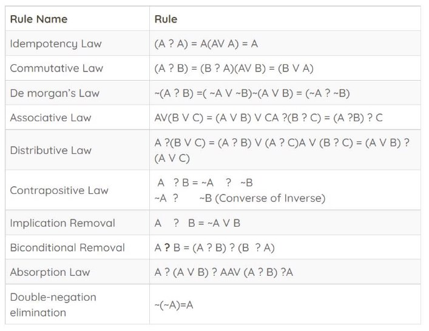

## Effective Propositional Model Checking

Not so important topic according to me. Choosing to ignore this one.

## Agents Based on Propositional Logic

*skipped*

## First Order Logic

First-order logic is also called first-order predicate calculus; it may be
abbreviated as FOL or FOPC.

In predicate logic, the input is taken as an entity, and the output it gives is
either true or false.

**Elements and their symbols in Predicate Logic**

*   **Objects:** It refers to an entity that exists in the real world. **For
    example,** Ram, John, etc. are referred to as Objects.
*   **Functions:** Any function performed by the object/on the object. **For**

**example,** LeftLeg, writes, eats, etc. are some of the functions.

*   **Relations:** The relation of an object with the other object defines its
    relation\*\*. For example,\*\* brother, mother, king, etc. are some types of
    relations which exist in the real world.

**The symbols used to represent these elements. They are as follows:**

*   **Constant Symbols:** These symbols are used to represent the objects.
*   **Predicate Symbols:** These symbols are used to represent relations.
*   **Function Symbols:** These symbols are used to represent the functions
    performed by the object.

Some examples follow:

“One plus two equals three.” Objects: one, two, three, one plus two; Relation:
equals; Function: plus. (“One plus two” is a name for the object that is
obtained by applying the function “plus” to the objects “one” and “two.” “Three”
is another name for this object.) “Squares neighboring the wumpus are smelly.”
Objects: wumpus, squares; Property: smelly; Relation: neighboring.

“Evil King John ruled England in 1200.” Objects: John, England, 1200; Relation:
ruled during; Properties: evil, king.

The primary difference between propositional and first-order logic

Propositional logic assumes

that there are facts that either hold or do not hold in the world. Each fact can
be in one of two states—true or false—and each model assigns true or false to
each proposition symbol. First-order logic assumes more; namely, that the world
consists of

objects with certain relations among them that do or do not hold.

## Representation Revisited

Programming languages (such as C++, Java, and Lisp) are by far the most widely
used formal languages.

This procedural method contrasts with propositional logic's declarative
character, in which knowledge and inference are separated and inference is
domain- independent.

They lack the expressiveness required to deal with incomplete data.

*   Using disjunction and negation, propositional logic has enough expressive
    capability to deal with partial knowledge.
*   Compositionality is a third characteristic of propositional logic that is
    useful in representation languages.

The meaning of a sentence in a compositional language is determined by the
meaning of its constituent elements.

For example, ―S1,4 ^ S1,2‖ is related to the meanings of ―S1,4‖ and ―S1,2‖.

Propositional logic lacks the expressive power to succinctly explain a complex
environment with numerous items.

For example, we were compelled to establish a distinct regulation for each
square regarding breezes and pits, such as: `B 1,1⇔(P 1,2 or P 2,1)`

In English, though, it seems simple enough to state unequivocally that squares
near to pits are airy.

Natural languages are also non-compositional, in the sense that the meaning of a
statement like "Then she saw it" might be influenced by the context created by
numerous preceding and following sentences.

Finally, natural languages contain ambiguity, which can make thinking harder.

The following are the most obvious features of natural language syntax:

*   Object-referential nouns and noun phrases ( squares , pits, wumpuses ).
*   Verbs and verb phrases that allude to object relationships (is breezy, is
    adjacent to, shoots).
*   Some of these relationships are functions, meaning they have only one value
    for each input. It's simple to start a list of objects, relations, and
    functions:

Objects: People, houses, numbers, theories, Ronald McDonald, colors, baseball
games, wars, centuries….

Relation: These can be unary relations or properties like red, round, bogus,
prime, multi-storied............, or more general n-ary relations like brother
of, bigger than, within, part of, has colour, happened after, owns, comes
between, etc.

Functions: father of, closest friend, third inning of, more than, and the start
of.

*   The first-order logic language has a syntax and semantics based on objects
    and relations.
*   First-order logic can also be used to convey facts about some or all of the
    universe's items.
*   This allows generic laws or norms to be represented, such as the sentence
    "Squares adjacent to the Wumpus are stinky."

The ontological commitment made by each language—that is, what it assumes about
the nature of reality—is the basic difference between propositional and first-
order logic.

*   Propositional logic, for example, assumes that there are facts in the world
    that either hold or do not hold. There are two possible states for each
    fact: true or untrue.
*   Temporal logic assumes that facts are true at specific moments and that
    those times (which can be points or intervals) are in chronological
    sequence. Higher-order logic considers the first-order logic's relations and
    functions to be objects in and of themselves. This enables claims to be made
    about all object relations. A talent for dealing with logical notation is
    required of an AI student.

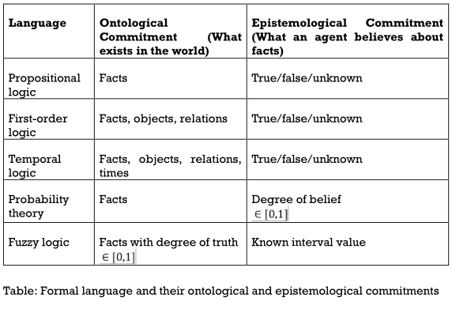

## Syntax and Semantics of First Order

**Syntax:** It defines the way of representing the given predicates. As these
predicates are represented via quantifiers, there are different types of
quantifiers used:

*   **Universal Quantifier(For all/every):** When the predicate is indicating
    about all/everything, we use **for all** quantifier. It is denoted as **" ?
    "**
*   **Existential Quantifier(For some):** When the predicate is indicating about
    some quantity, we use **for some** quantifier. It is denoted as **“?”**
*   **Nested Quantifiers:** It is the nesting of the same type of quantifier.
    One predicate is nested under the other predicate.
*   **Atomic Sentences:** These sentences are formed via predicate symbols

may or may not be followed by a list of terms.

**Example:** Parents(Ram, Sita) where Ram and Sita are the parents.

*   **Complex Sentences:** These sentences make use of logical connectives to
    construct more complex sentences.
*   **Equality:** We use the equality symbol to express that two terms refer to
    the same object\*\*. For example,\*\* Eleveenth\_President(India)= Dr. APJ
    Abdul Kalam. Here, both LHS is equal to RHS. It means that both terms refer
    to the same entity/ person.

**Semantics:** It defines the sense of the given predicate. It allows to make
more logical expression by devising its semantics. Semantics allow us to
understand the sentence meaning.

**Let’s understand Predicate logic with the help of below examples: Example 1:**
Lipton is a tea.

**Solution:** Here, the object is Lipton.

It will be represented as **Tea(Lipton).**

**Note:** In this example, there is no requirement of quantifiers because the
quantity is not specified in the given predicate. **Let’s see more.**

**Example 2:** Every man is mortal.

**Solution:** Here, the quantifier is the universal identifier, and the object
is man. Let x be the man.

Thus, it will be represented as **x: man(x)  ? mortal(x).**

**Example 3:** All girls are beautiful.

**Solution:** Here, we are talking about all girls. It means universal
quantifier will be used. The object is girls. Let, y be the girls.

Therefore, it will be represented as **girls(y) ? beautiful(y).**

**Example 4:** All that glitters is not gold.

**Solution:** Here, we will represent gold as x.

Therefore, it will be represented as **glitters(x) ? ¬gold(x).**

## Using First Order Logic

Again not an important topic

## Knowledge Engineering

Process of knowledge base construction in called knowledge engineering.

a knowledge engineer investigates a specific domain, learn the important
concepts regarding that domain, and creates the formal representation of the
objects and relations in that domain.

There are 7 steps in knowledge engineering:

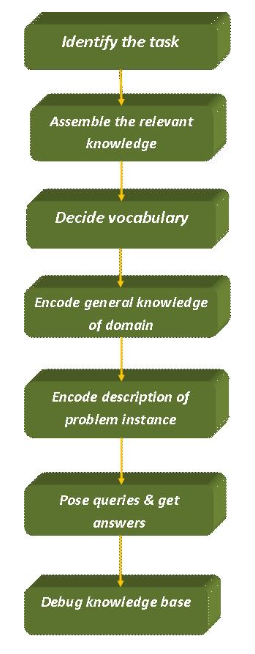

1.  IDENTIFY THE QUESTIONS

*   A knowledge engineer should be able to identify the task by asking a few
    questions like:
*   Do the knowledge base will support?
*   What kinds of facts will be available for each specific problem?

The task will identify the knowledge requirement needed to connect the problem
instance with the answers.

instance with the answers.

2.  ASSEMBLE THE RELEVANT KNOWLEDGE

*   A knowledge engineer should be an expert in the domain. If not, he should
    work with the real experts to extract their knowledge. This concept is

known as **Knowledge Acquisition**.

**Note:** Here, we do not represent the knowledge formally. But to understand
the scope of the knowledge base and also to understand the working of the
domain.

For the wumpus world, which is defined by an artificial set of rules, the
relevant

knowledge is easy to identify.

3.  DECIDE ON A VOCABULARY OF PREDICATES, FUNCTIONS, AND CONSTANTS.

*   Translating important domain-level concepts into logical level concepts.
    **Here, the knowledge engineer asks questions like:**
*   What are the elements which should be represented as objects?
*   What functions should be chosen?

After satisfying all the choices, the vocabulary is decided.

4.  ENCODE GENERAL KNOWLEDGE ABOUT THE DOMAIN

*   In this step, the knowledge engineer pen down the axioms for all the chosen

vocabulary terms.

**Note:** Here, misconceptions occur between the vocabulary terms.

•

*   **Encode description of the specific problem instance:** We write the simple
    atomic sentences for the selected vocabulary terms. We encode the chosen
    problem instances.
*   **Raise queries to the inference procedure and get answers:** It is the
    testing step. We apply the inference procedure on those axioms and
    problem-specific facts which we want to know.
*   **Debug the knowledge base:** It is the last step of the knowledge
    engineering process where the knowledge engineer debugs all the errors.

## Propositional vs First order Inference

One way to do first-order inference is to convert the first-order knowledge base
to propositional logic and use propositional inference. first step is
eliminating universal quantifiers.

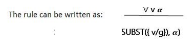

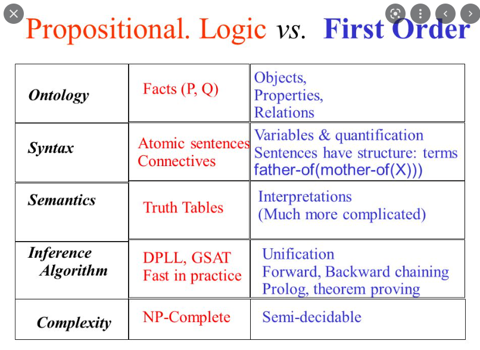

## Knowledge Engineering in First-Order Logic Inference is used in First-Order

Logic to generate new facts or sentences from current ones. It's crucial to
understand some basic FOL terms before diving into the FOL inference rule.

*   **Substitution:** Substitution is a fundamental approach for modifying
    phrases and formulations. All first-order logic inference systems contain
    it. The substitution becomes more difficult when there are quantifiers in
    FOL. We refer to the replacement of a constant "a" for the variable "x" when
    we write F\[a/x].

*   **Equality:** Atomic sentences are generated in First-Order Logic not only
    through the employment of predicate and words, but also through the
    application of equality. We can do this by using equality symbols, which
    indicate that the two terms relate to the same thing.

*   **FOL inference rules for quantifier:** Because inference rules in
    first-order logic are comparable to those in propositional logic, below are
    some basic inference rules in FOL:
    *   Universal Generalization
    *   Universal Instantiation
    *   Existential Instantiation
    *   Existential introduction

*   **Universal Generalization:**
    *   Universal generalization is a valid inference rule that states that if
        premise P(c) is true for any arbitrary element c in the universe of
        discourse, we can arrive at the conclusion x P. (x).

    *   It can be represented as: *formula not visible*

    *   If we want to prove that every element has a similar property, we can
        apply this rule.

    *   x must not be used as a free variable in this rule.

    *   **Example:** Let's represent, P(c): "A byte contains 8 bits", so for ∀ x
        P(x) "All bytes contain 8 bits.", it will also be true.

*   **Universal Instantiation:**
    *   Universal instantiation, often known as universal elimination or UI, is
        a valid inference rule. It can be used numerous times to add more
        sentences.
    *   The new knowledge base is logically equivalent to the previous one.
    *   We can infer any phrase by replacing a ground word for the variable,
        according to the UI.
    *   According to the UI rule, any phrase P(c) can be inferred by
        substituting a ground term c (a constant inside domain x) for any object
        in the universe of discourse in x P(x).
    *   It can be represented as: *formula not visible*
    *   **Example:** IF "Every person like ice-cream"=> ∀x P(x) so we can infer
        that "John likes ice-cream" => P(c)

*   **Existential Instantiation:**
    *   Existential Elimination, also known as Existential Instantiation, is a
        valid first- order logic inference rule.
    *   It can only be used once to substitute for the existential sentence.
    *   Despite the fact that the new KB is not conceptually identical to the
        previous KB, it will suffice if the old KB was.
    *   This rule states that one can infer P(c) from the formula given in the
        form of ∃x P(x) for a new constant symbol c.
    *   The only constraint with this rule is that c must be a new word for
        which P(c) is true.
    *   It can be represented as:  *formula not visible*

*   **Existential introduction:**
    *   An existential generalization, also known as an existential
        introduction, is a valid inference rule in first-order logic.
    *   If some element c in the world of discourse has the characteristic P, we
        can infer that something else in the universe has the attribute P,
        according to this rule.
    *   It can be represented as:  *formula not visible*
    *   **Example:** Let's say that, "Pritisha got good marks in English."
        "Therefore, someone got good marks in English."

*   **Propositional vs. First-Order Inference:** Previously, inference in first
    order logic was checked via propositionalization, which is the act of
    turning the Knowledge Base included in first order logic into propositional
    logic and then utilizing any of the propositional logic inference mechanisms
    to check inference.

*   **Key takeaway:**
    *   In First-Order Logic, inference is used to derive new facts or sentences
        from existing ones.
    *   In First-Order Logic, atomic sentences are formed not only via the use
        of predicate and words, but also via the application of equality.
    *   There are some Inference rules that can be applied to sentences with
        quantifiers to obtain sentences without quantifiers.
