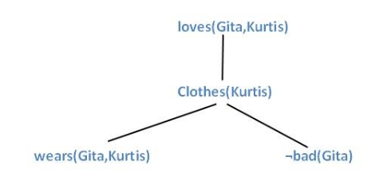
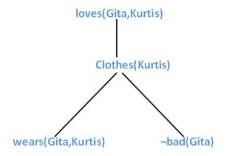
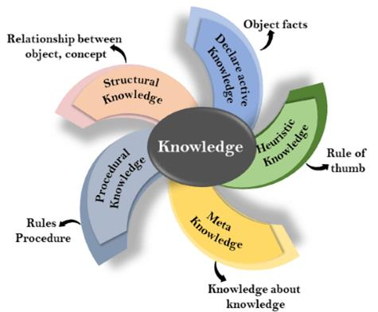
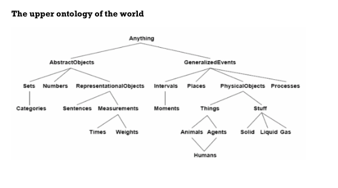
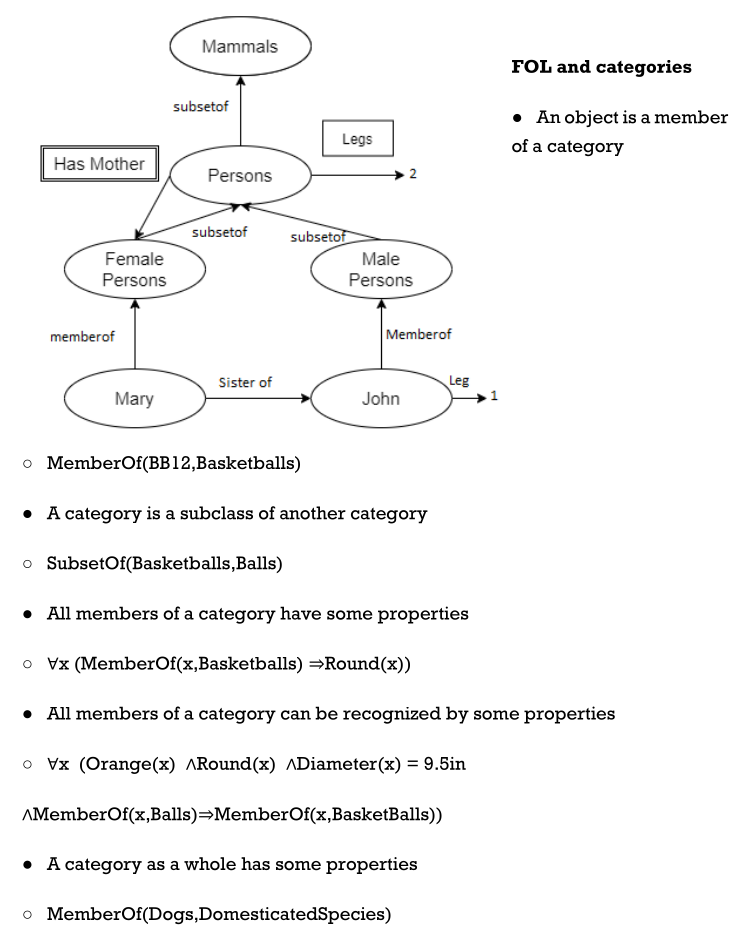
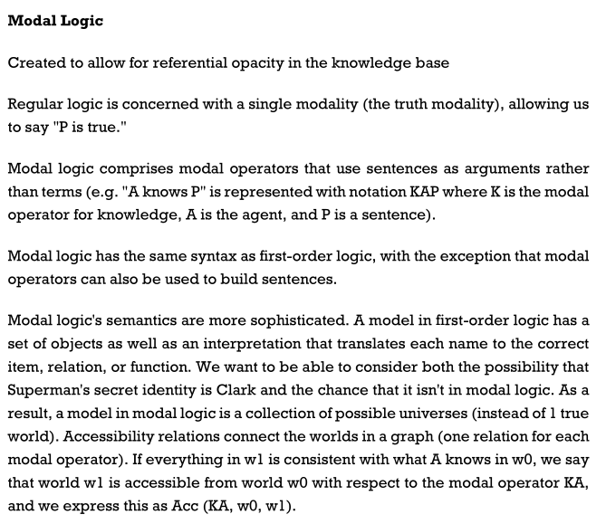
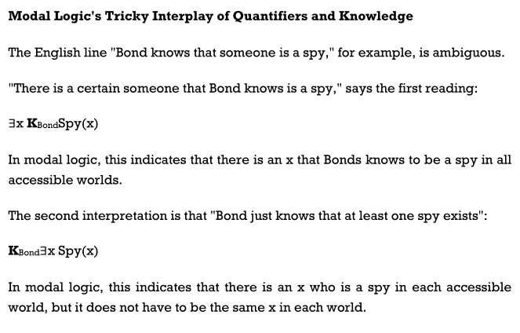
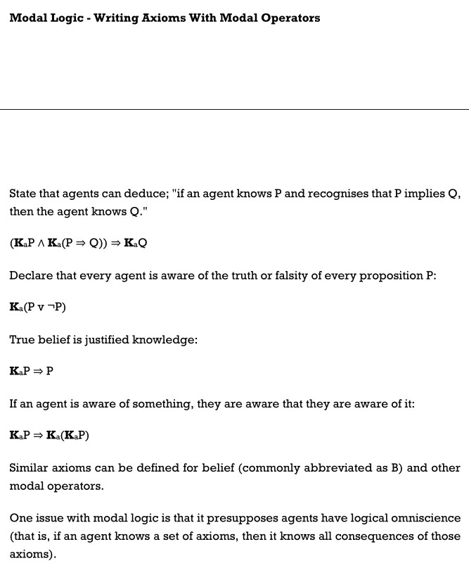

# Unit V: Reasoning

## Unification and first order inference

*   It is the key component of First-order inference algorithms. Unification is
    the process used by the lifted inference rules to find substituents that
    could give identical but different logical expressions. It means the meaning
    of the sentence should not be changed, but it should be expressed in
    multiple ways. The **UNIFY** algorithm in unification takes two sentences as
    input and

    then returns a unifier if one exists:

  <!-- CODE -->

    UNIFY(p,q)= ? where SUBST( ? , p) = SUBST( ?, ).

Let see how UNIFY works with the help of the below example:

**Given:**

    Knows(Ram,x). The question is- Whom does Ram knows?

The UNIFY algorithm will search all the related sentences in the knowledge base,
which could unify with Knows(Ram,x).

    UNIFY (Knows(Ram, x), Knows(Ram, Shyam))?{x/Shyam}

    UNIFY (Knows{Ram,x}, Knows{y, Aakash})?{x/Aakash, y/Ram}

    UNIFY (Knows{Ram,x}, Knows{x, Raman})?fails.

The last one failed because we have used the same variable for two persons at
the same time.

**Unification Algorithm**

Earlier, we have studied **TELL** and **ASK** functions which are used to inform
and interrogate a knowledge base. These are the primitive functions

of **STORE** and **FETCH** functions\*\*. STORE\*\* function is used to store a

sentence **s** into the knowledge base and **FETCH** function is used to return
all the unifiers with some sentences.

A simple scheme called predicate indexing puts all the

facts in one bucket and all the brother facts in another. The buckets can be
stored in a hash table for efficient access.

Predicate indexing is useful when there are many predicate symbols but only a
few clauses for each symbol

## Forward Chaining

First-order definite clauses are disjunctions of literals of which exactly one
is positive. definite clause is either atomic, or is an implication whose
antecedent is a

conjunction of positive literals and whose consequent is a single positive
literal.

A typical first-order definite

clause looks like this:

King(x) ^ Greedy(x)  => Evil(x) ,

but the literals king(john) and greedy (john) also count as definite clauses.
First-order literals can include variables, so Greedy(y) is interpreted as
“everyone is greedy” (the universal quantifier is implicit).

In forward chaining, we start with the atomic sentences in the knowledge base
and apply Modus Ponen in forward direction. Also adding new sentences until any
inference is not made.

Starting from the known

facts, it triggers all the rules whose premises are satisfied, adding their
conclusions to the

known facts. The process repeats until the query is answered (assuming that just
one

answer is required) or no new facts are added.

**Consider the below axioms:**

1.  Gita loves all types of clothes.
2.  Suits are clothes.
3.  Jackets are clothes.
4.  Anything any wear and isn’t bad is clothes.
5.  Sita wears skirt and is good.
6.  Renu wears anything Sita wears.

**Apply forward chaining and prove that Gita loves Kurtis.**

## Backward Chaining

These algorithms work backward from the goal, chaining through rules to

find known facts that support the proof. Backward chaining, is clearly a
depth-first search algorithm. is clearly a depth- first search algorithm suffers
from problems with repeated states and incompleteness.

Example:

**Consider the below axioms:**

1.  Gita loves all types of clothes.

2.  Suits are clothes.

3.  Jackets are clothes.

4.  Anything any wear and isn’t bad is clothes.

5.  Sita wears skirt and is good.

6.  Renu wears anything Sita wears.

**Apply backward chaining and prove that Gita loves Kurtis.**

NOTE:

the graph of forward and backward chaining is same. It means that forward
chaining follows the**bottom-up approach** and backward chaining follows
the**top-down approach.**

## Resolution

Resolution works for any knowledge base.

This method is basically used for proving the satisfiability of a sentence. In
resolution method, we use **Proof by Refutation** technique to prove the given
statement.

The key idea for the resolution method is to use the knowledge base and negated
goal to obtain null clause (which indicates contradiction). Resolution method is
also called **Proof by Refutation**. Since the knowledge base itself is
consistent, the contradiction must be introduced by a negated goal. As a result,
we have to conclude that the original goal is true.

**In FOPL, the process to apply the resolution method is as follows:**

*   Convert the given axiom into CNF, i.e., a conjunction of clauses. Each
    clause should be dis-junction of literals.
*   Apply negation on the goal given.
*   Use literals which are required and prove it.
*   Unlike propositional logic, FOPL literals are complementary if one unifies
    with the negation of other literal.

**Note:** Skolemization is the process of removing existential quantifiers by
elimination.

## Knowledge Representation

Humans are best at understanding, reasoning, and interpreting knowledge. Humans
know things, which is that of the knowledge and as per that of their knowledge
they perform several of the actions in that of the real world. But how machines
do all of these things come under the knowledge representation and the
reasoning. Hence we can describe that of the Knowledge representation as
follows they are:

*   Knowledge representation and the reasoning (KR, KRR) is the part of
    Artificial intelligence which concerned with AI agents thinking and how
    thinking contributes to intelligent behaviour of agents.
*   It is responsible for representing information about the real world so that
    a computer can understand and then can utilize that of the knowledge to
    solve that of the complex real world problems for instance diagnosis a
    medical condition or communicating with humans in natural language.
*   It is also a way which describes that how we can represent that of the
    knowledge in that of the artificial intelligence. Knowledge representation
    is not just that of the storing data into some of the database, but it also
    enables of an intelligent machine to learn from that of the knowledge and
    experiences so that of the it can behave intelligently like that of a human.
    What to Represent: Following are the kind of knowledge which needs to be
    represented in that of the AI systems:
*   **Object:** All the facts about that of the objects in our world domain.
    Example Guitars contains strings, trumpets are brass instruments.
*   **Events:** Events are the actions which occur in our world.
*   **Performance:** It describes that of the behaviour which involves the
    knowledge about how to do things.
*   **Meta-knowledge:** It is knowledge about what we know.
*   **Facts:** Facts are the truths about the real world and what we represent.
*   **Knowledge-Base:** The central component of the knowledge-based agents is
    the knowledge base. It is represented as KB. The Knowledgebase is a group of
    the Sentences (Here, sentences are used as a technical term and not
    identical with the English language). **Knowledge:** Knowledge is the
    awareness or familiarity gained by that of the experiences of facts, data,
    and situations. Following are the types of knowledge in artificial
    intelligence:

## Ontological Engineering

*   This field of engineering describes:
    *   How to make representations that are more broad and adaptable
    *   Actions, time, physical objects, and beliefs are examples of concepts.
    *   Works on a far larger scale than K.E.
*   Define general framework of concepts
    *   Upper ontology
*   Limitations of logic representation
    *   Red, green and yellow tomatoes: exceptions and uncertainty.
*   Ontological engineering is a term used to describe the process of
    representing abstract concepts.

## Categories and Objects

*   Sorting the items into categories.
*   At the level of categories, some reasoning takes happen.
*   "I'd like to eat an apple," says the narrator.
*   Member(x, Apple) and Subset(x, Apple) are Apple(x) and Member(x, Apple)
    respectively (Apple, Food).
*   The categories create a hierarchy, or simply a network, in which each class
    inherits the properties of the parent (apples are both food and fruit).
*   A taxonomy is made up of the categories of a class.
*   The organisation of items into categories is required by KR.
*   Interaction at the object level;
*   Reasoning at the category level
*   Categories play a role in predictions about objects
*   Based on perceived properties
*   FOL can represent categories in two ways (First Order Logic)
    *   Predicates: apple(x)
    *   Reification of categories into objects: apples
        *   Category = set of its members
        *   Category organization
        *   Relation = inheritance:
*   Food is edible in all forms; fruit is a subclass of food, and apples are a
    subclass of fruit, hence an apple is edible.

## Events

The usefulness of situation calculus is limited: it was created to represent a
world in which activities are discrete, instantaneous, and occur one at a time.
Consider filling a bathtub, which is a continual action. Situation calculus can
claim that the tub is empty before the action and filled after the action, but
it can't describe what happens in the middle of the activity. It also can't
depict two simultaneous actions, as cleaning one's teeth while waiting for the
tub to fill. We present an alternative formalism known as event calculus to
address such circumstances, which is based on points of time rather than
situations.

Instances of event categories are used to describe events.4 Shankar's flight
from San Francisco to Washington, D.C. Is described as follows:

*   E1 ∈ Flyings ∧ Flyer (E1, Shankar ) ∧ Origin(E1, SF) ∧ Destination(E1,DC)

Then we use Happens(E1, I to indicate that the event E1 occurred at the time
interval i. A (start, finish) pair of times is used to express time intervals.

## Mental Objects & Modal Logic

  

## Reasoning Systems for Categories

*skipped*

## Reasoning with Default Information

*skipped*
