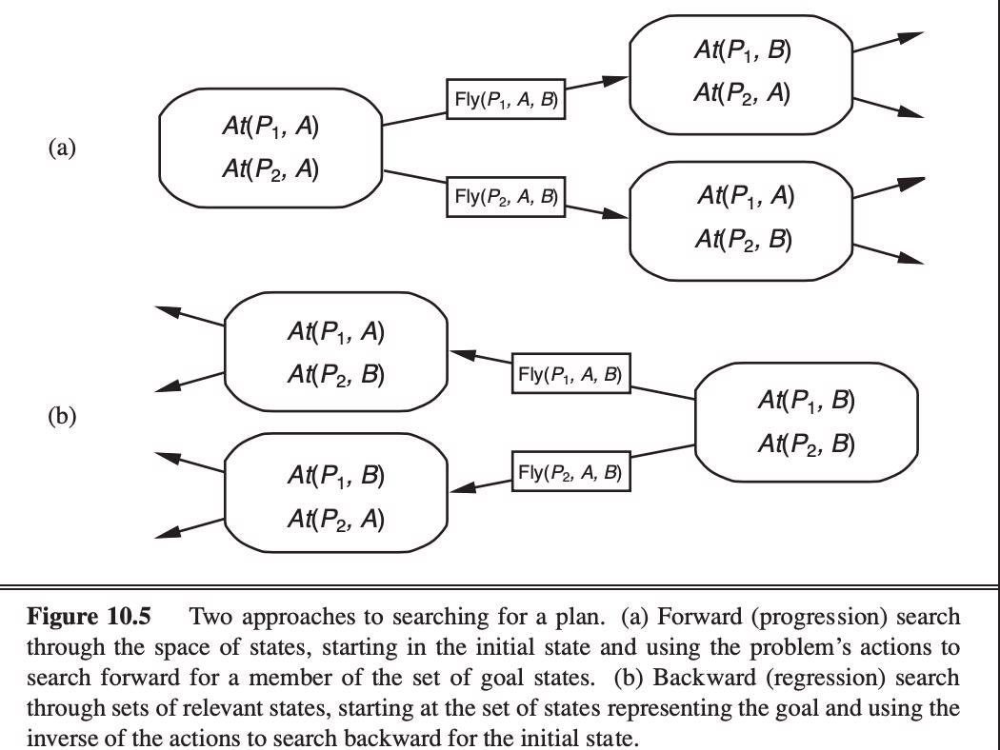
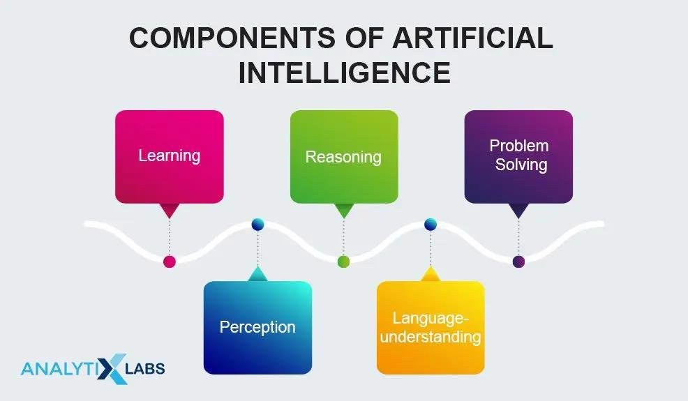

# Unit VI: Planning

## Automated Planning

The  field  of  Artificial  Intelligence  known  as  Automated  Planning
investigates this discussion process computationally. Its goal is to aid
planning by reasoning on conceptual models, which are abstract and formal
representations of the domain, the effects and combinations of activities, and
the requirements to be met and objectives to be met. The planning domain is the
conceptual model of the domain in which activities are carried out, plans are
combinations of actions, and goals are the needs to be met. Intuitively, a
planning problem entails determining a plan that satisfies the goal in a
specific domain, given a planning domain and a goal. For Automated Planning, we
give a broad formal framework.

Domains, plans, and goals are the three fundamental components of the planning
problem that the framework is built upon.

**Domain** - We allow for nondeterministic domains, which are domains in which
actions may have varied effects and it is impossible to predict which of the
various possible outcomes will actually occur at the time of planning. We also
take partial observability into account.

**Plans** -  We  define  plans  in  which  the  action  to  be  performed  in  a
particular state may be influenced by information about prior execution phases.
There are plans that rely on a finite number of execution steps (finite- memory
plans) and plans that do not rely on prior execution steps (non- memory plans)
(memory-less plans). Plan executions, in general, result in  trees  (called
execution  trees)  whose nodes  correspond  to  domain states.

**Goals** - Goals are defined as sets of acceptable trees that correspond to
intended planning domain evolutions. They can be used to represent traditional
reachability goals, which are requirements expressed on the leaves of execution
trees that specify the end states to be achieved once a plan is performed.

Deterministic  domains,  plans  that  are sequences of actions, and reachability
goals can all be used to mimic traditional planning.

Nondeterministic domains do, in fact, model uncertainty in action effects,
whereas partial observability does so for observations.

**Key takeaway**

The  field  of  Artificial  Intelligence  known  as  Automated  Planning
investigates this discussion process computationally. Its goal is to aid
planning by reasoning on conceptual models, which are abstract and formal
representations of the domain, the effects and combinations of activities, and
the requirements to be met and objectives to be met.

## Classical Planning

Classical planning is the process of constructing complicated plans of action
using the issue structure as a guide.

Invariants  are  used  in  optimum  planning  (graph  theory,  complexity
theory).

Domain-specific  solvers  are  integrated  to  improve  the  efficiency  of
classical planning on certain domains (puzzles, logistics, video games). Machine
learning  approaches  are  being  used  in  the  planning  and extraction of
structural data (machine learning, deep learning, neural networks).

Optimize your strategy.

In traditional planning, the agent performs three tasks:

*   planning: After determining the problem, the agent makes a plan.
*   Acting: It chooses the course of action to adopt.
*   Learning: The agent's actions cause him to learn new things.

    

PDDL  (Planning  Domain Definition  Language)  is  a language  that  is  used to
represent  all  actions  in  a single action schema.

The four basic things required in  a  search  problem  are described by PDLL:

*   Initial state - Each state is represented  as  the  union  of the  ground
    and  functionless atoms in its initial state.
*   Action - It is defined by a series of action schemas that define the
    ACTION() and RESULT() functions implicitly.
*   Result - The collection of activities taken by the agent yielded this
    result.
*   Goal  -  The  goal  is  the  same  as  a  precondition,  which  is  a
    literal conjunction (whose value is either positive or negative).

There are various examples which will make PDLL understandable:

*   Air cargo transport
*   The spare tire problem
*   The blocks world and many more.

**Advantages of Classical Planning** Classical planning has the following
benefits:

*   It  has  enabled  the  development  of  precise  domain-independent
    heuristics.
*   The systems are simple to use and operate efficiently.

**Complexity of the classical planning**

There are two decision difficulties that arise in traditional planning:

*   PlanSAT: is a query that asks if any plan exists that solves a planning
    difficulty.
*   Bounded PlanSAT: It's a question that asks if there's a solution with a
    length of k or less.

**Key takeaway**

Classical planning is the process of constructing complicated plans of action
using the issue structure as a guide.

## **Algorithms for Classical Planning**

Now we'll take a look at planning algorithms. We saw how the description of a
planning problem defines a search problem: we can search through the space of
states,  looking for  a  goal, starting from  the initial state. One of the
wonderful features of the declarative representation of action schemas is that
we can search for the initial state backwards from the objective.

**Forward (progression) state-space search**

Now that we've seen how a planning problem maps to a search problem, we may
utilize any of the heuristic search algorithms or a local search algorithm to
solve planning problems (provided we keep track of the actions used to reach the
goal). Forward state-space search was thought to be too inefficient to be
feasible from the beginning of planning research (about 1961) until roughly
1998\. It's not difficult to think of reasons for this.

Second, state spaces in planning issues are frequently huge. Consider a cargo
scenario with ten airports, each having five planes and 20 items of goods. The
objective is to transport all of the cargo from airport A to airport B. The
problem has a straightforward solution: load the cargo into one of the planes at
A, fly the plane to B, and discharge the cargo.

The objective is to transport all of the cargo from airport A to airport B. The
problem has a straightforward solution: load the cargo into one of the planes at
A, fly the plane  to  B,  and  discharge  the  cargo.  The  average  branching
factor  is  high, therefore finding the answer can be difficult: each of the 50
planes can travel to 9 different airports, and each of the 200 packages can be
unloaded (if loaded) or loaded into any plane at its airport (if it is
unloaded). So there are a minimum of 450 activities (when all the packages are
at airports with no planes) and a maximum of 10,450 actions in any situation
(when all packages and planes are at the same airport).

Let's say there are roughly 2000 potential actions per state on average,
therefore the search graph has about 200041 nodes up to the depth of the obvious
solution.

**Backward (regression) relevant-states search**

In regression search, we begin at the goal and work backwards until we identify
a set of steps that leads to the original state. Because we only evaluate
activities that are related to the objective, it's termed relevant-states search
(or current state). At each phase, just like in belief-state search, there are a
number of relevant states to consider, not just one.

We begin with the goal, which is a set of literals that describes a set of
states—for example, the goal PoorFamous describes states in which Poor is false,
Famous is true, and any other fluent can have any value. There are 2n ground
states (each fluent might be true or false) but 3n descriptions of sets of
target states in a domain with n ground fluents (each fluent can be positive,
negative, or not mentioned).

## Heuristics for Planning

Without a good heuristic function, neither forward nor backward search is
efficient. Remember that a heuristic function h(s) measures the distance between
a state s and the goal, and that we may utilize A search to identify optimal
solutions if we can  construct  an  admissible  heuristic  for  this
distance—one  that  does  not overestimate. By establishing a relaxed issue that
is easier to solve, an admissible heuristic can be generated. The heuristic for
the original problem is then the exact cost of a solution to this easier
problem.

Consider a search issue as a network with nodes representing states and edges
representing operations. The goal is to find a path from the original state to
the desired state. We may make this problem easier in two ways: by adding more
edges to the graph, making it stricter to identify a path, or by grouping
several nodes together, generating an abstraction of the state space with fewer
states, making it easier to search.

First,  we'll  look  at  heuristics  for  adding  edges  to  the  graph.  The
disregard preconditions  heuristic,  for  example,  removes  all  preconditions
from  actions. Every  action  becomes  relevant  in  every  stage,  and  any
single  goal  can  be accomplished in a single step (assuming an applicable
action exists—if not, the problem is impossible to solve). This almost indicates
that the number of steps required to solve the relaxed problem is equal to the
number of unmet goals— almost, but not quite, because some acts may accomplish
several goals and others may negate the results of others. Consider and ignore
is a good way to get an accurate heuristic for many problems.

First, we loosen up the actions by removing all preconditions and consequences
that aren't literals in the goal. Then we count the least number of activities
required to achieve the goal when the impacts of those actions are added
together. This is a case of the set-cover problem in action. One small annoyance
is that the set-cover problem is NP-hard. Thankfully, a basic greedy algorithm
will always provide a set covering that is within a factor of log n of the true
lowest covering, where n is the number  of  literals  in  the  target.
Unfortunately,  the  greedy  algorithm  loses  its admissibility guarantee.

**Key takeaway**

Without a good heuristic function, neither forward nor backward search is
efficient. Remember that a heuristic function h(s) measures the distance between
a state s and the goal, and that we may utilize A search to identify optimal
solutions if we can  construct  an  admissible  heuristic  for  this
distance—one  that  does  not overestimate.

## Hierarchical Planning

When planning, it's common to have hierarchical information on the actions, or a
description of how complex actions are broken down. For instance, a complicated
activity such as "serving coffee" can be broken down into two complex actions:
"making coffee" and "bringing coffee." As a result, there exist planners, such
as ABSTRIPS, that take as input the hierarchical description of the activities
in addition to the description of the actions. For example, one can start
planning at a general level  and  then  drill  down  into  the  details  if
necessary  (as  does  ABSTRIPS  for example). A hierarchical task network is
then used to express the goal (HTN).

*   Hierarchical planning, often known as HTN planning, is a planning system
    based on the Hierarchical Task Network (HTN).

*   It combines Partial Order Planning and HTN Planning concepts.

*   HTN planning is frequently organized around a single "top-level" action
    termed Act, with the purpose of finding an Act execution that meets the
    goal.

*   The first plan is considered as a high-level statement of what needs to be
    done in HTN planning.

*   Decomposition actions are used to refine this strategy.

*   Each action decomposition breaks down a higher-level activity into a jumble
    of lower-level actions.

*   This deconstruction continues until the plan is reduced to its most basic
    actions.

*   Consider  a  hierarchical  travel  plan  from  a  specific  source  to  a
    specific destination.

*   Assume we're traveling from source "Mumbai" to destination "Goa" in the
    above hierarchical planner diagram.
*   Then you can decide how you want to travel: by plane, bus, or car. Assume
    you decide to travel by "Bus."
*   The "Take-Bus" strategy can then be broken down into a series of tasks, such
    as going  to  Mumbai  –  Bus  stop,  purchasing  a  bus  ticket,  boarding
    the  bus,  and departing for Goa.
*   The four acts in the previous point can now be split down into their
    component parts. Take, for example, "By-Ticket for Bus."
*   It may be broken down into three steps: go to the bus stop counter, request
    a ticket, and pay for the ticket.
*   As a result, each of these actions can be further deconstructed until we
    reach the level of actions that can be performed without thought in order to
    generate the needed motor control sequences.

**Advantages of Hierarchical Planning:**

*   The main advantage of a hierarchical structure is that it reduces the plan
    at each level  of  the  hierarchy  to  a  small  number  of  activities  at
    the  next  lower  level, lowering the computing cost of determining the best
    method to organise those activities for the current challenge.
*   Many real-world applications demand very big plans, which HTN algorithms may
    generate.
*   In the event that something goes wrong, the hierarchical structure makes it
    simple to rectify the problem.
*   Hierarchical  planning  is  far  more  efficient  than  single-level
    planning  for complex issues.

**Disadvantages of Hierarchical Planning:**

*   A Deterministic environment is required by many HTN planners.
*   Many HTN planners are unable to deal with unpredictable results of actions.

**Key takeaway**

When planning, it's common to have hierarchical information on the actions, or a
description of how complex actions are broken down.

## Planning  and  Acting  in  Nondeterministic  Domains,  Time, Schedules, and

Resources

**Domain**

We allow for nondeterministic domains, which are domains in which actions may
have varied effects and it is impossible to predict which of the various
possible outcomes  will  actually  occur  at  the  time  of  planning.  We  also
take  partial observability into account. It represents the reality that the
state of the domain cannot always be observed completely, and so cannot be
determined uniquely in some instances. The special circumstances of full
observability, where the state may be totally observed and hence uniquely
determined, and null observability, where no observation is ever feasible at run
time, are both included in a model with partial observability.

**Time, Schedule and Resources**

The standard planning representation can communicate about what to do and in
what order, but it can't talk about how to execute it.

*   **Temporal ordering constraint** - When an activity should occur (before
    and/or after  a  particular  time  and/or  specific  action(s)),  there  are
    temporal  ordering constraints.
*   **Resource constraints** - outlines the resources required to carry out a
    task.

**Representing Temporal Constraints, Resource Constraints, and the Available
Resources**

Each action is represented by:

*   A period of time
*   A collection of temporal ordering constraints (actions that must be
    performed before this action may be carried out)
*   A set of limits on resources

Each resource is represented by 3 things:

*   The resource's kind (e.g. Bolts, wrenches, or pilots).
*   The quantity of that resource at the start.
*   Whether or not that resource:
*   Consumable - e.g. The bolts are no longer available for use
*   Reusable - e.g. a pilot is occupied during a flight but is available again
    when the flight is over
*   Sharable

Actions have the ability to generate resources.

A  solution  must  meet  all  of  the  activities'  and  resources'  temporal
ordering constraints.

Example of a Scheduling Issue (Assembly of 2 Cars).

The problem of assembling two cars consists of the following steps:

*   Resources: There are four different sorts of resources, with a certain
    number of each type available at the start: 

  <!-- TABLE -->

|Resource type |Number available |Consumable or reusable |
| - | - | - |
|Engine hoist |1 |Reusable |
|Wheel station |1 |Reusable |
|Lug nuts |500 |Consumable |
|Inspector |2 |Reusable |

*   Ordering & resource constraints: 2 jobs, each of form \[AddEngine, AddWheels, Inspect] and their individual action durations and its resource constraints 

|Action |Duration units |Resources constraints |
| - | - | - |
|AddEngine1 |30 |1 engine hoist |
|AddEngine2 |60 |1 engine hoist |
|AddWheels1 |30 |1 wheel station and 40 lug nuts |
|AddWheels2 |15 |1 wheel station and 40 lug nuts |
|Inspect1 |10 |1 inspector |
|Inspect2 |10 |1 inspector |

**Key takeaway**

We allow for nondeterministic domains, which are domains in which actions may
have varied effects and it is impossible to predict which of the various
possible outcomes  will  actually  occur  at  the  time  of  planning.  We  also
take  partial observability into account.

## Analysis of Planning Approaches

Planning brings together the two key AI disciplines we've discussed so far:
search and logic. A planner can be thought of as either a programme that looks
for a solution or one that (constructively) argues that one exists. The
cross-fertilization of ideas from the two fields has resulted in performance
gains of several orders of magnitude over the last decade, as well as a rise
in the usage of planners in industrial applications. Regrettably, we do not
yet have a firm grasp of which strategies  are  most  effective  in particular
situations.  It's  possible  that  new procedures will arise that will
supplant old ones.

For a more complex example, it was determined that the propositions involved in
commanding NASA's Deep Space One spacecraft are serializable for the Remote
Agent  planner  that  commanded  NASA's  Deep  Space  One  spacecraft.  This  is
perhaps unsurprising, given that engineers construct spaceships to be as simple
to manage as possible (subject to other constraints). The Remote Agent planner
was able to eliminate the majority of the search by taking use of the serialized
ordering of goals. This meant it could control the spacecraft in real time,
which had previously been thought impossible.

GRAPHPLAN, SATPLAN, and FF are examples of planners who have advanced the
science of planning by improving the performance of planning systems, explaining
the  representational  and  combinatorial  challenges  involved,  and developing
useful heuristics. However, it is unclear how far these procedures can be
scaled. Further progress on larger issues is likely to require some type of
synthesis of first- order and hierarchical representations with the efficient
techniques already in use, rather than relying solely on factored and
propositional representations.

**Key takeaway**

Planning brings together the two key AI disciplines we've discussed so far:
search and logic. A planner can be thought of as either a programme that looks
for a solution or one that (constructively) argues that one exists.

## Limits of AI

The  availability  of  data  is  one  of  the  most  significant  obstacles  to
AI implementation. Data is frequently fragmented, inconsistent, and of low
quality, posing hurdles for firms attempting to leverage AI at scale. To avoid
this, you should have a defined approach for obtaining the data that your AI
will require from the start.

Another major impediment to AI adoption is a skills scarcity and a lack of
technical professionals.

Another important factor to consider when purchasing AI technology is the price.

Cost and maintenance - Purchase costs can be high, and there may be a need for
ongoing maintenance and repair, as with any new technology.

Lack of creativity - A good marketing effort requires a high level of
creativity. Machines just do not possess the ability to think creatively.
Humans, unlike robots, have the ability to think and feel, which influences
their decision-making when it comes to creativity.

Other AI limitations include:

*   Implementation  times,  which  can  vary  based  on  what  you're  trying to
    accomplish.
*   Integration issues and a lack of knowledge about cutting-edge technology.
*   Interoperability with various systems and platforms, as well as usability.

**Key takeaway**

The  availability  of  data  is  one  of  the  most  significant  obstacles  to
AI implementation. Data is frequently fragmented, inconsistent, and of low
quality, posing hurdles for firms attempting to leverage AI at scale.

## Ethics of AI

Artificial Intelligence ethics, often known as AI ethics, is a set of beliefs,
ideas, and methodologies that use commonly accepted criteria of right and wrong
to govern moral behavior in the development and deployment of AI systems.

In recent years, the ethics of AI and robotics have gotten a lot of press
attention, which helps support related research but also risks  undermining it:
the press frequently talks as if the issues under discussion are just
predictions of what future technology will bring, and as if we already know what
would be most ethical and how to get there.

Some  technologies,  such  as  nuclear  power,  automobiles,  and  plastics,
have sparked ethical and political debate as well as considerable regulatory
initiatives to  limit  their  trajectory,  usually  after  some  damage  has
been  done.  New technologies,  in  addition  to  "ethical  issues,"  challenge
present  norms  and conceptual frameworks, which is of particular interest to
philosophy.

A variety of ethical challenges have arisen as a result of AI's rapid growth.
These are some of them:

*   The potential for employment loss as a result of automation technologies
*   Employees must be redeployed or retrained in order to keep their positions.
*   Machine-created wealth should be distributed fairly.
*   The impact of human-machine interaction on human attention and behaviour
*   The necessity to address algorithmic bias in data resulting from human bias
*   The safety of AI systems that have the capacity to cause harm (e.g.
    Autonomous weapons).
*   Because smart machines are considered to learn and develop independently,
    there is a need to guard against unforeseen outcomes.

## Future of AI

Artificial Intelligence (AI) is a breakthrough discipline of computer science
that is poised to become a key component of several future technologies such as
big data, robotics, and the Internet of Things (IoT). In the coming years, it
will continue to be a technical trailblazer. AI has gone from science fiction to
reality in a few of years. Machines that assist people with intelligence can be
found in the real world as well as in science fiction films. We now live in a
world of Artificial Intelligence, which was only a story a few years ago.

Because  AI  is  such  a  revolutionary  technology,  there  are  numerous
questions concerning its  future and impact on humans. It's risky, but it's also
a fantastic opportunity. Artificial intelligence will be used to improve both
defensive and offensive  cyber  operations.  In  addition,  new cyber-attack
methods  will  be developed to exploit AI technology's specific vulnerabilities.

**Future impact of AI in different sectors** 

**Healthcare:** In  the  healthcare  industry,  AI  will  be  critical  in
promptly  and effectively diagnosing ailments. With the help of AI, new drug
discovery will be speedier and more cost-effective. It will also improve patient
engagement in their care by making appointment booking and bill payment easier
and with fewer errors. Apart from these helpful applications, one of AI's
greatest challenges in healthcare is ensuring its acceptance in daily clinical
operations.

**Cyber security:** Without a question, ensuring data security is a top
responsibility for every company. The following are some predictions about how
cyber security will alter as a result of AI:

*   Security incidents will be tracked using AI techniques.
*   NLP is used to identify the source of cyber-attacks.
*   RPA bots are used to automate rule-based operations and procedures.

**Transportation:** In the transportation industry, a fully autonomous vehicle
has not yet been produced, but researchers are working on it.

**E-commerce:** In the near future, Artificial Intelligence will play a critical
role in the e-commerce industry. In the  future,  we  can  expect  e-commerce to
include  automated warehouse  and inventory management, shopper personalisation,
and the employment of chatbots.

**Employment:** In the job market, AI is already being employed with stringent
regulations and algorithms that automatically reject an employee's résumé if it
does not meet the company's requirements.

Apart from the aforementioned industries, AI has a bright future in
manufacturing, finance and banking, entertainment, and other fields.

**Key takeaway**

Artificial Intelligence (AI) is a breakthrough discipline of computer science
that is poised to become a key component of several future technologies such as
big data, robotics, and the Internet of Things (IoT). In the coming years, it
will continue to be a technical trailblazer.

## AI Components

Learning, thinking, problem solving, perception, and language use are all
aspects of intelligence.

**Learning**

Computer programmes, like humans, learn in a variety of ways. When it comes to
AI, this platform's learning is divided into a variety of categories. Learning
for AI comprises the trial-and-error approach, which is one of the most
important aspects of AI. The solution continues to solve problems until it
obtains the desired results. As a consequence, the programme keeps track of
all the movements that resulted in positive outcomes and stores them in its
database for use the next time the computer is presented with the same
problem.

Individual  things,  such  as  multiple  solutions  to  problems,  vocabulary,
foreign languages, and so on, are memorized as part of AI's learning component,
often known as rote learning. The generalization method is then used to put this
learning process into practice.

**Reasoning**

Reasoning  is  one  of  the  most  important  components  of  artificial
intelligence because of its ability to differentiate. To reason is to allow the
platform to make inferences  that  are  appropriate  for  the  situation  at
hand.

**Problem-solving**

Problem  solving,  especially  in  artificial  intelligence,  can  be  defined
as  a methodical search through a set of options in order to arrive at a
predetermined goal or solution. There are two types of problem-solving methods:
special purpose and general purpose. A special-purpose approach is designed
specifically for a problem  and  typically  takes  advantage  of  extremely
specific  aspects  of  the scenario in which the problem exists. A
general-purpose method, on the other hand, can be used to solve a wide range of
issues.

**Perception**

The fact that an object can seem differently depending on the angle from which
it is viewed, the direction and intensity of illumination in the scene,  and how
much  the  object  contrasts  with  the surrounding  field,  makes analysis more
difficult.

Artificial perception has progressed to the point that optical sensors can
identify humans, autonomous vehicles can drive at highway speeds, and robots can
roam through buildings collecting empty drink cans.

**Language - understanding**

Language can be defined as a collection of diverse system indications that use
convention to justify their means.

Similarly, AI is designed in such a way that it can grasp English, the most
widely spoken human language. In this way, the platform  enables  computers  to
quickly  comprehend  the  many computer programmes that are run on them.

A language is a set of signs with predetermined meaning. Language does not have
to be limited to the spoken word in this sense. For example, traffic signs form
a mini language, with "danger ahead" being a matter of convention in some
nations.

**Key takeaway**

Learning, thinking, problem solving, perception, and language use are all
aspects of intelligence.

## AI Architectures

Today's  architecture  is  a  multi-skilled  profession  that  draws  on  a
variety  of disciplines, including structural and environmental engineering, as
well as social and  material  sciences.  We  have  a  long  history  of
studying,  adapting,  and leveraging  available  technology  to  broaden  and
strengthen  our  design capabilities at Foster + Partners. The Applied Research
and Development (ARD) team is at the forefront of this, having recently
investigated the possibilities of employing artificial intelligence (AI) in the
creative process.

Many systems  and processes  must be perfected in order  to  accurately mimic
human intelligence; one example is the AI subset known as machine learning,
which  is  defined  as  "the  study  of  computer  algorithms  that  allow
computer programmes to automatically improve through experience" by computer
scientist Tom Mitchell.

Machine learning has the ability to analyze our designs more rapidly and at a
lower cost  in  the  context  of  architecture  and  design.  The  ARD  team has
been experimenting with two methods for incorporating it into the design
process, as well as some potentially innovative applications.

Many  architectural  projects  today  are  of  immense  scale  and  complexity,
characterized by a diverse array of overlapping talent and technologies. Machine
learning may be able to assist us in this diverse subject by allowing us to
solve problems and find patterns that were previously dependant on complex
analytical simulations  and  programmes.  Due  to  the  time  and  effort
required, design optimization based on their findings has been almost difficult,
weakening the value of these tools.
