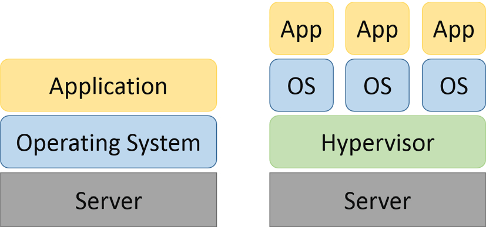

# Unit III: Virtualization in Cloud Computing

*   Virtualization in cloud computing allows a provider to virtualize servers,
    storage, or other physical hardware or data center resources, which can
    then, in turn, allow them to provide numerous services such as
    infrastructure, software, and platforms.

## Adopting Virtualization

*   Some users may confuse virtualization with cloud computing, but they’re not
    entirely the same.

    *   Virtualization is the creation of a virtual resource such as a server,
        desktop, operating system, file, storage space, or network to help
        businesses manage and scale workloads.

    *   Cloud computing is the sharing of resources, software, applications and
        data as a service. Together, the two can be used to provide even greater
        advantages.

*   Reasons to adopt virtualization:
    1.  Increased agility for the business
    2.  Better resource deployment
    3.  Greater operational efficiency
    4.  Enhanced security
    5.  Higher availability
    6.  Stronger disaster recovery
    7.  Improved quality of service
    8.  Reduced energy consumption
    9.  Preparation for the cloud

## Types of Virtualization

*   Types of Virtualization
    1.  Application Virtualization.
    2.  Network Virtualization.
    3.  Desktop Virtualization.
    4.  Storage Virtualization.
    5.  Server Virtualization.
    6.  Data virtualization.

*   [More Details](https://www.geeksforgeeks.org/virtualization-cloud-computing-types/)

## Virtualization architecture & software

### Virtualization architecture

*   A virtualization architecture is a conceptual model specifying the
    arrangement and interrelationships of the particular components involved in
    delivering a virtual -- rather than physical -- version of something, such
    as an operating system (OS), a server, a storage device or network
    resources.

    

    *Left: Traditional architecture | Right: Virtual architecture*

    [More
    Details](https://www.techtarget.com/whatis/definition/virtualization-architecture)

### Virtualization software

*   Virtualization software, also called hypervisor, allows a single host
    computer to create and run one or more virtual environments.

*   Virtualization software is most often used to emulate a complete computer
    system in order to allow a guest operating system to be run, for example
    allowing Linux to run as a guest on top of a PC that is natively running a
    Microsoft Windows operating system (or the inverse, running Windows as a
    guest on Linux).

*   Uses of virtualization software:
    1.  **Back up**: You can backup your entire operating system or server
        installation as a virtual OS.
    2.  **Run a different OS**: Let's say you want to try out Linux without
        having to install it on a physical hard drive.
    3.  **Run ancient apps**: Say an application you want to run only works on
        win8 and you're using win10 then instead of reinstalling an outdated OS on
        real hardware why not just install windows 8 in a VM.
    4.  **Look at dirty files**: Taking a look at malicious files might put your
        computer and your data at risk so it would be better to check it in a
        sandboxed environment.
    5.  **Using sandboxed browsers**: Hackers have successfully exploited all
        four of most popular browsers — Chrome, Internet Explorer, Firefox, and
        Safari. Browser plugins can be malicious too. In this case using a sandboxed
        browser like the TOR browser is safer.
    6.  **Try an application**: You just want to check if an application you
        wrote works well on multiple operating systems then using virtual machines
        would be more convenient as compared to installing on real hardware.

## Virtual Clustering

*   Virtual clusters are built with VMs installed at distributed servers from one or more physical clus-ters. The VMs in a virtual cluster are interconnected logically by a virtual network across several physical networks. Figure 3.18 illustrates the concepts of virtual clusters and physical clusters. Each virtual cluster is formed with physical machines or a VM hosted by multiple physical clusters. The virtual cluster boundaries are shown as distinct boundaries.

*   The provisioning of VMs to a virtual cluster is done dynamically to have the following interest-ing properties:
    *   The virtual cluster nodes can be either physical or virtual machines. Multiple VMs running with different OSes can be deployed on the same physical node.
    *   A VM runs with a guest OS, which is often different from the host OS, that manages the resources in the physical machine, where the VM is implemented.
    *   The purpose of using VMs is to consolidate multiple functionalities on the same server. This will greatly enhance server utilization and application flexibility.

*   [More Details](https://www.brainkart.com/article/Virtual-Clusters-and-Resource-Management_11343/)

## Virtual Applications

*   Virtual apps are applications that are optimized to run in a virtual
    environment. Simply put, a virtual app simply runs on a computer without
    being installed on it.

*   Remote apps are a popular virtual app delivery solution wherein the virtual
    applications installed on a server are delivered to users’ devices. These
    applications are not installed on the user’s device; instead, software
    called a client is installed on the device that connects to the server, and
    the application is presented as screenshots sent to the device.

*   ThinApp is an example of an agentless application virtualization solution,
    while Microsoft App-V represents an agent-based virtual app solution.
    Parallels Remote Application Server, Citrix, and VMware are the leading
    providers of application virtualization solutions in the market.

## Pitfalls of Virtualization

*Have added both pros and cons*

*   Pros
    1.  Cheaper
    2.  Predictable costs
    3.  reduced workload
    4.  Better uptime
    5.  Faster deployment of resources
    6.  Promotes digital entrepreneurship
    7.  Energy savings

*   Cons(pitfalls)
    1.  High implementation cost
    2.  Has limitations
    3.  Security risk
    4.  Availability issue
    5.  Scalability issue
    6.  Requires several links in a chain that must work together cohesively
    7.  Time consuming

## Grid, Cloud & Virtualization

### Grid Computing

*   Grid Computing can be defined as a network of computers working together to
    perform a task that would rather be difficult for a single machine. All
    machines on that network work under the same protocol to act as a virtual
    supercomputer.

*   The task that they work on may include analyzing huge datasets or simulating
    situations that require high computing power.

*   Computers on the network contribute resources like processing power and
    storage capacity to the network.

*   Grid computing is also called as "distributed computing." It links multiple
    computing resources (PC's, workstations, servers, and storage elements)
    together and provides a mechanism to access them.

*   The main advantages of grid computing are that it increases user
    productivity by providing transparent access to resources, and work can be
    completed more quickly.

### Cloud

*   "The cloud" refers to servers that are accessed over the Internet, and the
    software and databases that run on those servers. Cloud servers are located
    in data centers all over the world. By using cloud computing, users and
    companies do not have to manage physical servers themselves or run software
    applications on their own machines.

*   The cloud enables users to access the same files and applications from
    almost any device, because the computing and storage takes place on servers
    in a data center, instead of locally on the user device. This is why a user
    can log in to their Instagram account on a new phone after their old phone
    breaks and still find their old account in place, with all their photos,
    videos, and conversation history. It works the same way with cloud email
    providers like Gmail or Microsoft Office 365, and with cloud storage
    providers like Dropbox or Google Drive.

### Virtualization

*   Virtualization in cloud computing is defined as a creation of a virtual
    version of a server, a desktop, a storage device, an operating system, or
    network resources.

*   Virtualization in cloud computing allows a provider to virtualize servers,
    storage, or other physical hardware or data center resources, which can
    then, in turn, allow them to provide numerous services such as
    infrastructure, software, and platforms.

*   Virtualization is a technique, which allows to share a single physical
    instance of a resource or an application among multiple customers and
    organizations. It does by assigning a logical name to a physical storage and
    providing a pointer to that physical resource when demanded.

*   Types of Virtualization:

    [Refer Types of Virtualization section above](#types-of-virtualization)

### Virtualization in Grid

*   Whereas a grid has many systems in a network and hence multiple people can have ownership. Virtualization helps in providing cloud better security. Grid computing is more economical. It splits the work and distributes it over the network on computers increasing the efficiency as well.

*   Virtualization allows addressing multiple problems in Grid systems, such as
    coping with the heterogeneity of Grid resources, the difference in software
    stacks, and enhanced features in resource management such as more general
    check pointing or migration models. Adopting virtualization in smart ways
    gets us closer to real Grid computing with more flexibility in the type of
    applications and the resources to use.

*   Grid computing enables the virtualization of distributed computing resources suchas processing, network bandwidth,and storage capacity to create a single system image, granting users and applications seamless access to vast IT capabilities.

### Virtualization in Cloud

*   Virtualization plays a very important role in the cloud computing
    technology, normally in the cloud computing, users share the data present in
    the clouds like application etc, but actually with the help of
    virtualization users shares the Infrastructure.

*   The main usage of Virtualization Technology is to provide the applications
    with the standard versions to their cloud users, suppose if the next version
    of that application is released, then cloud provider has to provide the
    latest version to their cloud users and practically it is possible because
    it is more expensive.

*   To overcome this problem we use basically virtualization technology, By
    using virtualization, all severs and the software application which are
    required by other cloud providers are maintained by the third party people,
    and the cloud providers has to pay the money on monthly or annual basis.

*   Types of Virtualization in Cloud Computing:
    1.  Application Virtualization
    2.  Network Virtualization
    3.  Desktop Virtualization
    4.  Storage Virtualization
    5.  Server Virtualization
    6.  Data virtualization

### Virtualization and Cloud Security.

*   Cloud security, also known as cloud computing security, is a collection of
    security measures designed to protect cloud-based infrastructure,
    applications, and data. These measures ensure user and device
    authentication, data and resource access control, and data privacy
    protection. They also support regulatory data compliance. Cloud security is
    employed in cloud environments to protect a company's data from distributed
    denial of service (DDoS) attacks, malware, hackers, and unauthorized user
    access or use.

*   Types of clouds:

    1.  **Public clouds:** Public cloud services are hosted by third-party cloud
        service providers. A company doesn't have to set up anything to use the
        cloud, since the provider handles it all. Usually, clients can access a
        provider's web services via web browsers. Security features, such as access
        control, identity management, and authentication, are crucial to public
        clouds.

    2.  **Private clouds:** Private clouds are typically more secure than public
        clouds, as they're usually dedicated to a single group or user and rely on
        that group or user's firewall. The isolated nature of these clouds helps
        them stay secure from outside attacks since they're only accessible by one
        organization. However, they still face security challenges from some
        threats, such as social engineering and breaches. These clouds can also be
        difficult to scale as your company's needs expand.

    3.  **Hybrid clouds:** Hybrid clouds combine the scalability of public
        clouds with the greater control over resources that private clouds offer.
        These clouds connect multiple environments, such as a private cloud and a
        public cloud, that can scale more easily based on demand. Successful hybrid
        clouds allow users to access all their environments in a single integrated
        content management platform.

*   Cloud security is critical since most organizations are already using cloud
    computing in one form or another. This high rate of adoption of public cloud
    services is reflected in Gartner’s recent prediction that the worldwide
    market for public cloud services will grow 23.1% in 2021.

*   Virtualized security, or security virtualization, refers to security
    solutions that are software-based and designed to work within a virtualized
    IT environment. This differs from traditional, hardware-based network
    security, which is static and runs on devices such as traditional firewalls,
    routers, and switches.

## Virtualization and Cloud Computing

### Anatomy of Cloud Infrastructure

*   Anatomy of Cloud Computing

    *   **Provisioning and Configuration Module:** It is the lowest level of
        cloud and typically resides on bare hardware (as a firmware) or on the
        top of the hypervisor layer. Its function is to abstract the underlying
        hardware and provide a standard mechanism to spawn instance of virtual
        machine on demand. It also handles the post-configuration of the
        operating systems and applications residing on the VM

    *   **Monitoring and Optimization:** This layer handles the monitoring of
        all services, storage, networking and applications components in cloud.
        Based on the statistics, it could perform routine functions that
        optimize the behavior of the infrastructure components and provide
        relevant data to the cloud administrator to further optimize the
        configuration for maximum utilization and performance,

    *   **Metering and Chargeback:** This layer provides functions to measure
        the usage of resources in cloud. The metering module collects all the
        utilization data per domain per use. This module gives the cloud
        administrator enough data to measure ongoing utilization of resources
        and to create invoices based on the usage on a periodic basis.

    *   **Orchestration:** Orchestration is a central to cloud operations.
        Orchestration converts requests from the service management layer and
        the monitoring, chargeback modules to appropriate action item which are
        then submitted to provisioning and configuration module for final
        closure. Orchestration updates the CMDB in the process.

    *   **Configuration Management Database (CMDB):** It is a central
        configuration repository wherein all the meta data and configuration of
        different modules, resources are kept and updated in the real-time
        basis. The repository can then be accessed using standards protocols
        like SOAP by third-party software and integration components. All
        updates in CMDB happen in real time as requests get processed in cloud.

    *   **Cloud Life cycle Management Layer (CLM):** This layer handles the
        coordination of all other layers in cloud. All requests internal and
        external are addressed to the CLM layer first. CLM may internally route
        requests and actions to other layers for further processing.

    *   **Service Catalog:** It is central to the definition of cloud, SC
        defines what kind of services the cloud is capable of providing and at
        what cost to the end user. SC is the first thing that is drafted before
        a cloud is architecture. The service management layer consults SC before
        it processes any request for a new resource.

### Virtual infrastructures

*   A virtual infrastructure allows you to utilise the IT capabilities of
    physical resources as software that can be used across multiple platforms.
    These resources are shared across multiple virtual machines (VMs) and
    applications for maximum efficiency, creating a virtual infrastructure.

*   Benefits of virtual infrastructure
    *   **Cost savings:** By consolidating servers, virtualization reduces
        capital and operating costs associated with variables such as electrical
        power, physical security, hosting and server development.
    *   **Scalability:** A virtual infrastructure allows organizations to react
        quickly to changing customer demands and market trends by ramping up on
        CPU utilization or scaling back accordingly.
    *   **Increased productivity:** Faster provisioning of applications and
        resources allows IT teams to respond more quickly to employee demands
        for new tools and technologies.
    *   **Simplified server management:** Simplified server management makes
        sure IT teams can spin up, or down, virtual machines when required and
        re-provision resources based on real-time needs.

*   [More
    Details](https://www.vmware.com/topics/glossary/content/virtual-infrastructure.html)

### CPU Virtualization

*   CPU Virtualization is a hardware feature found in all current AMD & Intel
    CPUs that allows a single processor to act as if it was multiple individual
    CPUs.This allows an operating system to more effectively & efficiently
    utilize the CPU power in the computer so that it runs faster.

*   CPU Virtualization emphasizes performance, running apps/programs, and runs
    directly on the processor whenever possible. All operations are controlled
    by an emulator that controls software to run accordingly, CPU Virtualisation
    is not the same as emulation. The emulator works the same as a normal
    computer machine does, it makes a copy of data and generates the same output
    as a physical machine does. The emulation function gives a feeling of
    working on multiple platforms while being on a single platform.

*   CPU Virtualization helps all the virtual machines to behave like physical
    machines and distribute their physical resources like virtual machines
    sharing their physical memories.

*   CPU Virtualization improves performance and efficiency to a greater extent
    because virtual machines work on a single CPU, sharing resources is actually
    like using multiple processors at the same time. This saves Cost and Money.

*   Types of CPU Virtualization:
    1.  **Hardware-assisted CPU Virtualization :** Hardware supports CPU
        Virtualization through certain processors like Guest User. This Uses
        different versions of code and the mode is known as a Guest mode. The best
        part of hardware-assisted CPU Virtualization is, it doesn’t need any
        translation while we use it for Hardware assistance. In short, it uplifts
        system calls and makes them run faster than expected.

    2.  **Software-based CPU Virtualization :** This type of CPU Virtualization
        is software-based and it helps application code to get executed on a
        processor. First, the privileged code gets translated, and then translated
        code is directly executed on the processor. This translation process is
        known as Binary Translation. The translated code is slow in execution and is
        very large at the same time. Guest programs that are programmed in
        privileged coding run very smoothly and fast. Applications with privileged
        coding would run slower comparatively in a virtual environment.

    3.  **Virtualization and Processor-Specific behavior:** Although this
        software virtualizes the CPU, the virtual machine can detect the model of a
        processor on which it is running, processor models may differ in CPU
        features they offer and applications running on these CPUs may use these
        features. Therefore it is not possible to use v motion to transfer virtual
        machines running on processors with different feature sets.

### Network and Storage Virtualization.

#### Network Virtualization

Network virtualization is a method of combining the available resources in a
network to consolidate multiple physical networks, divide a network into
segments or create software networks between virtual machines (VMs).

[Refer virtualization section for more](#virtualization)

#### Storage Virtualization

Storage virtualization in Cloud Computing is nothing but the sharing of physical
storage into multiple storage devices which further appears to be a single
storage device. It can be also called as a group of an available storage device
which simply manages from a central console.

[Refer virtualization section for more](#virtualization)
