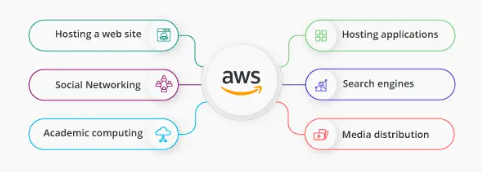
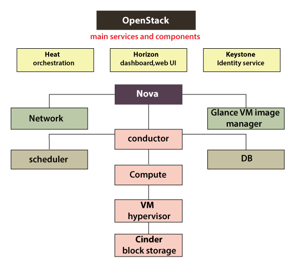

Unit IV: Cloud Platforms and Cloud Applications

## Amazon Web Services (AWS): Amazon Web Services and Components

*   Amazon Web Services, Inc. is a subsidiary of Amazon that provides on-demand
    cloud computing platforms and APIs to individuals, companies, and
    governments, on a metered pay-as-you-go basis. These cloud computing web
    services provide distributed computing processing capacity and software
    tools via AWS server farms.

### AWS Services

*   Amazon Web Services offer the following services for various computing
    purposes:
    1.  Hosting a web site
    2.  Social networking
    3.  Academic computing
    4.  Sharing media
    5.  Hosting applications
    6.  Backup, storage, and disaster recovery
    7.  Media distribution and content delivery
    8.  Developing and testing environments
    9.  Search engines

### AWS Components

1.  **Data Management and Data Transfer:** To run HPC applications in the AWS
    cloud, you need to move the required data into the cloud. There are several data
    transport solutions designed to securely transfer huge amounts of data. This
    overcomes issues like a long time for transfer, high network costs, and security
    concerns. Also, you can automate the movement of data between the AWS cloud and
    on-premises storage. There are options for establishing a private connection to
    the AWS from your premises. This increases bandwidth to provide more throughput,
    reduces the cost of the network, and provides a consistent network experience.

2.  **Compute & Networking:** There are several compute instances types that can
    be customized according to your needs. It also handles monitoring your
    application and adjusting its capacity for maintaining a steady and predictable
    performance at an affordable cost. Also, setting up application scaling across
    multiple services for multiple resources takes a few minutes. Enhanced
    networking options from AWS allow achieving lower inter-instance latency and
    higher bandwidth.

3.  **Storage:** When looking for an HPC solution, you need to consider the
    storage options and cost. There are several flexible blocks, object, and file
    storage options in AWS services that allow permanent and transient data storage.
    It allows allocating storage volumes according to the size you need. You can
    store and access and data type over the cloud without doing a data migration
    project. Also, with AWS services, you can transfer your workload to the cloud
    from on-premises.

4.  **Automation and Orchestration:** For using the infrastructure efficiently,
    you need to automate scheduling submitted jobs and the job submission process.
    AWS services allow you to run thousands of batch computing jobs through the
    dynamic provision of the computer resources on the basis of the requirements.

5.  **Operations and Management:** As a system administrator, you are
    responsible for avoiding cost overruns and monitoring the infrastructure. There
    are several management and monitoring services that allow you to optimize
    utilization of resources, monitor the application, get a complete view of
    operational health, and respond to the performance changes.

6.  **Visualization:** With the AWS services, you can easily visualize the
    engineering simulations’ results without moving huge amounts of data. Now, you
    can access the interactive applications remotely over a standard network and
    deliver application sessions to any workstation.

7.  **Security and Compliance:** For running applications on the cloud, you need
    to have an understanding of regulatory compliance and security management. There
    are several quick-launch templates and security related services offered by AWS
    that helps in protecting data and customer privacy by putting strong safeguards
    in the AWS infrastructure.

### Amazon Simple DB

*   Amazon SimpleDB is a distributed database written in Erlang by Amazon.com.
    It is used as a web service in concert with Amazon Elastic Compute Cloud and
    Amazon S3 and is part of Amazon Web Services.

*   [More Details](https://aws.amazon.com/simpledb/)

### Elastic Cloud Computing (EC2)

*   Amazon Elastic Compute Cloud is a part of Amazon.com's cloud-computing
    platform, Amazon Web Services, that allows users to rent virtual computers
    on which to run their own computer applications.

*   [More Details](https://aws.amazon.com/ec2/)

### Amazon Storage System

*   Amazon Simple Storage Service (Amazon S3) is an object storage service that
    offers industry-leading scalability, data availability, security, and
    performance.

*   [More Details](https://aws.amazon.com/products/storage/)

### Amazon Database services (Dynamo DB).

*   Amazon DynamoDB is a fully managed proprietary NoSQL database service that
    supports key–value and document data structures and is offered by Amazon.com
    as part of the Amazon Web Services portfolio. DynamoDB exposes a similar
    data model to and derives its name from Dynamo, but has a different
    underlying implementation.

*   [More Details](https://aws.amazon.com/dynamodb/)

## Microsoft Cloud Services

*   Microsoft Azure, often referred to as Azure, is a cloud computing service
    operated by Microsoft for application management via Microsoft-managed data
    centers.

### Azure core concepts

| Concept Name        | Description                                                                                                                                                                                                                                                           |
|---------------------|-----------------------------------------------------------------------------------------------------------------------------------------------------------------------------------------------------------------------------------------------------------------------|
| **Regions**         | Azure is a global cloud platform which is available across various regions around the world. When you request a service, application, or VM in Azure, you are first asked to specify a region. The selected region represents datacenter where your application runs. |
| **Datacenter**      | In Azure, you can deploy your applications into a variety of data centers around the globe. So, it is advisable to select a region which is closer to most of your customers. It helps you to reduce latency in network requests.                                     |
| **Azure portal**    | The Azure portal is a web-based application which can be used to create, manage and remove Azure resource and services. It is located at https://portal.azure.com.                                                                                                    |
| **Resources**       | Azure resource is an individual computer, networking data or app hosting services which charged individually. Some common resources are virtual machines( VM), storage account, or SQL databases.                                                                     |
| **Resource groups** | An Azure resource group is a container which holds related resource for an Azure solution. It may include every resource or just resource which you wants to manage. |
| **Resource Manager templates**                                                                                                                                                                                                                                        | It is a JSON which defines one or more resource to deploy to a resource group. It also establishes dependencies between deployed resources. |
| **Automation:**                                                                                                                                                                                                                                                       | Azure allows you to automate the process of creating, managing and deleting resource by using PowerShell or the Azure command-line Interface(CLI). |
| **Azure PowerShell**                                                                                                                                                                                                                                                  | PowerShell is a set of modules that offer cmdlets to manage Azure. In most cases, you are allowed to use, the cmdlets command for the same tasks which you are performing in the Azure portal. |
| **Azure command-line interface(CLI)**                                                                                                                                                                                                                                 | The Azure CLI is a tool that you can use to create, manage, and remove Azure resources from the command line. |
| **REST APIs**                                                                                                                                                                                                                                                         | Azure is built on a set of REST APIs help you perform the same operation that you do in Azure portal Ul. It allows your Azure resources and apps to be manipulated via any third party software application. |

### SQL Azure

*   Microsoft Azure SQL Database is a managed cloud database provided as part of
    Microsoft Azure. A cloud database is a database that runs on a cloud
    computing platform, and access to it is provided as a service. Managed
    database services take care of scalability, backup, and high availability of
    the database.

*   [More
    Details](https://docs.microsoft.com/en-us/azure/azure-sql/database/sql-database-paas-overview?view=azuresql)

### Windows Azure Platform Appliance.

*   The Windows Azure Platform Appliance consists of Windows Azure, SQL Azure
    and a Microsoft-specified configuration of network, storage and server
    hardware. Service providers, governments and large enterprises who would,
    for example, invest in a 1000 servers at a time, will be able to deploy the
    Windows Azure platform on their own hardware in their datacenter.
    Microsoft Windows Azure Platform Appliance is optimized for scale out
    applications - such as eBay- and datacenter efficiency across hundreds to
    thousands to tens-of-thousands servers.

*   [More
    Details](https://azure.microsoft.com/en-in/blog/just-announced-at-wpc-the-windows-azure-platform-appliance/)

## Cloud Computing Applications:

*   Cloud service providers provide various applications in the field of art,
    business, data storage and backup services, education, entertainment,
    management, social networking, etc.

*   [More Details](https://www.javatpoint.com/cloud-computing-applications)

### Healthcare

#### ECG Analysis in the Cloud

*   **ECG analysis in cloud computing**: cloud computing technologies allows the
    remote monitoring of a patient's heart beat data. Through this way the
    patient at risk can be constantly monitored without going to the hospital
    for ECG analysis. At the same time the Doctor's can instantly be notified
    with cases that need's their attention.

### Biology

#### Protein Structure Prediction

*   Cloud computing is an emerging technology that provides various computing
    services on demand. It provides convenient access to a shared pool of
    higher-level services and other system resources. Nowadays, cloud computing
    has a great significance in the fields of geology, biology, and other
    scientific research areas.

*   Protein structure prediction is the best example in research area that makes
    use of cloud applications for its computation and storage.

*   A protein is composed of long chains of amino acids joined together by
    peptide bonds. The various structures of protein help in the designing of
    new drugs and the various sequences of proteins from its three-dimensional
    structure in predictive form is known as a Protein structure prediction.

*   Firstly primary structures of proteins are formed and then prediction of the
    secondary, tertiary and quaternary structures are done from the primary one.
    In this way predictions of protein structures are done. Protein structure
    prediction also makes use of various other technologies like artificial
    neural networks, artificial intelligence, machine learning and probabilistic
    techniques, also holds great importance in fields like theoretical chemistry
    and bioinformatics.

*   There are various algorithms and tools that exists for protein structure
    prediction. CASP (Critical Assessment of Protein Structure Prediction) is a
    well-known tool that provides methods for automated web servers and the
    results of research work are placed on clouds like CAMEO (Continuous
    Automated Model Evaluation) server. These servers can be accessed by anyone
    as per their requirements from any place. Some of the tools or servers used
    in protein structure prediction are Phobius, FoldX, LOMETS, Prime, Predict
    protein, SignalP, BBSP, EVfold, Biskit, HHpred, Phre, ESyired3D. Using these
    tools new structures are predicted and the results are placed on the
    cloud-based servers.

### Geosciences

*   Earth science or geoscience includes all fields of natural science related
    to the planet Earth.

#### Satellite Image Processing,

*   Satellite Image Processing is an important field in research and development
    and consists of the images of earth and satellites taken by the means of
    artificial satellites. Firstly, the photographs are taken in digital form
    and later are processed by the computers to extract the information.
    Statistical methods are applied to the digital images and after processing
    the various discrete surfaces are identified by analyzing the pixel values.

*   Majorly there are four kinds of resolutions associated with satellite
    imagery. These are:

    *   **Spatial resolution:** It is determined by the sensors Instantaneous
        Field of View(IFoV) and is defined as the pixel size of an image that is
        visible to the human eye being measured on the ground. Since it has high
        resolving power or the ability to separate and hence is termed as
        Spatial Resolution.
    *   **Spectral resolution:** This resolution measures the wavelength
        internal size and determines the number of wavelength intervals that the
        sensor measures.
    *   **Temporal resolution:** The word temporal is associated with time or
        days and is defined as the time that passes between various imagery
        cloud periods.
    *   **Radiometric resolution:** This resolution provides the actual
        characteristics of the image and is generally expressed in bits size. It
        gives the effective bit depth and records the various levels of
        brightness of imaging system.

### Business and Consumer Applications

#### CRM and ERP

*   CRM (Customer Relationship Management) and ERP (Enterprise Resource
    Planning) software are powerful tools for a business or enterprise to use.
    CRM handles the sales, marketing, and customer service information.

*   [More
    Details](https://www.netsuite.com/portal/resource/articles/erp/erp-vs-crm.shtml)

#### Social Networking

*   Social networks help boost internet usability by storing heavy multimedia
    content in cloud storage systems. Videos and photographs are the most
    popular content on social media, which essentially use up the maximum space
    allocated to them. They have the capacity to slow down applications and
    servers with all of their resource demands. Cloud computing vendors such as
    Salesforce and Amazon nowadays provide varied services including Customer
    Relationship Management (CRM) and Enterprise Resource Planning (ERP). As
    they deliver these things through cloud servers, clients can use the
    flexibility and scalability of the system without purchasing standalone
    software or hardware.

*   Apart from data storage, the social networks are now also using clouds for
    various other tasks. For example, this can be ideal for big data analytics.
    One of the benefits of using cloud systems is that users can access vast
    amount of structured and even non-structured data easily. Just take a look
    at the much-improved analytics provided by sites like Facebook, especially
    for its business users.

*   Another way cloud computing becomes helpful is by reducing the cost of data
    backup and recovery in case of a disaster. If the data is only stored in one
    central location, it becomes much riskier. If something happens there, it is
    almost impossible to recover the data. But through cloud they remain
    accessible through shared resources across the globe. This is especially
    useful for social networks as the store personal data of its users, and so
    cannot afford to lose even one part of it.

### Google Cloud Application

*   Google Cloud Platform, offered by Google, is a suite of cloud computing
    services that runs on the same infrastructure that Google uses internally
    for its end-user products, such as Google Search, Gmail, Google Drive, and
    YouTube.

#### Google App Engine.

*   Google App Engine is a cloud computing platform as a service for developing
    and hosting web applications in Google-managed data centers. Applications
    are sandboxed and run across multiple servers.

*   [More
    Details](https://www.techtarget.com/searchaws/definition/Google-App-Engine)

## Overview of OpenStack architecture.

*   OpenStack is a free, open standard cloud computing platform. It is mostly
    deployed as infrastructure-as-a-service in both public and private clouds
    where virtual servers and other resources are made available to users.

*   OpenStack contains a modular architecture along with several code names for
    the components.

*   [More Details](https://www.javatpoint.com/openstack-architecture)
