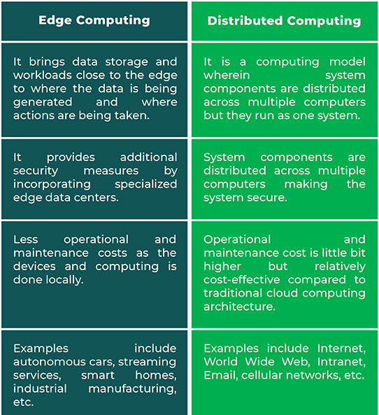

# Unit VI Advanced Techniques in Cloud Computing

## Future Trends in Cloud Computing

1.  **Hybrid/ Multi-Cloud Solutions:** Hybrid cloud computing refers to using a
    combination of the private cloud as well as a third-party public cloud
    service. It is primarily used to allow workloads to move between private and
    public clouds, giving users more flexibility with their computing needs.

2.  **Backup And Disaster Recovery:** Cyber attacks, data outages, and system
    failures are a part and parcel of running a business these days. Most
    businesses have dealt with their servers crashing, leading to loss of
    critical data files. To ensure such issues don’t damage the organization and
    its processes, backup and disaster recovery has become a trending use case
    of the cloud. If Spiceworks reports are to be believed, 15% of the cloud
    budget is allocated to Backup and Disaster Recovery, which is the highest
    budget allocation followed by email hosting and productivity tools.

3.  **Serverless Architecture:** A serverless architecture removes all barriers
    that a standard IT infrastructure would usually bring. Users don’t have to
    purchase or rent the servers that they run their data on. Instead, a
    third-party will handle it all for you, allowing your organization to tackle
    other tasks.

4.  **AI Platform:** As technology advances, one of the most common cloud
    computing trends to look forward to is AI. Tech giants are now looking into
    incorporating AI to process big data to improve their business functioning.

5.  **Cloud Security:** Data theft, leakage, and deletion- security is a big
    challenge even for traditional IT infrastructures. But, with more companies
    moving to cloud platforms, it’s important to ensure that cloud service
    providers can create an airtight security system to guarantee the safety of
    their client’s data.

6.  **IoT Platform:** With a hyper-connected world, one of the most popular
    cloud computing trends is the rise of IoT platforms. A study by Gartner
    suggests the number of connected things in use will be going up to 25
    billion by 2021 from 14.2 billion as of 2019.

7.  **Edge Computing:** It is a method of optimizing cloud computing network
    system by performing data processing at the edge of the network, near the
    source of the data. It works real-time on the cloud servers to process less
    time-sensitive data or store data for the long term.

8.  **DevSecOps:** Cloud computing services provide users with a seamless and
    simple experience in managing their data but there are many security risks
    involved.  The security risk of cloud computing includes network
    eavesdropping, illegal invasion, denial of service attacks, side channel
    attacks, virtualization vulnerabilities, and abuse of cloud services.

9.  **Service Mesh:** Since cloud platforms are complex, it is critical to
    ensure that the platform has a fast and safe communication environment. With
    a service mesh, users have a dedicated layer for service-to-service
    communication, making their cloud platform highly dynamic and secure.

10. **Open Source:** This industry is moving towards a path of innovation and
    collaboration. With this shift in how cloud services are managed, many
    organizations are looking at adopting an Open Source cloud computing service
    for their business.

## Mobile Cloud

*   Mobile cloud computing uses cloud computing to deliver applications to
    mobile devices. These mobile apps can be deployed remotely using speed and
    flexibility and development tools. Mobile cloud applications can be built or
    revised quickly using cloud services. They can be delivered to many
    different devices with different operating systems, computing tasks, and
    data storage. Thus, users can access applications that could not otherwise
    be supported.

*   Key features:
    *   Facilitates the quick development, Shared resources of mobile apps.
    *   Supports a variety of development approaches and devices.
    *   Improves reliability with information backed up and stored in the cloud.
    *   Applications use fewer device resources because they are
        cloud-supported.
    *   Mobile devices are connected to services delivered on an API
        architecture.

*   [More
    Details](https://www.ibm.com/cloud/learn/what-is-mobile-cloud-computing)

## Automatic Cloud Computing

*   Cloud automation is a broad term that refers to processes and tools that
    reduce or eliminate manual efforts used to provision and manage cloud
    computing workloads and services. Organizations can apply cloud automation
    to private, public and hybrid cloud environments.

*   Benefits:
    *   Improved security and resilience
    *   Improved backup processes
    *   Improved governance

*   [More
    Details](https://cloud.netapp.com/blog/cloud-automation-why-where-and-how-cvo-blg)

### Comet Cloud

*   COMET Cloud is an Internet data storage designed for recording measured
    values from selected COMET measuring instruments. The data is accessible
    after the user's connection to the Internet and is displayed in a web
    browser in the form of a table or graph.

*   Main features of COMETCloud
    *   display of measured values in the form of a table or graph
    *   comparison of measured values of several sensors in one time period
    *   storing GPS coordinates for the device position and displaying all
        devices on a map
    *   user-friendly display of measured values in an embedded image of a
        building or technology diagram
    *   user name of each device
    *   insert a note for each device

*   [More
    Details](https://www.cometsystem.com/reg-cloud)

## Multimedia Cloud

*   Cloud Computing opened the opportunity for media operators who serve content
    providers, IPTV (Internet Protocol Television) operators and multimedia
    players. When we consider multimedia players, adopting cloud computing is
    often one of the important priorities in the coming years. Some media
    players, for example, companies like media post-production, already utilize
    these kinds of cloud computing–based service capabilities for managing the
    digital delivery.

*   In the future, multimedia companies will use cloud computing first, who
    started looking to move their storage requirements into cloud computing. The
    cost and the investment return for these kinds of services have accelerated.

### IPTV

*   Internet Protocol television (IPTV) is the delivery of television content
    over Internet Protocol (IP) networks. This is in contrast to delivery
    through traditional terrestrial, satellite, and cable television formats.
    Unlike downloaded media, IPTV offers the ability to stream the source media
    continuously. As a result, a client media player can begin playing the
    content (such as a TV channel) almost immediately. This is known as
    streaming media.

*   [More Details](https://en.wikipedia.org/wiki/Internet_Protocol_television)

## Energy Aware Cloud Computing

*   Cloud infrastructures are increasingly becoming essential components for
    providing Internet services. By benefiting from economies of scale, Clouds
    can efficiently manage and offer a virtually unlimited number of resources
    and can minimize the costs incurred by organizations when providing Internet
    services. However, as Cloud providers often rely on large data centres to
    sustain their business and offer the resources that users need, the energy
    consumed by Cloud infrastructures has become a key environmental and
    economical concern.

*   Implementing efficient techniques, frameworks, etc. for better energy
    efficiency in cloud computing is called "Energy Aware Cloud Computing".

*   [More
    Details](https://www.researchgate.net/publication/324029239_Energy-aware_cloud_computing)

## Jungle Computing

*   Jungle computing is a form of high performance computing that distributes
    computational work across cluster, grid and cloud computing.

*   The increasing complexity of the high performance computing environment has
    provided a range of choices beside traditional supercomputers and clusters.
    Scientists can now use grid and cloud infrastructures, in a variety of
    combinations along with traditional supercomputers - all connected via fast
    networks. And the emergence of many-core technologies such as GPUs, as well
    as supercomputers on chip within these environments has added to the
    complexity. Thus, high-performance computing can now use multiple diverse
    platforms and systems simultaneously, giving rise to the term "computing
    jungle".

## Distributed Cloud Computing Vs Edge Computing

*   A distributed cloud is an architecture where multiple clouds are used to
    meet compliance needs, performance requirements, or support edge computing
    while being centrally managed from the public cloud provider.

*   In essence, a distributed cloud service is a public cloud that runs in
    multiple locations, including:
    *   The public cloud provider’s infrastructure
    *   The public cloud provider’s infrastructure
    *   In another cloud provider’s data center
    *   On third party or colocation center hardware

*   **Edge vs Distributed Computing:**

    

## Containers

*   Containers are lightweight packages of your application code together with
    dependencies such as specific versions of programming language runtimes and
    libraries required to run your software services.

*   Containers are packages of software that contain all of the necessary
    elements to run in any environment. In this way, containers virtualize the
    operating system and run anywhere, from a private data center to the public
    cloud or even on a developer’s personal laptop.

*   Containers make it easy to share CPU, memory, storage, and network resources
    at the operating systems level and offer a logical packaging mechanism in
    which applications can be abstracted from the environment in which they
    actually run.

*   Benefits Of Containers:
    *   **Separation of responsibility:** Containerization provides a clear
        separation of responsibility, as developers focus on application logic
        and dependencies, while IT operations teams can focus on deployment and
        management instead of application details such as specific software
        versions and configurations.

    *   **Workload portability:** Containers can run virtually anywhere, greatly
        easing development and deployment: on Linux, Windows, and Mac operating
        systems; on virtual machines or on physical servers; on a developer’s
        machine or in data centers on-premises; and of course, in the public
        cloud.

    *   **Application isolation:** Containers virtualize CPU, memory, storage,
        and network resources at the operating system level, providing
        developers with a view of the OS logically isolated from other
        applications.

*   [More Details](https://cloud.google.com/learn/what-are-containers)

## Docker

*   Docker is a set of platform as a service products that use OS-level
    virtualization to deliver software in packages called containers. The
    service has both free and premium tiers. The software that hosts the
    containers is called Docker Engine.

*   [More Details](https://www.docker.com/resources/what-container/)

## Kubernetes

*   Kubernetes is an open-source container orchestration system for automating
    software deployment, scaling, and management. Google originally designed
    Kubernetes, but the Cloud Native Computing Foundation now maintains the
    project.

*   [More Details](https://kubernetes.io/docs/concepts/overview/)

## Introduction to DevOps

*   DevOps is the combination of cultural philosophies, practices, and tools
    that increases an organization's ability to deliver applications and
    services at high velocity: evolving and improving products at a faster pace
    than organizations using traditional software development and infrastructure
    management processes.

*   A DevOps engineer introduces processes, tools, and methodologies to balance
    needs throughout the software development life cycle, from coding and
    deployment, to maintenance and updates.

*   [More
    Details](https://aws.amazon.com/devops/what-is-devops/)

## IoT and Cloud Convergence

*   The Internet of things describes physical objects with sensors, processing
    ability, software, and other technologies that connect and exchange data
    with other devices and systems over the Internet or other communications
    networks.

*   The field has evolved due to the convergence of multiple technologies,
    including ubiquitous computing, commodity sensors, increasingly powerful
    embedded systems, and machine learning.

*   [More Details](https://en.wikipedia.org/wiki/Internet_of_things)

### The Cloud and IoT in your Home

*   **Home cloud computing** is the process of using a remote server to store,
    manage and access data and applications from home. It allows users to access
    their files, applications, and other digital content from any device with an
    internet connection, whether it be a computer, phone, or tablet. Private
    cloud computing can also be used to back up data and protect the information
    in case of emergencies.

*   A lot of individuals and small businesses use home/private cloud computing
    to browse, search through files and even work on projects from any device.
    It’s a great alternative to setting up a server in your house because it
    eliminates the need for physical storage devices that contain data.

*   [More about home cloud
    computing](https://www.eiresystems.com/importance-of-home-cloud-computing/)

*   **IoT home** automation is the ability to control domestic appliances by
    electronically controlled, internet-connected systems. It may include
    setting complex heating and lighting systems in advance and setting alarms
    and home security controls, all connected by a central hub and
    remote-controlled by a mobile app.

*   [More about Home
    IoT](https://www.toptal.com/designers/interactive/smart-home-domestic-internet-of-things)

### The IoT and cloud in your Automobile

#### IoT in Automobile

*   “Automotive IoT” refers to the integration of such components as sensors,
    gadgets, clouds, and apps into vehicles and their use as a complex system
    for predictive maintenance, connection of cars, fleet management, etc.

*   Implementation of the Internet of Things for cars’ manufacturing brought the
    following benefits for the producers:
    *   better data collection and analysis with the following improvement and
        speed up of the whole manufacturing process;
    *   avoidance of certain risks and financial losses;
    *   higher industrial safety standards;
    *   equipment theft monitoring, etc.

#### Cloud in Automobile

*   The way we interact with our car changed entirely in a few decades.
    Nowadays, cloud technology in cars is present in several ways. For example,
    most electric cars can exchange information with remote data centers to
    inform the driver about the road and weather conditions.

*   The cloud technology in cars has a lot of possibilities. It is uniquely
    suited to set up, scale, manage and update features and services efficiently
    with a connected unit.

*   Automobile companies develop and adapt their connectivity software
    continuously to allow their customers a better interaction between the
    cloud, the car, and smartphones using infotainment as the primary interface.

### PERSONAL

*   A personal cloud is a collection of digital content and services which are
    accessible from any device. The personal cloud is not a tangible entity. It is
    a place which gives users the ability to store, synchronize, stream and share
    content on a relative core, moving from one platform, screen and location to
    another.

*   [More
    Details](https://en.wikipedia.org/wiki/Personal_cloud)

#### IoT in Healthcare

*   IoT explores new dimensions of patient care through real-time health
    monitoring and access to patients' health data. This data is a goldmine for
    healthcare stakeholders to improve patient's health and experiences while
    making revenue opportunities and improving healthcare operations.

*   [More
    Details](https://www.wipro.com/business-process/what-can-iot-do-for-healthcare-/)
