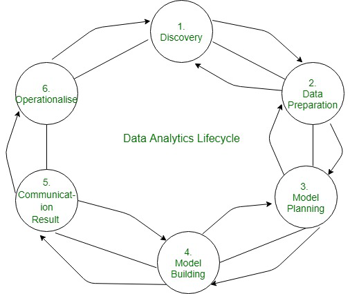

# Unit III: Big Data Analytics Life Cycle

## Introduction to Big Data

Big data refers to data sets that are too large or complex to be dealt with by
traditional data-processing application software. Data with many fields offer
greater statistical power, while data with higher complexity may lead to a
higher false discovery rate.

*   Five Vs of big data:

    1.  **Volume:**	The amount of data matters. With big data, you’ll have to
        process high volumes of low-density, unstructured data. This can be data of
        unknown value, such as Twitter data feeds, clickstreams on a web page or a
        mobile app, or sensor-enabled equipment. For some organizations, this might
        be tens of terabytes of data. For others, it may be hundreds of petabytes.

    2.  **Velocity:**	Velocity is the fast rate at which data is received and
        (perhaps) acted on. Normally, the highest velocity of data streams directly
        into memory versus being written to disk. Some internet-enabled smart
        products operate in real time or near real time and will require real-time
        evaluation and action.

    3.  **Variety:**	Variety refers to the many types of data that are
        available. Traditional data types were structured and fit neatly in a
        relational database. With the rise of big data, data comes in new
        unstructured data types. Unstructured and semistructured data types, such as
        text, audio, and video, require additional preprocessing to derive meaning
        and support metadata.

    4.  **Veracity:** It refers to inconsistencies and uncertainty in data, that
        is data which is available can sometimes get messy and quality and accuracy
        are difficult to control. Big Data is also variable because of the multitude
        of data dimensions resulting from multiple disparate data types and sources.
        Example: Data in bulk could create confusion whereas less amount of data
        could convey half or Incomplete Information.

    5.  **Value:** After having the 4 V’s into account there comes one more V
        which stands for Value!. The bulk of Data having no Value is of no good to
        the company, unless you turn it into something useful. Data in itself is of
        no use or importance but it needs to be converted into something valuable to
        extract Information. Hence, you can state that Value! is the most important
        V of all the 5V’s.

*   Big data benefits:
    *   Big data makes it possible for you to gain more complete answers because
        you have more information.
    *   More complete answers mean more confidence in the data—which means a
        completely different approach to tackling problems.

## Sources of Big Data

The bulk of big data generated comes from three primary sources: social data,
machine data and transactional data. In addition, companies need to make the
distinction between data which is generated internally, that is to say it
resides behind a company’s firewall, and externally data generated which needs
to be imported into a system. Whether data is unstructured or structured is also
an important factor. Unstructured data does not have a pre-defined data model
and therefore requires more resources to make sense of it.

*   The three primary sources of  Big Data

    *   **Social data** comes from the Likes, Tweets & Retweets, Comments, Video
        Uploads, and general media that are uploaded and shared via the world’s
        favorite social media platforms. This kind of data provides invaluable
        insights into consumer behavior and sentiment and can be enormously
        influential in marketing analytics. The public web is another good
        source of social data, and tools like Google Trends can be used to good
        effect to increase the volume of big data.

    *   **Machine data** is defined as information which is generated by
        industrial equipment, sensors that are installed in machinery, and even
        web logs which track user behavior. This type of data is expected to
        grow exponentially as the internet of things grows ever more pervasive
        and expands around the world. Sensors such as medical devices, smart
        meters, road cameras, satellites, games and the rapidly growing Internet
        Of Things will deliver high velocity, value, volume and variety of data
        in the very near future.

    *   **Transactional data** is generated from all the daily transactions that
        take place both online and offline. Invoices, payment orders, storage
        records, delivery receipts – all are characterized as transactional data
        yet data alone is almost meaningless, and most organizations struggle to
        make sense of the data that they are generating and how it can be put to
        good use.

## Data Analytic Lifecycle:

The Data analytic lifecycle is designed for Big Data problems and data science
projects. The cycle is iterative to represent real project. To address the
distinct requirements for performing analysis on Big Data, step – by – step
methodology is needed to organize the activities and tasks involved with
acquiring, processing, analyzing, and repurposing data.

*   There are six phases in Data Analytics Lifecycle:

    

    1.  **Discovery:** The data science team learn and investigate the problem.
        Develop context and understanding. Come to know about data sources needed
        and available for the project. The team formulates initial hypothesis that
        can be later tested with data.
    2.  **Data Preparation:** Steps to explore, preprocess, and condition data
        prior to modeling and analysis. It requires the presence of an analytic
        sandbox, the team execute, load, and transform, to get data into the
        sandbox. Data preparation tasks are likely to be performed multiple times
        and not in predefined order. Several tools commonly used for this phase are
        – Hadoop, Alpine Miner, Open Refine, etc.
    3.  **Model Planning:** Team explores data to learn about relationships
        between variables and subsequently, selects key variables and the most
        suitable models. In this phase, data science team develop data sets for
        training, testing, and production purposes. Team builds and executes models
        based on the work done in the model planning phase. Several tools commonly
        used for this phase are – Matlab, STASTICA.
    4.  **Model Building:** Team develops datasets for testing, training, and
        production purposes. Team also considers whether its existing tools will
        suffice for running the models or if they need more robust environment for
        executing models. Free or open-source tools – Rand PL/R, Octave, WEKA.
        Commercial tools – Matlab , STASTICA.
    5.  **Communication Results:** After executing model team need to compare
        outcomes of modeling to criteria established for success and failure. Team
        considers how best to articulate findings and outcomes to various team
        members and stakeholders, taking into account warning, assumptions. Team
        should identify key findings, quantify business value, and develop narrative
        to summarize and convey findings to stakeholders.
    6.  **Operationalize:** The team communicates benefits of project more
        broadly and sets up pilot project to deploy work in controlled way before
        broadening the work to full enterprise of users. This approach enables team
        to learn about performance and related constraints of the model in
        production environment on small scale  , and make adjustments before full
        deployment. The team delivers final reports, briefings, codes. Free or open
        source tools – Octave, WEKA, SQL, MADlib.
