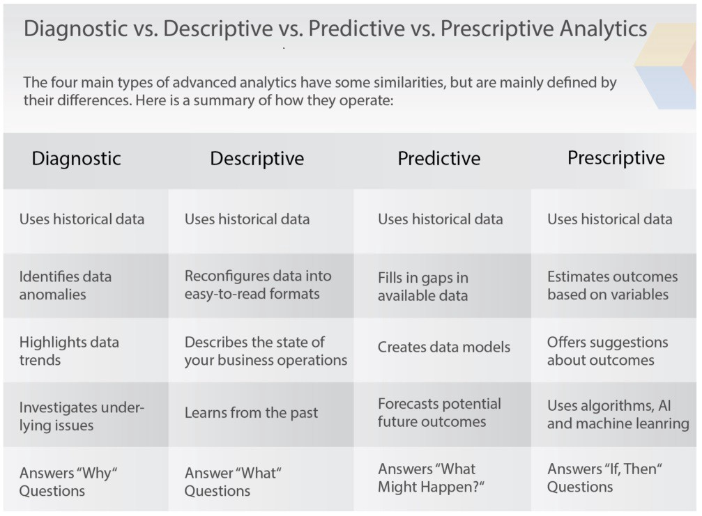

# Unit IV: Predictive Big Data Analytics with Python

## Introduction

Predictive analytics is a branch of advanced analytics that makes predictions
about future outcomes using historical data combined with statistical modeling,
data mining techniques and machine learning. Companies employ predictive
analytics to find patterns in this data to identify risks and opportunities.

Predictive analytics is often associated with big data and data science.
Companies today are swimming in data that resides across transactional
databases, equipment log files, images, video, sensors or other data sources. To
gain insights from this data, data scientists use deep learning and machine
learning algorithms to find patterns and make predictions about future events.
These include linear and nonlinear regression, neural networks, support vector
machines and decision trees. Learnings obtained through predictive analytics can
then be used further within prescriptive analytics to drive actions based on
predictive insights.

Python and R are two of the languages that are most commonly used for developing
predictive analytics applications.

## Essential Python Libraries

*   **Numpy and Scipy:** Fundamental Scientific Computing NumPy stands for
    Numerical Python. The most powerful feature of NumPy is n-dimensional array.
    This library also contains basic linear algebra functions, Fourier
    transforms, advanced random number capabilities and tools for integration
    with other low level languages like Fortran, C and C++. SciPy stands for
    Scientific Python. It is built on NumPy. Scipy is one of the most useful
    library for variety of high level science and engineering modules like
    discrete Fourier transform, Linear Algebra, Optimization and Sparse
    matrices.

*   **Pandas:** Data Manipulation and Analysis Pandas for structured data
    operations and manipulations. It is extensively used for data munging and
    preparation. Pandas were added relatively recently to Python and have been
    instrumental in boosting Python’s usage in data scientist community.

*   **Matplotlib:** Plotting and Visualization Matplotlib for plotting vast
    variety of graphs, starting from histograms to line plots to heat plots..
    You can use Pylab feature in ipython notebook (ipython notebook –pylab =
    inline) to use these plotting features inline. If you ignore the inline
    option, then pylab converts ipython environment to an environment, very
    similar to Matlab.

*   **Scikit-learn:** Machine Learning and Data Mining Scikit Learn for machine
    learning. Built on NumPy, SciPy and matplotlib, this library contains a lot
    of efficient tools for machine learning and statistical modeling including
    classification, regression, clustering and dimensional reduction.

*   **StatsModels:** Statistical Modeling, Testing, and Analysis Statsmodels for
    statistical modeling. It is a Python module that allows users to explore
    data, estimate statistical models, and perform statistical tests. An
    extensive list of descriptive statistics, statistical tests, plotting
    functions, and result statistics are available for different types of data
    and each estimator.

*   **Seaborn:** For Statistical Data Visualization Seaborn for statistical data
    visualization.  It is a library for making attractive and informative
    statistical graphics in Python. It is based on matplotlib. Seaborn aims to
    make visualization a central part of exploring and understanding data.

## Basic examples

1.  Predicting buying behavior in retail
2.  Detecting sickness in healthcare
3.  Curating content in entertainment
4.  Predicting maintenance in manufacturing
5.  Detecting fraud in cybersecurity
6.  Predicting performance in sports
7.  Forecasting patterns in weather

## Data Preprocessing:

Data preprocessing is a data mining technique which is used to transform the raw
data in a useful and efficient format.

<!-- TODO: data preprocessing -->

**NEEDS REFACTORING**

### Removing Duplicates

### Transformation of Data using function or mapping

### Replacing values

### Handling Missing Data

### Analytics Types

*   **Descriptive:**

    *   Descriptive analytics looks at what has happened in the past. As the
        name suggests, the purpose of descriptive analytics is to simply
        describe what has happened; it doesn’t try to explain why this might
        have happened or to establish cause-and-effect relationships. The aim is
        solely to provide an easily digestible snapshot.

    *   Google Analytics is a good example of descriptive analytics in action;
        it provides a simple overview of what’s been going on with your website,
        showing you how many people visited in a given time period, for example,
        or where your visitors came from. Similarly, tools like HubSpot will
        show you how many people opened a particular email or engaged with a
        certain campaign.

    *   There are two main techniques used in descriptive analytics: Data
        aggregation and data mining. Data aggregation is the process of
        gathering data and presenting it in a summarized format. Let’s imagine
        an ecommerce company collects all kinds of data relating to their
        customers and people who visit their website. The aggregate data, or
        summarized data, would provide an overview of this wider dataset—such as
        the average customer age, for example, or the average number of
        purchases made.

*   **Predictive:**

    *   Predictive analytics seeks to predict what is likely to happen in the
        future. Based on past patterns and trends, data analysts can devise
        predictive models which estimate the likelihood of a future event or
        outcome. This is especially useful as it enables businesses to plan
        ahead.

    *   Predictive models use the relationship between a set of variables to
        make predictions; for example, you might use the correlation between
        seasonality and sales figures to predict when sales are likely to drop.
        If your predictive model tells you that sales are likely to go down in
        summer, you might use this information to come up with a summer-related
        promotional campaign, or to decrease expenditure elsewhere to make up
        for the seasonal dip. Perhaps you own a restaurant and want to predict
        how many takeaway orders you’re likely to get on a typical Saturday
        night. Based on what your predictive model tells you, you might decide
        to get an extra delivery driver on hand.

    *   In addition to forecasting, predictive analytics is also used for
        classification. A commonly used classification algorithm is logistic
        regression, which is used to predict a binary outcome based on a set of
        independent variables.

*   **Prescriptive:**

    *   Prescriptive analytics looks at what has happened, why it happened, and
        what might happen in order to determine what should be done next. In
        other words, prescriptive analytics shows you how you can best take
        advantage of the future outcomes that have been predicted. What steps
        can you take to avoid a future problem? What can you do to capitalize on
        an emerging trend?

    *   Prescriptive analytics is, without doubt, the most complex type of
        analysis, involving algorithms, machine learning, statistical methods,
        and computational modeling procedures. Essentially, a prescriptive model
        considers all the possible decision patterns or pathways a company might
        take, and their likely outcomes. This enables you to see how each
        combination of conditions and decisions might impact the future, and
        allows you to measure the impact a certain decision might have. Based on
        all the possible scenarios and potential outcomes, the company can
        decide what is the best “route” or action to take.

Expand <b>Diagnostic</b> analytics(not in syllabus)

*   **Diagnostic:**
    *   While not as exciting as predicting the future, analyzing data from the past can serve an important purpose in guiding your business. Diagnostic data analytics is the process of examining data to understand cause and event or why something happened. Techniques such as drill down, data discovery, data mining, and correlations are often employed.

    *   Diagnostic data analytics help answer why something occurred. Like the other categories, it too is broken down into two more specific categories: discover and alerts and query and drill downs. Query and drill downs are used to get more detail from a report. For example, a sales rep that closed significantly fewer deals one month. A drill down could show fewer workdays, due to a two-week vacation.

    *   Discover and alerts notify of a potential issue before it occurs, for example, an alert about a lower amount of staff hours, which could result in a decrease in closed deals. You could also use diagnostic data analytics to “discover” information such as the most-qualified candidate for a new position at your company.

*   

## Association Rules

Association rule learning is a rule-based machine learning method for
discovering interesting relations between variables in large databases. It is
intended to identify strong rules discovered in databases using some measures of
interestingness. In any given transaction with a variety of items, association
rules are meant to discover the rules that determine how or why certain items
are connected.

Association rule learning is a great system for predicting the behavior in data
interconnections. This makes it a noteworthy technique for classification, or
discovering patterns in data, when implementing machine learning methods.

*   **Benefits:** There are many benefits of using Association rules like
    finding the pattern that helps understand the correlations and
    co-occurrences between data sets. A very good real-world example that uses
    Association rules would be medicine. Medicine uses Association rules to help
    diagnose patients. When diagnosing patients there are many variables to
    consider as many diseases will share similar symptoms. With the use of the
    Association rules, doctors can determine the conditional probability of an
    illness by comparing symptom relationships from past cases.

*   **Downfalls:** However, Association rules also lead to many different
    downfalls such as finding the appropriate parameter and threshold settings
    for the mining algorithm. But there is also the downfall of having a large
    number of discovered rules. The reason is that this does not guarantee
    that the rules will be found relevant, but it could also cause the
    algorithm to have low performance. Sometimes the implemented algorithms
    will contain too many variables and parameters. For someone that doesn’t
    have a good concept of data mining, this might cause them to have trouble
    understanding it.

### Apriori Algorithm

Apriori algorithm is given by R. Agrawal and R. Srikant in 1994 for finding
frequent itemsets in a dataset for boolean association rule. Name of the
algorithm is Apriori because it uses prior knowledge of frequent itemset
properties. We apply an iterative approach or level-wise search where k-frequent
itemsets are used to find k+1 itemsets.

To improve the efficiency of level-wise generation of frequent itemsets, an
important property is used called Apriori property which helps by reducing the
search space.

**Apriori Property:** All non-empty subset of frequent itemset must be frequent.
The key concept of Apriori algorithm is its anti-monotonicity of support
measure. Apriori assumes that

> All subsets of a frequent itemset must be frequent(Apriori property). If an
> itemset is infrequent, all its supersets will be infrequent.

[More Details](https://www.geeksforgeeks.org/apriori-algorithm/)

### FP growth(Frequent Pattern Growth Algorithm)

Frequent Pattern Growth Algorithm This algorithm is an improvement to the
Apriori method. A frequent pattern is generated without the need for candidate
generation. FP growth algorithm represents the database in the form of a tree
called a frequent pattern tree or FP tree.

This tree structure will maintain the association between the itemsets. The
database is fragmented using one frequent item. This fragmented part is called
“pattern fragment”. The itemsets of these fragmented patterns are analyzed. Thus
with this method, the search for frequent itemsets is reduced comparatively.

[More
Details](https://www.geeksforgeeks.org/ml-frequent-pattern-growth-algorithm/)

## Regression

*   Regression, one of the most common types of machine learning models,
    estimates the relationships between variables. Whereas classification models
    identify which category an observation belongs to, regression models
    estimate a numeric value.

*   In the context of data science, regression specifically refers to the
    estimation of a continuous dependent variable or response from a list of
    input variables, or features.

*   Regression is essential for any machine learning problem that involves
    continuous numbers, which includes a vast array of real-life applications:
    *   Financial forecasting, such as estimating housing or stock prices
    *   Automobile testing
    *   Weather analysis
    *   Time series forecasting

### Linear Regression

Linear regression is one of the easiest and most popular Machine Learning
algorithms. It is a statistical method that is used for predictive analysis.
Linear regression makes predictions for continuous/real or numeric variables
such as sales, salary, age, product price, etc.

Linear regression algorithm shows a linear relationship between a dependent (y)
and one or more independent (y) variables, hence called as linear regression.
Since linear regression shows the linear relationship, which means it finds how
the value of the dependent variable is changing according to the value of the
independent variable.

[More Details](https://www.javatpoint.com/linear-regression-in-machine-learning)

### Logistic Regression

Logistic regression is a process of modeling the probability of a discrete
outcome given an input variable. The most common logistic regression models a
binary outcome; something that can take two values such as true/false, yes/no,
and so on. Multinomial logistic regression can model scenarios where there are
more than two possible discrete outcomes. Logistic regression is a useful
analysis method for classification problems, where you are trying to determine
if a new sample fits best into a category. As aspects of cyber security are
classification problems, such as attack detection, logistic regression is a
useful analytic technique.

[More Details](https://www.geeksforgeeks.org/understanding-logistic-regression/)

## Classification

Data Classification is the process of organizing data into categories for its
most effective and efficient use.

In a time where nearly everything is digitized, from personal records to highly
sensitive corporate data, it's about time we take a closer look into
classification. Data classification in data science refers to the process that
tags and categorizes any kind of data so that it can be better understood and
analyzed. The latter is what we'll be focusing on.

But also, a well-planned data classification system makes essential data easy to
find and retrieve. This can be of particular importance for risk management,
legal discovery, and compliance.

[More Details](https://levity.ai/blog/data-classification-types-applications)

### Naive Bayes

In statistics, naive Bayes classifiers are a family of simple "probabilistic
classifiers" based on applying Bayes' theorem with strong (naive) independence
assumptions between the features (see Bayes classifier). They are among the
simplest Bayesian network models, but coupled with kernel density estimation,
they can achieve high accuracy levels.

Naive Bayes classifiers are highly scalable, requiring a number of parameters
linear in the number of variables (features/predictors) in a learning problem.
Maximum-likelihood training can be done by evaluating a closed-form expression,
which takes linear time, rather than by expensive iterative approximation as
used for many other types of classifiers.

[More Details](https://en.wikipedia.org/wiki/Naive_Bayes_classifier)

### Decision Trees

A decision tree is a type of supervised machine learning used to categorize or
make predictions based on how a previous set of questions were answered. The
model is a form of supervised learning, meaning that the model is trained and
tested on a set of data that contains the desired categorization.

The decision tree may not always provide a clear-cut answer or decision.
Instead, it may present options so the data scientist can make an informed
decision on their own. Decision trees imitate human thinking, so it’s generally
easy for data scientists to understand and interpret the results.

[More
Details](https://www.mastersindatascience.org/learning/introduction-to-machine-learning-algorithms/decision-tree/)

## Introduction to Scikit-learn

Scikit-learn (Sklearn) is the most useful and robust library for machine
learning in Python. It provides a selection of efficient tools for machine
learning and statistical modeling including classification, regression,
clustering and dimensionality reduction via a consistence interface in Python.
This library, which is largely written in Python, is built upon NumPy, SciPy and
Matplotlib.

[More Details](https://en.wikipedia.org/wiki/Scikit-learn)

### Installations

Install the 64bit version of Python 3, for instance from
<https://www.python.org> Then run:

    pip install -U scikit-learn

In order to check your installation you can use

    python -m pip show scikit-learn  # to see which version and where
    scikit-learn is installed python -m pip freeze  # to see all packages
    installed in the active virtualenv python -c "import sklearn;
    sklearn.show_versions()"

### Dataset

*   A dataset, or data set, is simply a collection of data.

*   The simplest and most common format for datasets you’ll find online is a
    spreadsheet or CSV format — a single file organized as a table of rows and
    columns. But some datasets will be stored in other formats, and they don’t
    have to be just one file. Sometimes a dataset may be a zip file or folder
    containing multiple data tables with related data.

*   [Read about dataset in scikit-learn](https://scikit-learn.org/stable/datasets/toy_dataset.html)

### Matplotlib

*   Matplotlib is a comprehensive library for creating static, animated, and
    interactive visualizations in Python. Matplotlib makes easy things easy and
    hard things possible.
    *   Create publication quality plots.
    *   Make interactive figures that can zoom, pan, update.
    *   Customize visual style and layout.
    *   Export to many file formats .
    *   Embed in JupyterLab and Graphical User Interfaces.
    *   Use a rich array of third-party packages built on Matplotlib.

*   [More Details](https://matplotlib.org/stable/tutorials/introductory/usage.html)

### Filling missing values

<!-- TODO: filling missing values -->

**NEEDS REFACTORING**

### Regression and Classification using Scikit-learn

*   Python provides a lot of tools for implementing Classification and
    Regression. The most popular open-source Python data science library is
    scikit-learn. Let’s learn how to use scikit-learn to perform Classification
    and Regression in simple terms.

*   The basic steps of supervised machine learning include:
    1.  Load the necessary libraries
    2.  Load the dataset
    3.  Split the dataset into training and test set
    4.  Train the model
    5.  Evaluate the model

[More
Details](https://www.educative.io/blog/scikit-learn-cheat-sheet-classification-regression-methods#implementation)
