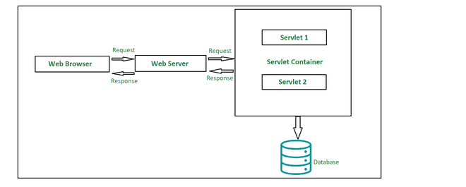
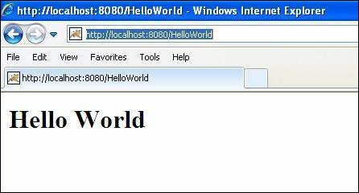

# Unit III: **Java Servlets and XML**

## Servlet

*   A servlet is a small Java program that runs within a Web server. Servlets
    receive and respond to requests from Web clients, usually across HTTP, the
    HyperText Transfer Protocol. To implement this interface, you can write a
    generic servlet that extends javax. servlet.

*   Servlets are grouped under the Advanced Java tree that are used to create
    dynamic web applications. Servlets are robust in nature, well scalable and
    are primarily used in developing server-side applications. If we go a little
    back in time, we would be able to witness that before the introduction of
    servlets, CGI (Common Gateway Interface) were used. Amid several indigenous
    tasks that a servlet is capable of doing, dynamically performing client
    requests and responses are most common. Other tasks that a servlet can do
    effectively are:
    *   Can easily manage/control the application flow.
    *   Suitable to implement business logic.
    *   Can effectively balance the load at the server-side.
    *   Easily generate dynamic web content.

*   Talking about the types of servlets, there are primarily two types, namely:
    1.  Generic Servlets
    2.  HTTP Servlets

*   There are three potential ways in which we can employ to create a servlet:
    1.  Implementing Servlet Interface
    2.  Extending Generic Servlet
    3.  Extending HTTP Servlet

*   **Advantages:**
    *   Prime functionality of a servlet is that they are independent of server
        configuration and they are pretty much compatible with any of the web
        servers
    *   Servlets are also protocol-independent supporting FTP, HTTP, SMTP, etc.
        protocols to the fullest.
    *   Until destroyed manually, servlets can be retained in the memory helping
        process several requests over time. Also, once a database connection is
        established, it can facilitate process several requests for a database in
        the very same database session.
    *   Servlets inherit Java’s property of portability and hence are compatible
        with nearly any web server.
    *   Servlets are first converted into byte codes and then executed, which
        helps in increasing the processing time.

*   **Disadvantages:**
    *   Designing a servlet can be pretty laborious.
    *   Exceptions need to be handled while designing a servlet since they are not
        thread-safe.
    *   Developers may need additional skills to program a servlet.

*   [More
    Details](https://docs.oracle.com/javaee/6/api/javax/servlet/Servlet.html)

### Servlet architecture overview



1.  **Client:** The client shown in the architecture above is primarily working
    as a medium who is sending out HTTP requests over to the web server and again
    processing the response it gets back from the server. As we can see in the
    diagram, our client here is the web browser.

2.  **Web Server:** Primary job of a web server is to process the requests and
    responses that a user sends over time and maintain how a web user would be able
    to access the files that has been hosted over the server. The server we are
    talking about here is a software which manages access to a centralized resource
    or service in a network.. There are precisely two types of webservers:
    1.  Static web server
    2.  Dynamic web server

3.  **Web Container:** Web container is another typical component in servlet
    architecture which is responsible for communicating with the servlets. Two prime
    tasks of a web container are:

    *   Managing the servlet lifecycle
    *   URL mapping

    Web container sits at the server-side managing and handling all the requests
    that are coming in either from the servlets or from some JSP pages or
    potentially any other file system.

### A “Hello World” servlet

<!-- CODE -->

*   Sample source code for "Hello world" servlet:
    ```java
    // Import required java libraries
    import java.io.*;
    import javax.servlet.*;
    import javax.servlet.http.*;

    // Extend HttpServlet class
    public class HelloWorld extends HttpServlet {
     
       private String message;

       public void init() throws ServletException {
          // Do required initialization
          message = "Hello World";
       }

       public void doGet(HttpServletRequest request, HttpServletResponse response)
          throws ServletException, IOException {
          
          // Set response content type
          response.setContentType("text/html");

          // Actual logic goes here.
          PrintWriter out = response.getWriter();
          out.println("<h1>" + message + "</h1>");
       }

       public void destroy() {
          // do nothing.
       }
    }
    ```

*   Save the above file with any name say "hello.java"

*   Compile the servlet with `$ javac hello.java`

*   Create following entries in web.xml file located in
    "<Tomcat-installation-directory>/webapps/ROOT/WEB-INF/"
    ```java
    <servlet>
       <servlet-name>HelloWorld</servlet-name>
       <servlet-class>HelloWorld</servlet-class>
    </servlet>

    <servlet-mapping>
       <servlet-name>HelloWorld</servlet-name>
       <url-pattern>/HelloWorld</url-pattern>
    </servlet-mapping> 
    ```

*   Start tomcat server using "<Tomcat-installationdirectory>\bin\startup.bat"
    (on Windows) or "<Tomcat-installationdirectory>/bin/startup.sh" (on
    Linux/Solaris etc.) and finally type http://localhost:8080/HelloWorld in the
    browser's address box. If everything goes fine, you would get the following
    result

    

*   [More
    Details](https://www.tutorialspoint.com/servlets/servlets-first-example.htm)

### Servlets generating dynamic content

<!-- TODO -->

**NEEDS REFACTORING**

### Servlet life cycle

*   The entire life cycle of a Servlet is managed by the Servlet container which
    uses the javax.servlet.Servlet interface to understand the Servlet object
    and manage it. So, before creating a Servlet object, let’s first understand
    the life cycle of the Servlet object which is actually understanding how the
    Servlet container manages the Servlet object.

*   Stages of the Servlet Life Cycle: The Servlet life cycle mainly goes through
    four stages,

    1.  Loading a Servlet.
    2.  Initializing the Servlet.
    3.  Request handling.
    4.  Destroying the Servlet.

*   Let’s look at each of these stages in details:

    1.  **Loading a Servlet:** The first stage of the Servlet lifecycle involves
        loading and initializing the Servlet by the Servlet container. The Web
        container or Servlet Container can load the Servlet at either of the
        following two stages :
        *   Initializing the context, on configuring the Servlet with a zero or
            positive integer value.
        *   If the Servlet is not preceding stage, it may delay the loading
            process until the Web container determines that this Servlet is
            needed to service a request.

    2.  **Initializing a Servlet:** After the Servlet is instantiated
        successfully, the Servlet container initializes the instantiated Servlet
        object. The container initializes the Servlet object by invoking the
        Servlet.init(ServletConfig) method which accepts ServletConfig object
        reference as parameter.

    3.  **Handling request:** After initialization, the Servlet instance is
        ready to serve the client requests. The Servlet container performs the
        following operations when the Servlet instance is located to service a
        request :
        *   It creates the ServletRequest and ServletResponse objects. In this
            case, if this is a HTTP request, then the Web container creates
            HttpServletRequest and HttpServletResponse objects which are
            subtypes of the ServletRequest and ServletResponse objects
            respectively.
        *   After creating the request and response objects it invokes the
            Servlet.service(ServletRequest, ServletResponse) method by passing
            the request and response objects.

    4.  **Destroying a Servlet:** When a Servlet container decides to destroy
        the Servlet, it performs the following operations,
        *   It allows all the threads currently running in the service method of
            the Servlet instance to complete their jobs and get released.
        *   After currently running threads have completed their jobs, the
            Servlet container calls the destroy() method on the Servlet
            instance.

    After the destroy() method is executed, the Servlet container releases all
    the references of this Servlet instance so that it becomes eligible for
    garbage collection.

*   **Servlet Life Cycle Methods:**

    *   There are three life cycle methods of a Servlet :
        *   init()
        *   service()
        *   destroy()

*   [More Details](https://www.geeksforgeeks.org/life-cycle-of-a-servlet/)

### Parameter data

*   Parameters may come into our application from the client request, or may be
    configured through deployment descriptor (web.xml) elements or their
    corresponding annotations. When you submit a form, form values are sent as
    request parameters to a web application. In case of a GET request, these
    parameters are exposed in the URL as name value pairs and in case of POST,
    parameters are sent within the body of the request.

*   Servlet init parameters and context init parameters are set through the
    deployment descriptor (web.xml) or their corresponding annotations. All
    parameters are read-only from the application code. We have methods in the
    Servlet API to retrieve various parameters.

*   Attributes are objects that are attached to various scopes and can be
    modified, retrieved or removed. Attributes can be read, created, updated and
    deleted by the web container as well as our application code. We have methods
    in the Servlet API to add, modif, retrieve and remove attributes. When an
    object is added to an attribute in any scope, it is called binding as the
    object is bound into a scoped attribute with a given name.

*   Important differences between attributes and parameters in JSP/servlets are:
    \* Parameters are read only, attributes are read/write objects.
    \* Parameters are String objects, attributes can be objects of any type.

*   [More Details](https://www.javajee.com/parameters-and-attributes-in-servlet)

### Sessions

*   Session simply means a particular interval of time.

*   Session Tracking is a way to maintain state (data) of an user. It is also
    known as session management in servlet.

*   Http protocol is a stateless so we need to maintain state using session
    tracking techniques. Each time user requests to the server, server treats
    the request as the new request. So we need to maintain the state of an user
    to recognize to particular user.

*   HTTP is stateless that means each request is considered as the new request.
    It is shown in the figure given below:

*   There are four techniques used in Session tracking:
    1.  Cookies
    2.  Hidden Form Field
    3.  URL Rewriting
    4.  HttpSession

### Cookies

*   A cookie is a small piece of information that is persisted between the
    multiple client requests.

*   A cookie has a name, a single value, and optional attributes such as a
    comment, path and domain qualifiers, a maximum age, and a version number.

*   How Cookie works:

    *   By default, each request is considered as a new request. In cookies
        technique, we add cookie with response from the servlet. So cookie is
        stored in the cache of the browser. After that if request is sent by the
        user, cookie is added with request by default. Thus, we recognize the
        user as the old user.

    

*   There are 2 types of cookies in servlets:
    1.  **Non-persistent cookie:**
        *   It is valid for single session only. It is removed each time when
            user closes the browser.

    2.  **Persistent cookie:**
        *   It is valid for multiple session . It is not removed each time when
            user closes the browser. It is removed only if user logout or
            signout.

*   Advantage of Cookies:
    *   Simplest technique of maintaining the state.
    *   Cookies are maintained at client side.

*   Disadvantage of Cookies
    *   It will not work if cookie is disabled from the browser.
    *   Only textual information can be set in Cookie object.

### URL rewriting

*   In URL rewriting, we append a token or identifier to the URL of the next
    Servlet or the next resource. We can send parameter name/value pairs using
    the following format:

*   `url?name1=value1&name2=value2&??`

*   A name and a value is separated using an equal = sign, a parameter
    name/value pair is separated from another parameter using the ampersand(&).
    When the user clicks the hyperlink, the parameter name/value pairs will be
    passed to the server. From a Servlet, we can use getParameter() method to
    obtain a parameter value.

*   Advantage of URL Rewriting
    *   It will always work whether cookie is disabled or not (browser
        independent).
    *   Extra form submission is not required on each pages.

*   Disadvantage of URL Rewriting
    *   It will work only with links.
    *   It can send Only textual information.

*   [Refer for
    example](https://www.javatpoint.com/url-rewriting-in-session-tracking)

### Other servlet capabilities

*   [Refer Advantages in the Servlet section](#servlet)

*   [More Details](https://ecomputernotes.com/servlet/intro/http-servlets)

### Data storage

<!-- TODO -->

**NEEDS REFACTORING**

### Servlets concurrency

*   A Java servlet container or web server is multithreaded and multiple requests
    to the same servlet may be executed at the same time. Therefore, we need to
    take concurrency into consideration while writing servlet.

*   As we discussed earlier that one and only one instance of Servlet gets created
    and for every new request , Servlet Container spawn a new thread to execute
    doGet() or doPost() methof of a servlet.

*   By default servlets are not thread safe and it is a responsibility of  a
    servlet developer to take care of it.

*   In this chapter we will discuss about concurrency in servlets and this is very
    important concept so your attention is required.

*   There are certain points which we should consider while writing servlets.
    *   Service() , doGet(), doPost() or to be more generic doXXX()  methods
        should not update or modify instance variables as instance variables are
        shared by all threads of same instance.
    *   If you have a requirement which requires modification of instance variable
        then do it in a synchronized block.
    *   Above two rules are applicable for static variables also because they are
        also shared.
    *   Local variables are always thread safe.
    *   The request and response objects are thread safe to use because new
        instance of these are created for every request into your servlet, and
        thus for every thread executing in your servlet.

*   [More Details](https://www.wideskills.com/servlets/concurrency-in-servlets)

### Databases (MySQL) and Java Servlets.

*   [Read at
    geeksforgeeks](https://www.geeksforgeeks.org/java-servlet-and-jdbc-example-insert-data-in-mysql/)

## XML

*   XML (Extensible Markup Language) is a markup language similar to HTML, but
    without predefined tags to use. Instead, you define your own tags designed
    specifically for your needs. This is a powerful way to store data in a format
    that can be stored, searched, and shared.

*   [Read more](https://developer.mozilla.org/en-US/docs/Web/XML/XML_introduction)

### XML documents and vocabularies

*   XML documents are strictly text files. In the context of data transport, the
    phrase "XML document" refers to a file or data stream containing any form of
    structured data. Examples include e-commerce transactions, server APIs,
    mathematical equations, customer information, and inventory status.

*   XML documents contain only markup and content. All of the rules and semantics
    of the document are defined by the applications that process them. Like HTML
    documents, XML documents can be displayed in a Web browser. In this case, the
    semantics are usually derived from style sheets or Resource Description
    Framework (RDF) files.

*   XML documents are said to be either "well-formed" or "valid." Well-formed
    documents follow all of the XML rules for a document–for example, for every
    start tag, there is a corresponding end tag. Valid XML documents are
    well-formed, but they also contain a document type definition (DTD), and they
    obey the constraints of that definition. ### XML declaration

*   [More
    Details](https://www.microfocus.com/documentation/extend-acucobol/925/BKITITNONVS004.html)

### XML Namespaces

*   XML namespaces are used for providing uniquely named elements and attributes
    in an XML document. They are defined in a W3C recommendation.\[1]\[2] An XML
    instance may contain element or attribute names from more than one XML
    vocabulary. If each vocabulary is given a namespace, the ambiguity between
    identically named elements or attributes can be resolved.

*   A simple example would be to consider an XML instance that contained
    references to a customer and an ordered product. Both the customer element and
    the product element could have a child element named id. References to the id
    element would therefore be ambiguous; placing them in different namespaces
    would remove the ambiguity.

*   XML Namespaces provide a method to avoid element name conflicts.

*   [More Details](https://www.w3schools.com/xml/xml_namespaces.asp)

### DOM based XML processing

*   The XML Document Object Model (DOM) treats XML data as a standard set of
    objects and is used to process XML data in memory. The System.Xml namespace
    provides a programmatic representation of XML documents, fragments, nodes, or
    node-sets. It is based on the World Wide Web Consortium (W3C) DOM Level 1 Core
    and the DOM Level 2 Core recommendations.

*   The XmlDocument class represents an XML document. It includes members for
    retrieving and creating all other XML objects. Using the XmlDocument, and its
    related classes, you can construct XML documents, load and access data, modify
    data, and save changes.

*   [More
    Details](https://docs.microsoft.com/en-us/dotnet/standard/data/xml/xml-document-object-model-dom)

### Transforming XML documents

*   Now that we've covered parsing, generating, and searching an XML document, we
    get into another very important part of XML processing—XML transformation. You
    can transform, or in other words convert, an XML document to another format by
    applying various transformation techniques. You can transform the XML document
    to either another XML document, which might be a subset of the original
    document by filtering certain info, or you can transform to a whole different
    data format, like HTML, eXtensible HyperText Markup Language (XHTML), Wireless
    Markup Language (WML), CSV, and so forth.

*   Why would you want to convert our neatly formatted XML document to another
    format? We can read and understand the data as-is. Well the answer is,
    although as a technically savvy individual you took the time to learn XML and
    are now able to read it, most people would prefer their data represented in a
    user-friendly format.

*   One of the most popular methods of transforming XML to another format is to
    use the eXtensible Stylesheet Language for Transformations (XSLT) standard. An
    XSLT processor provides the interface needed to transform XML data. One of the
    processor's components is the XML parser itself, which is needed for the XSLT
    processor to understand and interact with XML. This makes sense if you think
    about it—the XSLT processor needs to parse the document to extract the
    information contained in the XML before it can format the contents. The
    processor requires an XSLT stylesheet to perform the transformation. An XSLT
    stylesheet is itself an XML document that contains embedded rules used to
    perform the transformation. An XSLT processor uses XPath and the rules
    contained in the XSLT stylesheet to transform the document. It searches
    through the XML data using XPath and tries to find the desired elements.

*   [More
    Details](https://www.informit.com/articles/article.aspx?p=30010\&seqNum=7)

## DTD

*   A DTD is a Document Type Definition.

*   A DTD defines the structure and the legal elements and attributes of an XML document.

*   With a DTD, independent groups of people can agree on a standard DTD for interchanging data.

*   An application can use a DTD to verify that XML data is valid.

*   An XML document with correct syntax is called "Well Formed".

*   An XML document validated against a DTD is both "Well Formed" and "Valid".

*   [More Details](https://www.w3schools.com/xml/xml_dtd.asp)

### Schema

*   The purpose of an XML Schema is to define the legal building blocks of an XML
    document:
    *   the elements and attributes that can appear in a document
    *   the number of (and order of) child elements
    *   data types for elements and attributes
    *   default and fixed values for elements and attributes

*   In the XML world, hundreds of standardized XML formats are in daily use.

*   Many of these XML standards are defined by XML Schemas.

*   XML Schema is an XML-based (and more powerful) alternative to DTD.

*   One of the greatest strength of XML Schemas is the support for data types.
    *   It is easier to describe allowable document content
    *   It is easier to validate the correctness of data
    *   It is easier to define data facets (restrictions on data)
    *   It is easier to define data patterns (data formats)
    *   It is easier to convert data between different data types

*   XML Schemas use XML Syntax
    *   You don't have to learn a new language
    *   You can use your XML editor to edit your Schema files
    *   You can use your XML parser to parse your Schema files
    *   You can manipulate your Schema with the XML DOM
    *   You can transform your Schema with XSLT

*   XML Schemas are extensible, because they are written in XML.

*   With an extensible Schema definition you can:
    *   Reuse your Schema in other Schemas
    *   Create your own data types derived from the standard types
    *   Reference multiple schemas in the same document

*   Differences between an XML Schema Definition (XSD) and Document Type
    Definition (DTD) include:
    *   XML schemas are written in XML while DTD are derived from SGML syntax.

    *   XML schemas define datatypes for elements and attributes while DTD doesn't
        support datatypes.

    *   XML schemas allow support for namespaces while DTD does not.

    *   XML schemas define number and order of child elements, while DTD does not.

    *   XML schemas can be manipulated on your own with XML DOM but it is not
        possible in case of DTD.

    *   using XML schema user need not to learn a new language but working with
        DTD is difficult for a user.

    *   XML schema provides secure data communication i.e sender can describe the
        data in a way that receiver will understand, but in case of DTD data can
        be misunderstood by the receiver.

    *   XML schemas are extensible while DTD is not extensible.

    *   On the other hand:
        *   DTD lets you define new ENTITY values for use in your XML file.
        *   DTD lets you extend it local to an individual XML file.

### Elements

*   XML elements can be defined as building blocks of an XML document. Elements can behave as a container to hold text, elements, attributes, media objects or mix of all.

*   In a DTD, elements are declared with an ELEMENT declaration.

*   In a DTD, XML elements are declared with the following syntax:

*   A DTD element is declared with an ELEMENT declaration. When an XML file is validated by DTD, parser initially checks for the root element and then the child elements are validated.

*   Syntax:
    ```xml
    <!ELEMENT elementname (content)>
    ```
    *   *elementname* is the element name (also called the generic identifier) that you are defining.
    *   *ELEMENT* declaration is used to indicate the parser that you are about to define an element.
    *   *content* defines what content (if any) can go within the element.

*   [Read more here](https://www.w3schools.com/xml/xml_dtd_elements.asp)

### Attributes

*   In a DTD, attributes are declared with an ATTLIST declaration.

*   Attribute declaration is very much similar to element declarations in many
    ways except one; instead of declaring allowable content for elements, you
    declare a list of allowable attributes for each element. These lists are
    called ATTLIST declaration.

*   Syntax: `xml <!ATTLIST element-name attribute-name attribute-type
    attribute-value> `
    *   In the above syntax −
        *   The DTD attributes start with \<!ATTLIST keyword if the element
            contains the attribute.
        *   **element-name** specifies the name of the element to which the
            attribute applies.
        *   **attribute-name** specifies the name of the attribute which is
            included with the element-name.
        *   **attribute-type** defines the type of attributes. We will discuss
            more on this in the following sections.
        *   **attribute-value** takes a fixed value that the attributes must
            define. We will discuss more on this in the following sections.

*   [More Details](https://www.w3schools.com/xml/xml_dtd_attributes.asp)

## AJAX

*   Ajax is a set of web development techniques that uses various web technologies
    on the client-side to create asynchronous web applications. With Ajax, web
    applications can send and retrieve data from a server asynchronously (in the
    background) without interfering with the display and behaviour of the existing
    page. By decoupling the data interchange layer from the presentation layer,
    Ajax allows web pages and, by extension, web applications, to change content
    dynamically without the need to reload the entire page. In practice, modern
    implementations commonly utilize JSON instead of XML.

*   Ajax is not a technology, but rather a programming concept. HTML and CSS can
    be used in combination to mark up and style information. The webpage can be
    modified by JavaScript to dynamically display—and allow the user to interact
    with the new information. The built-in XMLHttpRequest object is used to
    execute Ajax on webpages, allowing websites to load content onto the screen
    without refreshing the page. Ajax is not a new technology, nor is it a new
    language. Instead, it is existing technologies used in a new way.

*   [Read working of Ajax here](https://www.w3schools.com/js/js_ajax_intro.asp)
