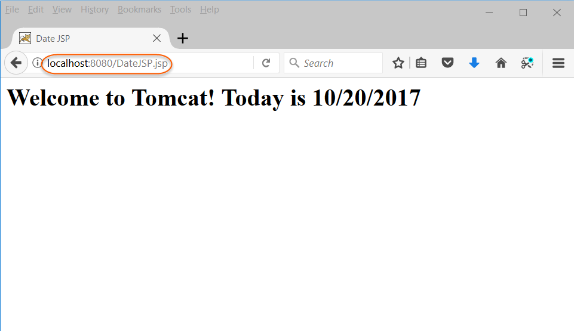

# Unit IV: **JSP and Web Services**

## JSP

Java Server Pages (JSP) is a server-side programming technology that enables the
creation of dynamic, platform-independent method for building Web-based
applications. JSP have access to the entire family of Java APIs, including the
JDBC API to access enterprise databases. This tutorial will teach you how to use
Java Server Pages to develop your web applications in simple and easy steps.

### Introduction to Java Server Pages

*   It stands for Java Server Pages.

*   It is a server side technology.

*   It is used for creating web application.

*   It is used to create dynamic web content.

*   In this JSP tags are used to insert JAVA code into HTML pages.

*   It is an advanced version of Servlet Technology.

*   It is a Web based technology helps us to create dynamic and platform
    independent web pages.

*   In this, Java code can be inserted in HTML/ XML pages or both.

*   JSP is first converted into servlet by JSP container before processing the
    client’s request.

*   JSP pages are more advantageous than Servlet:
    *   They are easy to maintain.
    *   No recompilation or redeployment is required.
    *   JSP has access to entire API of JAVA .
    *   JSP are extended version of Servlet.

*   Applications of JSP
    *   **JSP vs. Active Server Pages (ASP):** The advantages of JSP are
        twofold. First, the dynamic part is written in Java, not Visual Basic or
        other MS specific language, so it is more powerful and easier to use.
        Second, it is portable to other operating systems and non-Microsoft Web
        servers.

    *   **JSP vs. Pure Servlets:** It is more convenient to write (and to
        modify!) regular HTML than to have plenty of println statements that
        generate the HTML.

    *   **JSP vs. Server-Side Includes (SSI):** SSI is really only intended for
        simple inclusions, not for "real" programs that use form data, make
        database connections, and the like.

    *   **JSP vs. JavaScript:** JavaScript can generate HTML dynamically on the
        client but can hardly interact with the web server to perform complex
        tasks like database access and image processing etc.

    *   **JSP vs. Static HTML:** Regular HTML, of course, cannot contain dynamic
        information.

*   Features of JSP
    *   Coding in JSP is easy :- As it is just adding JAVA code to HTML/XML.
    *   Reduction in the length of Code :- In JSP we use action tags, custom
        tags etc.
    *   Connection to Database is easier :-It is easier to connect website to
        database and allows to read or write data easily to the database.
    *   Make Interactive websites :- In this we can create dynamic web pages
        which helps user to interact in real time environment.
    *   Portable, Powerful, flexible and easy to maintain :- as these are
        browser and server independent.
    *   No Redeployment and No Re-Compilation :- It is dynamic, secure and
        platform independent so no need to re-compilation.
    *   Extension to Servlet :- as it has all features of servlets, implicit
        objects and custom tags

*   [More Details](https://www.geeksforgeeks.org/introduction-to-jsp/)

### JSP and Servlets

<!-- TABLE -->

| Servlet                                                                                                                              | JSP                                                                                                                                                      |
|--------------------------------------------------------------------------------------------------------------------------------------|----------------------------------------------------------------------------------------------------------------------------------------------------------|
| Servlet is a java code                                                                                                               | JSP is a HTML based code                                                                                                                                 |
| Writing code for servlet is harder than JSP as it is HTML in java                                                                    | JSP is easy to code as it is java in HTML                                                                                                                |
| Servlet plays a controller role in the hasMVC approach                                                                               | JSP is the view in the MVC approach for showing output                                                                                                   |
| Servlet is faster than JSP                                                                                                           | JSP is slower than Servlet because the first step in JSP lifecycle is the translation of JSP to java code and then compile                               |
| Servlet can accept all protocol requests                                                                                             | JSP only accepts HTTP requests                                                                                                                           |
| In Servlet, we can override the service() method                                                                                     | In JSP, we cannot override its service() method                                                                                                          |
| In Servlet by default session management is not enabled, user have to enable it explicitly                                           | In JSP session management is automatically enabled                                                                                                       |
| In Servlet we have to implement everything like business logic and presentation logic in just one servlet file                       | In JSP business logic is separated from presentation logic by using javaBeans                                                                            |
| Modification in Servlet is a time consuming task because it includes reloading, recompiling, JavaBeans the and restarting the server | JSP modification is fast, just need to click the refresh button                                                                                          |
| It does not have inbuilt implicit objects                                                                                            | In JSP , there are inbuilt implicit objects                                                                                                              |
| There is no method for running JavaScript on the client side in Servlet                                                              | While running the JavaScript at the client side in JSP , the client-side validation is used                                                              |
| Packages are to be imported on the top of the program                                                                                | Packages can be imported into the JSP program(i                                                                            .e bottom , middle , or top )

### running JSP applications

*   A Java Server Page, or JSP, program is a crucial part of a Java web
    application because the JSP will send a response back to the server in the
    form of a web page. For example, a JSP might display the line items of an
    order to the browser user. In this topic, you will create a very simple JSP
    and learn how to run the program at the Tomcat server.

*   Creating a JSP application in 7 steps:

    1.  In your text editor, you will develop a simple JSP that creates a web page to
        display the current date. Type in the following statements in a new file:

        <!-- CODE -->

        ```html
        <%@ page language="java" contentType="text/html"%>
        <%@ page import="java.text.*,java.util.*" %>
        <html>
        <head>
        <title>Date JSP</title>
        </head>
        <% SimpleDateFormat sdf=new SimpleDateFormat("MM/dd/yyyy"); %>
        <body>
        <h1>Welcome to Tomcat! Today is </h1>
        </body>
        </html>
        ```

    2.  The program contains `<%@` tags that provide metadata about the JSP and
        import directives. The JSP also contains HTML tags that will be rendered by
        the browser in the usual way. Note the `<%` tags that encapsulate Java code.
        The snippets of Java code are referred to as "scriplets." When the JSP is
        requested by the browser, the program will be converted into a servlet by a
        program in the Tomcat container (`Jasper`) and the HTML output will be sent
        to the browser.

    3.  Save your file as `DateJSP.jsp`

    4.  Copy your file to `CATALINA_HOME/webapps/ROOT`, e.g.,
        `c:/Tomcat8/webapps/ROOT`

    5.  Start the Tomcat server.

    6.  Start your browser if it is not already running.

    7.  In the address area of the browser, type `http://localhost:8080/DateJSP.jsp`
        and submit that address to the browser.

    8.  The output of your JSP page will be displayed:

        

### Basic JSP

*   [Learn here](https://www3.ntu.edu.sg/home/ehchua/programming/java/JSPByExample.html)

### JavaBeans classes and JSP

*   JavaBeans are classes that encapsulate many objects into a single object (the bean). It is a java class that should follow following conventions:
    1.  Must implement Serializable.
    2.  It should have a public no-arg constructor.
    3.  All properties in java bean must be private with public getters and setter methods.

*   Syntax:
    ```java
      // Java program to illustrate the
      // structure of JavaBean class
      public class TestBean {
      private String name;
      public void setName(String name)
          {
              this.name = name;
          }
      public String getName()
          {
              return name;
          }
      }
    ```

*   [More Details](https://www.geeksforgeeks.org/javabean-class-java/)

### Support for the Model-View-Controller paradigm

*   MVC stands for Model View and Controller. It is a design pattern that separates the business logic, presentation logic and data.

*   Controller acts as an interface between View and Model. Controller intercepts all the incoming requests.

*   Model represents the state of the application i.e. data. It can also have business logic.

*   View represents the presentaion i.e. UI(User Interface).

*   Advantage of MVC (Model 2) Architecture

    *   Navigation Control is centralized
    *   Easy to maintain the large application

    

*   [Refer for example](https://www.javatpoint.com/MVC-in-jsp)

### JSP related technologies

*   [More Details](https://flylib.com/books/en/1.94.1.95/1/)

## Web Services

*   A Web service is a method of communication between two electronic devices
    over a network. It is a software function provided at a network address over
    the Web with the service always-on as in the concept of utility computing.
    Many organizations use multiple software systems for management.

*   Web services are self-contained, modular, distributed, dynamic applications
    that can be described, published, located, or invoked over the network to
    create products, processes, and supply chains. These applications can be
    local, distributed, or web-based. Web services are built on top of open
    standards such as TCP/IP, HTTP, Java, HTML, and XML.

*   Web services are XML-based information exchange systems that use the Internet
    for direct application-to-application interaction. These systems can include
    programs, objects, messages, or documents.

*   A web service is a collection of open protocols and standards used for
    exchanging data between applications or systems. Software applications written
    in various programming languages and running on various platforms can use web
    services to exchange data over computer networks like the Internet in a manner
    similar to inter-process communication on a single computer. This
    interoperability (e.g., between Java and Python, or Windows and Linux
    applications) is due to the use of open standards.

*   [More Details](https://www.tutorialspoint.com/webservices/what_are_web_services.htm)

### Web Service concepts

*   Components(Types) of Web Services

    *   **SOAP (Simple Object Access Protocol):** SOAP stands for “Simple Object
        Access Protocol.” It is a transport-independent messaging protocol. SOAP
        is built on sending XML data in the form of SOAP Messages.

    *   **UDDI (Universal Description, Discovery, and Integration):** UDDI is a
        standard for specifying, publishing and discovering a service provider’s
        online services.

    *   **WSDL (Web Services Description Language):** If a web service can’t be
        found, it can’t be used. The client invoking the web service should be
        aware of the location of the web service.

    *   **REST(Representational State Transfer):**
        Is an architectural style, meaning each unique URL represents an individual
        object of some sort. A REST web service uses HTTP and supports/repurposes
        several HTTP methods: GET, POST, PUT or DELETE. It also offers simple
        CRUD-oriented services. Fun fact: The original RESTful architecture was
        designed by one of the leading authors of HTTP, Roy Fielding.

*   [More Details](https://www.cleo.com/blog/knowledge-base-web-services)

### Writing a Java Web Service

*   [Read here](https://blog.idrsolutions.com/2013/08/creating-and-deploying-a-java-web-service/)

### Writing a Java web service client

*   [Read here](https://docs.oracle.com/javaee/5/tutorial/doc/bnayn.html)

## Describing Web Services

### WSDL

*   WSDL is an XML notation for describing a web service. A WSDL definition tells a
    client how to compose a web service request and describes the interface that is
    provided by the web service provider.

*   [More Details](https://www.w3schools.com/xml/xml_wsdl.asp)

### Communicating Object data

**NEEDS REFACTORING**

<!-- TODO -->

### SOAP

*   SOAP is an XML-based protocol for accessing web services over HTTP. It has
    some specification which could be used across all applications.

*   SOAP is known as the Simple Object Access Protocol, but in later times was
    just shortened to SOAP v1.2. SOAP is a protocol or in other words is a
    definition of how web services talk to each other or talk to client
    applications that invoke them.

*   SOAP was developed as an intermediate language so that applications built on
    various programming languages could talk easily to each other and avoid the
    extreme development effort.

*   [More Details](https://www.guru99.com/soap-simple-object-access-protocol.html)

## Struts

*   Apache Struts 2 is an open-source web application framework for developing
    Java EE web applications. It uses and extends the Java Servlet API to
    encourage developers to adopt a model–view–controller (MVC) architecture. The
    WebWork framework spun off from Apache Struts 1 aiming to offer enhancements
    and refinements while retaining the same general architecture of the original
    Struts framework. In December 2005, it was announced that WebWork 2.2 was
    adopted as Apache Struts 2, which reached its first full release in February
    2007\.

### Overview

*   [Overview](https://www.javatpoint.com/struts-2-tutorial)

### Architecture

*   Struts 2 is slightly different from a traditional MVC framework, where the
    action takes the role of the model rather than the controller, although there
    is some overlap.

    

*   The above diagram depicts the Model, View and Controller to the Struts2 high
    level architecture. The controller is implemented with a Struts2 dispatch
    servlet filter as well as interceptors, this model is implemented with
    actions, and the view is a combination of result types and results. The value
    stack and OGNL provides common thread, linking and enabling integration
    between the other components.

*   Request Life Cycle Based on the above diagram, you can understand the work
    flow through user's request life cycle in Struts 2 as follows:

    *   User sends a request to the server for requesting for some resource (i.e.
        pages).

    *   The Filter Dispatcher looks at the request and then determines the
        appropriate Action.

    *   Configured interceptor functionalities applies such as validation, file
        upload etc.

    *   Selected action is performed based on the requested operation.

    *   Again, configured interceptors are applied to do any post-processing if
        required.

    *   Finally, the result is prepared by the view and returns the result to the
        user.

### Configuration

*   Configuration files like web.xml, struts.xml, strutsconfig.xml and
    struts.properties are used to configure a Struts 2 application.

    *   The **web.xml** File: The web.xml configuration file is a J2EE
        configuration file that determines how elements of the HTTP request are
        processed by the servlet container. It is not strictly a Struts2
        configuration file, but it is a file that needs to be configured for
        Struts2 to work.

    *   The **Struts.xml** File: The struts.xml file contains the configuration
        information that you will be modifying as actions are developed. This
        file can be used to override default settings for an application, for
        example struts.devMode = false and other settings which are defined in
        property file. This file can be created under the folder
        WEB-INF/classes.

    *   The **Struts-config.xml** File: The struts-config.xml configuration file
        is a link between the View and Model components in the Web Client but
        you would not have to touch these settings for 99.99% of your projects.

    *   The **Struts.properties** File: This configuration file provides a
        mechanism to change the default behavior of the framework. Actually, all
        the properties contained within the struts.properties configuration file
        can also be configured in the web.xml using the init-param, as well
        using the constant tag in the struts.xml configuration file. But, if you
        like to keep the things separate and more struts specific, then you can
        create this file under the folder WEB-INF/classes.

*   [See how the files
    look](https://www.tutorialspoint.com/struts_2/struts_configuration.htm)

### Actions

*   Actions are the core of the Struts2 framework, as they are for any MVC (Model
    View Controller) framework. Each URL is mapped to a specific action, which
    provides the processing logic which is necessary to service the request from
    the user.

*   [Read More](https://www.tutorialspoint.com/struts_2/struts_actions.htm)

### Interceptors

*   Interceptors are conceptually the same as servlet filters or the JDKs Proxy
    class. Interceptors allow for crosscutting functionality to be implemented
    separately from the action as well as the framework. You can achieve the
    following using interceptors −

    *   Providing preprocessing logic before the action is called.
    *   Providing postprocessing logic after the action is called.
    *   Catching exceptions so that alternate processing can be performed.

    <!-- TABLE -->

| Sr.No | Interceptor & Description                                                                                               |
|-------|-------------------------------------------------------------------------------------------------------------------------|
| 1     | **alias** Allows parameters to have different name aliases across requests.                                             |
| 2     | **checkbox** Assists in managing check boxes by adding a parameter value of false for check boxes that are not checked. |
| 3     | **conversionError** Places error information from converting strings to parameter types into the action's field errors. |
| 4     | **createSession** Automatically creates an HTTP session if one does not already exist.                                  |
| 5     | **debugging** Provides several different debugging screens to the developer.                                            |
| 6     | **execAndWait** Sends the user to an intermediary waiting page while the action executes in the background.             |

*   [Read More](https://www.tutorialspoint.com/struts_2/struts_interceptors.htm)

### Result types

*   Most use cases can be divided into two phases. First, we need to change or
    query the application’s state, and then we need to present an updated view of
    the application. The Action class manages the application’s state, and the
    Result Type manages the view.

*   Some predefined result types:

    <!-- TABLE -->

| Result Types           | Use                                                                            |
|------------------------|--------------------------------------------------------------------------------|
| Chain Result           | Used for Action Chaining                                                       |
| Dispatcher Result      | Used for web resource integration, including JSP integration                   |
| FreeMarker Result      | Used for FreeMarker integration                                                |
| HttpHeader Result      | Used to control special HTTP behaviors                                         |
| Redirect Result        | Used to redirect to another URL (web resource)                                 |
| Redirect Action Result | Used to redirect to another action mapping                                     |
| Stream Result          | Used to stream an InputStream back to the browser (usually for file downloads) |

*   [Read More](https://struts.apache.org/core-developers/result-types)

### Validations

*   [Read here](https://www.tutorialspoint.com/struts_2/struts_validations.htm)

### Localization

*   [Read here](https://www.tutorialspoint.com/struts_2/struts_localization.htm)

### Exception handling

*   [Read here](https://www.tutorialspoint.com/struts_2/struts_exception_handling.htm)

### Annotations

*   [Read here](https://www.tutorialspoint.com/struts_2/struts_annotations.htm)
