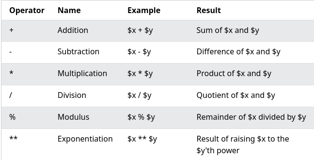
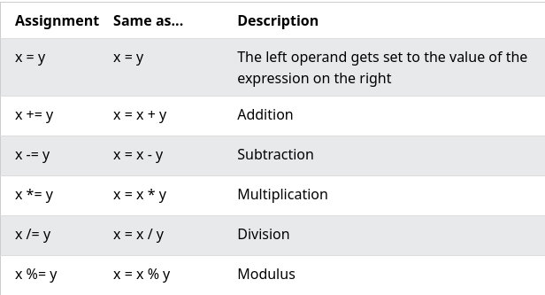
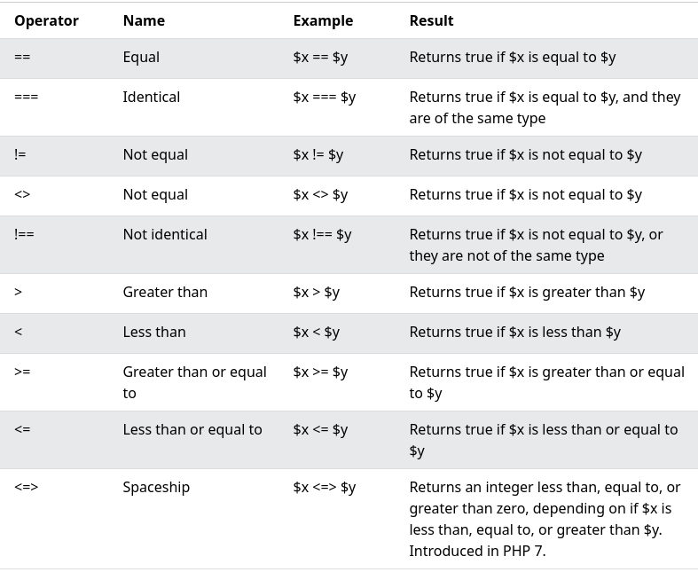
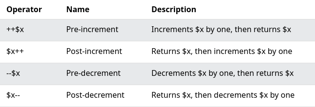
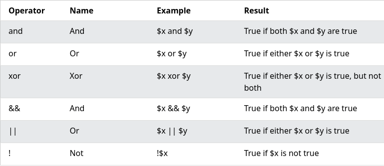
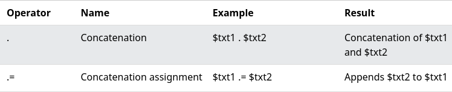
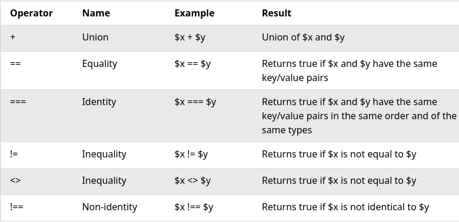
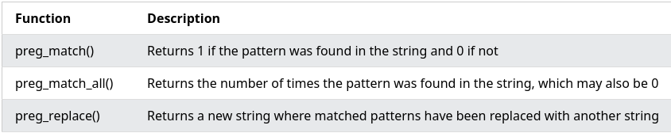

# Unit V: **Server Side Scripting Languages**

## PHP

PHP is a general-purpose scripting language geared toward web development. It
was originally created by Danish-Canadian programmer Rasmus Lerdorf in 1994. The
PHP reference implementation is now produced by The PHP Group.

### Introduction to PHP

*   PHP started out as a small open source project that evolved as more and more
    people found out how useful it was. Rasmus Lerdorf unleashed the first
    version of PHP way back in 1994.

*   PHP is a MUST for students and working professionals to become a great
    Software Engineer specially when they are working in Web Development Domain.
    I will list down some of the key advantages of learning PHP:
    *   PHP is a recursive acronym for "PHP: Hypertext Preprocessor".
    *   PHP is a server side scripting language that is embedded in HTML. It is
        used to manage dynamic content, databases, session tracking, even build
        entire e-commerce sites.
    *   It is integrated with a number of popular databases, including MySQL,
        PostgreSQL, Oracle, Sybase, Informix, and Microsoft SQL Server.
    *   PHP is pleasingly zippy in its execution, especially when compiled as an
        Apache module on the Unix side. The MySQL server, once started, executes
        even very complex queries with huge result sets in record-setting time.
    *   PHP supports a large number of major protocols such as POP3, IMAP, and
        LDAP. PHP4 added support for Java and distributed object architectures
        (COM and CORBA), making n-tier development a possibility for the first
        time.
    *   PHP is forgiving: PHP language tries to be as forgiving as possible.
    *   PHP Syntax is C-Like.

### Uses of PHP

*   PHP performs system functions, i.e. from files on a system it can create,
    open, read, write, and close them.
*   PHP can handle forms, i.e. gather data from files, save data to a file,
    through email you can send data, return data to the user.
*   You add, delete, modify elements within your database through PHP.
*   Access cookies variables and set cookies.
*   Using PHP, you can restrict users to access some pages of your website.
*   It can encrypt data.

### General syntactic characteristics

  <!-- CODE -->

*   Characteristics of PHP
    *   Simplicity
    *   Efficiency
    *   Security
    *   Flexibility
    *   Familiarity

*   Example(Hello World Program):
    ```html
    <html>
       
       <head>
          <title>Hello World</title>
       </head>
       
       <body>
          <?php echo "Hello, World!";?>
       </body>

    </html>
    ```

*   Writing the PHP code inside <?php ….?> is called Escaping to PH.

*   **Canonical PHP Tags:** The script starts with <?php and ends with ?>.
    ```php
    <?php
    # Here echo command is used to print
    echo "Hello, world!";
    ?>
    ```
    Output: `Hello, world!`

*   **SGML** or Short HTML Tags: These are the shortest option to initialize a
    PHP code.
    ```php
      <?
      # Here echo command will only work if
      # setting is done as said before
      echo "Hello, world!";
      ?>
    ```
    Output: `Hello, world!`

*   **ASP Style Tags:** To use this we need to set the configuration of the
    php.ini file. These are used by Active Server Pages to describe code blocks.
    ```php
    <%
    # Can only be written if setting is turned on
    # to allow %
    echo "hello world";
    %>
    ```
    Output: `hello world`

*   Single line comments: `#<comment>`

*   Multiline comments: `/* <comment> */`

*   PHP is case-sensitive

*   PHP is whitespace insensitive

*   In PHP, multiple statements can be executed simultaneously (under a single
    condition or loop) by using curly-braces **{}**
    ```php
    <?php
    $var = 50;
    if ($var>0){
      echo ("Positive as \n");
      echo ("greater than 0");
    }
    ?>
    ```
    Output:
    ```text
    Positive as
    greater than 0
    ```

### Primitives

*   PHP supports ten primitive types.

*   Four scalar types:
    *   bool
    *   int
    *   float (floating-point number, aka double)
    *   string

*   Four compound types:
    *   array
    *   object
    *   callable
    *   iterable

*   And finally two special types:
    *   resource
    *   NULL

### Operations and Expressions

*   Operators are used to perform operations on variables and values.

*   PHP divides the operators in the following groups:

    *   Arithmetic operators
    *   Assignment operators
    *   Comparison operators
    *   Increment/Decrement operators
    *   Logical operators
    *   String operators
    *   Array operators
    *   Conditional assignment operators

*   **Arithmetic operators:** 

*   **Assignment operators:** 

*   **Comparison operators:** 

*   **Increment/Decrement operators:** 

*   **Logical operators:** 

*   **String operators:** 

*   **Array operators:** 

*   **Conditional assignment operators:** 

*   Almost everything in a PHP script is an expression. Anything that has a value
    is an expression. In a typical assignment statement ($x=100), a literal value,
    a function or operands processed by operators is an expression, anything that
    appears to the right of assignment operator (=)

*   Syntax:
    ```php
    $x=100; //100 is an expression
    $a=$b+$c; //b+$c is an expression
    $c=add($a,$b); //add($a,$b) is an expresson
    $val=sqrt(100); //sqrt(100) is an expression
    $var=$x!=$y; //$x!=$y is an expression
    ```

### Output

*   `echo` & `print` are used to output data to the screen in PHP.

*   `echo` has no return value while `print` has a return value of 1 so it can be
    used in expressions.

*   `echo` can take multiple parameters (although such usage is rare) while
    `print` can take one argument.

*   `echo` is marginally faster than `print`

*   Example:
    ```php
    <?php
    echo "<h2>PHP is Fun!</h2>";
    echo "Hello world!<br>";
    echo "I'm about to learn PHP!<br>";
    echo "This ", "string ", "was ", "made ", "with multiple parameters.";
    print "<h2>PHP is Fun!</h2>";
    print "Hello world!<br>";
    print "I'm about to learn PHP!";
    ?>
    ```

### Control Statements

*   Control statements are conditional statements that execute a block of
    statements if the condition is correct. The statement inside the conditional
    block will not execute until the condition is satisfied.

*   **The if-else statement:**
    ```php
    if(expression1)  
    {  
      Only exceutes when the ic condition is correct.  
    }  
    elseif(expression2)  
    {  
      Executed when the if expression1  
      is false and the expression 2 is true.  
    }  
    else  
    {  
      Executed only when the both if block are false.  
    }
    ```

*   You can also use `if` alone

*   **? operator:**
    `condition expresion ? true : false;`

*   **switch statements:**
    ```php
    <?php  
      $day = date(" l ");  
      switch($day)  
      {   
       case "monday":   
           print($day);  
           break;  
      case "tuesday"  
          print($day);  
          break;  
      case "wednesday":  
         print($day);  
         break;  
      case "thursday":  
         print($day);  
         break;  
      case "friday":  
         print($day);  
         break;  
      case "saturday":  
         print($day);  
         break;  
    default:  
      print($day);  
    }?>
    ```

*   **for loop:**

    ```php
    <?php  
    for($a = 1; $a < = 5; $a++)  
    {  
      print("value of a is $a<br>\n");  
    }  
    ?>
    ```

    Output:

    ```text
    value of a is 1
    value of a is 2
    value of a is 3
    value of a is 4
    value of a is 5
    ```

*   **while loop:**
    ```php
    <?php  
     while (TRUE)  
     {  
        print("While loop is executed");  
     }  
     ?>
    ```

*   **do-while loop:**
    ```php
    <?php  
    $a=10;  
    do  
    {  
     print($a<br>\n)  
     a=a+a;  
    } while (a < 50);  
    ?>
    ```

*   **foreach statement:**
    ```php
    foreach (array as key = > value)  
    {  
      statement  
    }
    ```

### Arrays

*   An array stores multiple values in one single variable:

*   In PHP `array()` function is used to create arrays.

*   Arrays in PHP are homogenous that means they are a collection of only one
    type of data.
    ```php
    <?php
    $cars = array("Volvo", "BMW", "Toyota");
    echo "I like " . $cars[0] . ", " . $cars[1] . " and " . $cars[2] . ".";
    ?>
    ```

*   An array is a special variable, which can hold more than one value at a time.

*   If you have a list of items (a list of car names, for example), storing the
    cars in single variables could look like this:
    ```php
    $cars1 = "Volvo";
    $cars2 = "BMW";
    $cars3 = "Toyota";
    ```

*   Get length of an array using `count()`:
    ```php
    <?php
    $cars = array("Volvo", "BMW", "Toyota");
    echo count($cars);
    ?>
    ```

### Functions

*   PHP has more than 1000 built-in functions, and in addition you can create
    your own custom functions.

*   Syntax:
    ```php
    function functionName() {
      code to be executed;
    }
    ```

*   Example:
    ```php
    <?php
    function writeMsg() {
      echo "Hello world!";
    }

    writeMsg(); // call the function
    ?>
    ```

*   [More Examples](https://www.w3schools.com/php/php_functions.asp)

### Pattern Matching

*   A regular expression is a sequence of characters that forms a search pattern.
    When you search for data in a text, you can use this search pattern to
    describe what you are searching for.

*   A regular expression can be a single character, or a more complicated pattern.

*   Regular expressions can be used to perform all types of text search and text
    replace operations.

*   Syntax:

*   In PHP, regular expressions are strings composed of delimiters, a pattern and
    optional modifiers. `$exp = "/w3schools/i";`

*   In the example above, `/` is the usual delimiter, w3schools is the pattern
    that is being searched for, and i is a modifier that makes the search
    case-insensitive.

*   Regular Expression Functions in PHP:
    

### Form Handling

*   The PHP superglobals `$_GET` and `$_POST` are used to collect form-data.

*   Example Form:
    <!-- CODE -->
    ```php
    <html>
    <body>

    <form action="welcome.php" method="post">
    Name: <input type="text" name="name"><br>
    E-mail: <input type="text" name="email"><br>
    <input type="submit">
    </form>

    </body>
    </html>
    ```

*   [More Examples](https://www.w3schools.com/php/php_forms.asp)

### Files

*   PHP has several functions for creating, reading, uploading, and editing
    files.

*   PHP `readfile()` Function

*   The `readfile()` function reads a file and writes it to the output buffer.

*   The following code reads from a file and writes it's contents to the output
    buffer.
    <!-- CODE -->
    ```php
    <?php
    echo readfile("webdictionary.txt");
    ?>
    ```

### Cookies

*   A cookie is often used to identify a user. A cookie is a small file that the
    server embeds on the user's computer. Each time the same computer requests a
    page with a browser, it will send the cookie too. With PHP, you can both
    create and retrieve cookie values.

*   A cookie is created with the `setcookie()` function.

*   Syntax:

    `setcookie(name, value, expire, path, domain, secure, httponly);`

    Only the name parameter is required. All other parameters are optional.

*   In PHP we use:
    *   `isset()` function to check if the cookie is set.
    *   `setcookie()` to create of modify a cookie.
    *   `setcookie()` to delete a cookie with an old expiration date.

*   [More Details](https://www.w3schools.com/php/php_cookies.asp)

### Session tracking

*   A session is a way to store information (in variables) to be used across
    multiple pages.

*   Unlike a cookie, the information is not stored on the users computer.

*   When you work with an application, you open it, do some changes, and then you
    close it. This is much like a Session. The computer knows who you are. It
    knows when you start the application and when you end. But on the internet
    there is one problem: the web server does not know who you are or what you do,
    because the HTTP address doesn't maintain state.

*   Session variables solve this problem by storing user information to be used
    across multiple pages (e.g. username, favorite color, etc). By default,
    session variables last until the user closes the browser.

*   Session variables hold information about one single user, and are available to
    all pages in one application.

*   In PHP a session is started with the `session_start()` function.

*   Session variables are set with the PHP global variable: `$_SESSION`

*   [More Details](https://www.w3schools.com/php/php_sessions.asp)

### Using MySQL with PHP

*   PHP combined with MySQL are cross-platform (you can develop in Windows and
    serve on a Unix platform)

*   PHP 5 and later can work with a MySQL database using:
    *   **MySQLi** extension (the "i" stands for improved)
    *   **PDO** (PHP Data Objects)

*   [More about MySQLi and PDO](https://www.w3schools.com/php/php_mysql_connect.asp)

### WAP and WML

*   "Wireless Application Protocol (**WAP**) is a result of continuous work to
    define an industry wide standard for developing applications over wireless
    communication networks.

*   **WML** (Wireless Markup Language) is a markup language based on XML, and is
    intended for use in specifying content and user interface for narrowband
    devices, including cellular phones and pagers.

*   **WML** is designed with the constraints of small narrowband devices in mind.
    These constraints include:
    1.  Small display and limited user input facilities
    2.  Narrowband network connection
    3.  Limited memory and computational resources.

*   **WML** includes four major functional areas:
    1.  Text presentation and layout - **WML** includes text and image support,
        including a variety of formatting and layout commands
    2.  Deck/card organisational metaphor - all information in **WML** is
        organised into a collection of cards and decks
    3.  Inter-card navigation and linking - **WML** includes support for
        explicitly managing the navigation between cards and decks
    4.  String parameterization and state management - all **WML** decks can be
        parameterised, using a state model."

*   The topmost layer in the **WAP** (Wireless Application Protocol)
    architecture is made up of WAE (Wireless Application Environment), which
    consists of WML and WML scripting language.
    *   WML stands for Wireless Markup Language
    *   WML is an application of XML, which is defined in a document-type
        definition.
    *   WML is based on HDML and is modified so that it can be compared with
        HTML.
    *   WML takes care of the small screen and the low bandwidth of
        transmission.
    *   WML is the markup language defined in the **WAP** specification.
    *   **WAP** sites are written in WML, while web sites are written in HTML.
    *   WML is very similar to HTML. Both of them use tags and are written in
        plain text format.
    *   WML files have the extension ".wml". The MIME type of WML is
        "text/vnd.wap.wml".
    *   WML supports client-side scripting. The scripting language supported is
        called WMLScript.

## Introduction to ASP.NET

*   ASP.NET is a web development platform, which provides a programming model, a
    comprehensive software infrastructure and various services required to build
    up robust web applications for PC, as well as mobile devices.

*   ASP.NET works on top of the HTTP protocol, and uses the HTTP commands and
    policies to set a browser-to-server bilateral communication and cooperation.

*   ASP.NET is a part of Microsoft .Net platform. ASP.NET applications are
    compiled codes, written using the extensible and reusable components or
    objects present in .Net framework. These codes can use the entire hierarchy of
    classes in .Net framework.

*   The ASP.NET application codes can be written in any of the following
    languages:
    *   C#
    *   Visual Basic.Net
    *   Jscript
    *   J#

*   [More
    Details](https://www.tutorialspoint.com/asp.net/asp.net_introduction.htm)

### Overview of the .NET Framework

*   .NET is a developer platform made up of tools, programming languages, and
    libraries for building many different types of applications.

*   There are various implementations of .NET. Each implementation allows .NET
    code to execute in different places—Linux, macOS, Windows, iOS, Android, and
    many more.

    1.  .NET Framework is the original implementation of .NET. It supports
        running websites, services, desktop apps, and more on Windows. 1.NET is a
        cross-platform implementation for running websites, services, and console
        apps on Windows, Linux, and macOS. .NET is open source on GitHub. .NET was
        previously called .NET Core.
    2.  Xamarin/Mono is a .NET implementation for running apps on all the major
        mobile operating systems, including iOS and Android.

*   .NET Standard is a formal specification of the APIs that are common across
    .NET implementations. This allows the same code and libraries to run on
    different implementations.

### Overview of C\#

*   **C#** is a modern, general-purpose, object-oriented programming language
    developed by Microsoft and approved by European Computer Manufacturers
    Association (ECMA) and International Standards Organization (ISO).

*   **C#** was developed by Anders Hejlsberg and his team during the development of
    .Net Framework.

*   **C#** is designed for Common Language Infrastructure (CLI), which consists of the
    executable code and runtime environment that allows use of various high-level
    languages on different computer platforms and architectures.

*   The following reasons make C# a widely used professional language −
    *   It is a modern, general-purpose programming language
    *   It is object oriented.
    *   It is component oriented.
    *   It is easy to learn.
    *   It is a structured language.
    *   It produces efficient programs.
    *   It can be compiled on a variety of computer platforms.
    *   It is a part of .Net Framework.

*   [More Details](https://www.tutorialspoint.com/csharp/csharp_overview.htm)

### ASP.NET Controls

*   The ASP.NET page framework includes a number of built-in server controls that
    are designed to provide a more structured programming model for the Web. These
    controls provide the following features:
    *   Automatic state management.
    *   Simple access to object values without having to use the Request object.
    *   Ability to react to events in server-side code to create applications that
        are better structured.
    *   Common approach to building user interfaces for web pages.
    *   Output is automatically customized based on the capabilities of the
        browser.

*   In addition to the built-in controls, the ASP.NET page framework also provides
    the ability to create user controls and custom controls. User controls and
    custom controls can enhance and extend existing controls to build a much
    richer user interface.

*   [More Details](https://docs.microsoft.com/en-us/troubleshoot/developer/webapps/aspnet/development/server-controls)

### Web Services

*   A web service is a web-based functionality accessed using the protocols of the
    web to be used by the web applications. There are three aspects of web service
    development:
    *   Creating the web service
    *   Creating a proxy
    *   Consuming the web service

*   [More Details](https://www.tutorialspoint.com/asp.net/asp.net_web_services.htm)

## Overview of Node JS

*   Node.js is an open-source and cross-platform JavaScript runtime environment.
    It is a popular tool for almost any kind of project!

*   Node.js runs the V8 JavaScript engine, the core of Google Chrome, outside of
    the browser. This allows Node.js to be very performant.

*   A Node.js app runs in a single process, without creating a new thread for
    every request. Node.js provides a set of asynchronous I/O primitives in its
    standard library that prevent JavaScript code from blocking and generally,
    libraries in Node.js are written using non-blocking paradigms, making
    blocking behavior the exception rather than the norm.

*   When Node.js performs an I/O operation, like reading from the network,
    accessing a database or the filesystem, instead of blocking the thread and
    wasting CPU cycles waiting, Node.js will resume the operations when the
    response comes back.

*   [More Details](https://nodejs.dev/learn)
