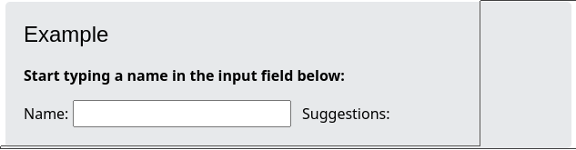
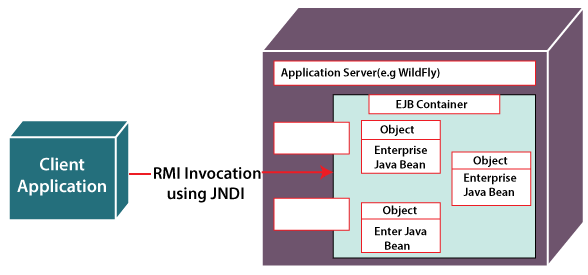
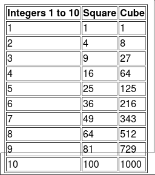

# Questions

**Questions from SKN's recent(May 2022) prelim examinations**

**1. Write benefits of using PHP and mysql. Explain PHP module to insert a
record in MySQL database.**

*   Major Advantages of PHP and MySQL Development:

    *   Cost-effective personalized PHP applications solutions;

    *   A complete open-source platform;

    *   Frequently updated (these updates are also available for free);

    *   Availability of various add-ons and plugins;

    *   Superior website performance;

    *   Vast amount of database interfaces;

    *   PHP checks various levels of security;

    *   Integration facility with various other open-source platforms;

    *   Integrates other software languages such as C, C++, JAVA/AJAX, etc;

    *   Supports Joomla, Drupal and WordPress CMS, and osCommerce and Zen Cart
        shopping carts;

    *   HTML Code can be embedded within PHP Code;

    *   Cross-platform ability;

    *   Server-side web programming language;

    *   Large user community.

    *   PHP uses **mysqli\_query** function to insert records in table. This
        function takes three parameters and returns TRUE on success or FALSE on
        failure.

    *   The mysqli\_query() function accepts a string value representing a query
        as one of the parameters and, executes/performs the given query on the
        database.

    *   Syntax:

    <!---->

        mysqli_query($con, query)

**2. What is the use of the XmlHttpRequest object? Explain its use with the help
of simple javascript code.**

*   XMLHttpRequest (XHR) objects are used to interact with servers. You can
    retrieve data from a URL without having to do a full page refresh. This
    enables a Web page to update just part of a page without disrupting what the
    user is doing. XMLHttpRequest is used heavily in AJAX programming.

*   XMLHttpRequest Example: When you type a character in the input field below,
    an XMLHttpRequest is sent to the server, and some name suggestions are
    returned (from the server):

    

*   Code:

    ```js
        // Create an xhr object
      var xhttp = new XMLHttpRequest();
        // specify the function to execute when xhr object's status changes
      xhttp.onreadystatechange = function() {
        // When readyState is 4 and status is 200 then response is ready
          if (this.readyState == 4 && this.status == 200) {
        // The responseText property returns the server response as a text string
             document.getElementById("demo").innerHTML = xhttp.responseText;
          }
      };
      xhttp.open("GET", "filename", true);
      xhttp.send();
    ```

<!-- CODE -->

**3. Draw and explain how AJAX works with the help of suitable examples.**

*   AJAX = Asynchronous JavaScript and XML.
*   AJAX is a technique for creating fast and dynamic web pages.
*   AJAX allows web pages to be updated asynchronously by exchanging small
    amounts of data with the server behind the scenes. This means that it is
    possible to update parts of a web page, without reloading the whole page.
*   How AJAX works:

    
*   Example:
    *   AJAX was made popular in 2005 by Google, with Google Suggest.
    *   Google Suggest is using AJAX to create a very dynamic web interface:
        When you start typing in Google's search box, a JavaScript sends the
        letters off to a server and the server returns a list of suggestions.

**4. Write a program of your choice that demonstrates use of properties of DOM.
Also list the limitations of using XML.**

<!-- TODO -->

*   **NEEDS REFACTORING**

*   Extensible Markup Language (**XML**) is a markup language and file format for
    storing, transmitting, and reconstructing arbitrary data. It defines a set
    of rules for encoding documents in a format that is both human-readable and
    machine-readable.

*   Limitations of **XML**:
    1.  XML syntax is verbose and redundant compared to other text-based data
        transmission formats such as JSON.
    2.  The redundancy in syntax of XML causes higher storage and transportation
        cost when the volume of data is large.
    3.  XML document is less readable compared to other text-based data
        transmission formats such as JSON.
    4.  XML doesn’t support array.
    5.  XML file sizes are usually very large due to its verbose nature, it is
        totally dependant on who is writing it.

**5. How to use interceptors in strut 2? List and describe important
interceptors provided by strut 2 framework.**

*   **Interceptor** is an object that is invoked at the preprocessing and
    postprocessing of a request. In Struts 2, interceptor is used to perform
    operations such as validation, exception handling, internationalization,
    displaying intermediate result etc.

*   [Find "How to Use Interceptors?" section on this
    page](https://www.tutorialspoint.com/struts_2/struts_interceptors.htm#how-to-use-interceptors)

**6. What are the web services? List and explain types and components of web
services.**

*   A Web service is a method of communication between two electronic devices over
    a network. It is a software function provided at a network address over the
    Web with the service always-on as in the concept of utility computing. Many
    organizations use multiple software systems for management.

*   Components(Types) of Web Services

    *   **SOAP (Simple Object Access Protocol):** SOAP stands for “Simple Object
        Access Protocol.” It is a transport-independent messaging protocol. SOAP
        is built on sending XML data in the form of SOAP Messages.

    *   **UDDI (Universal Description, Discovery, and Integration):** UDDI is a
        standard for specifying, publishing and discovering a service provider’s
        online services.

    *   **WSDL (Web Services Description Language):** If a web service can’t be
        found, it can’t be used. The client invoking the web service should be
        aware of the location of the web service.

    *   **REST(Representational State Transfer):**
        Is an architectural style, meaning each unique URL represents an individual
        object of some sort. A REST web service uses HTTP and supports/repurposes
        several HTTP methods: GET, POST, PUT or DELETE. It also offers simple
        CRUD-oriented services. Fun fact: The original RESTful architecture was
        designed by one of the leading authors of HTTP, Roy Fielding.

*   [More Details](https://www.cleo.com/blog/knowledge-base-web-services)

**7. What different configuration files are required to develop any struts
application?**

*   Configuration files like **web.xml, struts.xml, strutsconfig.xml** and
    **struts.properties** required to develop any struts application:
    *   The **web.xml** configuration file is a J2EE configuration file that
        determines how elements of the HTTP request are processed by the servlet
        container.
    *   The **struts.xml** file contains the configuration information that you
        will be modifying as actions are developed.
    *   The **struts-config.xml** configuration file is a link between the View
        and Model components in the Web Client but you would not have to touch
        these settings for 99.99% of your projects.
    *   The **struts.properties** configuration file provides a mechanism to
        change the default behavior of the framework.

*   [More Details](https://www.tutorialspoint.com/struts_2/struts_configuration.htm)

**8. What are enterprise java beans? Draw and explain main components of EJB
architecture.**

*   EJB is a server-side software component that encapsulates business logic of an
    application. An EJB web container provides a runtime environment for web
    related software components, including computer security, Java servlet
    lifecycle management, transaction processing, and other web services.

    

*   [Read about EJB components here](https://www.javatpoint.com/ejb-architecture-java)

**9. Explain what is Angular Expression? Explain what is the key difference
between angular expressions and JavaScript expressions?**

*   AngularJS Expressions:
    *   AngularJS expressions can be written inside double braces: {{ expression
        }}.
    *   AngularJS expressions can also be written inside a directive:
        ng-bind="expression".
    *   AngularJS will resolve the expression, and return the result exactly where
        the expression is written.
    *   Example {{ 5 + 5 }} or {{ firstName + " " + lastName }}

*   Key difference: Like JavaScript expressions, AngularJS expressions can contain
    literals, operators, and variables. Unlike JavaScript expressions, AngularJS
    expressions can be written inside HTML. AngularJS expressions do not support
    conditionals, loops, and exceptions, while JavaScript expressions do.

**10. Write a PHP script to display the squares and Cubes of 1 to 10 numbers.**

<!-- CODE -->

*   Code:
    ```html
    <!doctype html>
    <html>
       <head>
         <title>Square and Cube of Integers 1-10</title>
       </head>
       <body>
         <table border=1>
           <tr>
            <th>Integers 1 to 10</th>
            <th>Square</th>
            <th>Cube</th>
          </tr>
          <?php
          //Square and Cube
           for ($i = 1; $i <= 10; $i++) {
             $a = $i*$i;
             $b = $i*$i*$i;
             echo "<tr>";
             echo "<td>" . $i . "</td>";
             echo "<td>" . $a . "</td>";
             echo "<td>" . $b ."</td>";
             echo "</tr>";
          }
          ?>
      </table>
    </body>
    </html>
    ```

*   Output:

    

**11. What is an association array in PHP? Explain it with the help of simple
PHP code.**

<!-- CODE -->

*   Associative arrays are used to store key value pairs.

*   There are two ways to create an associative array:
    *   One liner:
    ```php
    $age = array("Peter"=>"35", "Ben"=>"37", "Joe"=>"43");
    ```
    *   Multiple lines:
    ```php
    $age['Peter'] = "35";
    $age['Ben'] = "37";
    $age['Joe'] = "43";
    ```

*   Example:
    ```html
    <!DOCTYPE html>
    <html>
    <body>

    <?php
    $age = array("Peter"=>"35", "Ben"=>"37", "Joe"=>"43");
    echo "Peter is " . $age['Peter'] . " years old.";
    ?>

    </body>
    </html>
    ```

*   Output:

    ```text
    Peter is 35 years old.
    ```

**12. Explain various directives in AngularJS & Create simple angular JS
application to display, "Hello, Input Name" using proper directive.**

*   AngularJS Directives

*   AngularJS directives are extended HTML attributes with the prefix ng-.
    *   The ng-app directive initializes an AngularJS application.
    *   The ng-init directive initializes application data.
    *   The ng-model directive binds the value of HTML controls (input, select,
        textarea) to application data.

*   Code:
    ```html
    <!DOCTYPE html>
    <html>
    <script src="https://ajax.googleapis.com/ajax/libs/angularjs/1.6.9/angular.min.js"></script>
    <body>

    <div ng-app="" ng-init="firstName='John'">

    <p>Input something in the input box:</p>
    <p>Name: <input type="text" ng-model="firstName"></p>
    <p>Hello, {{ firstName }}</p>

    </div>

    </body>
    </html>
    ```

*   Input:

    **Input something in the input box:**

    **Name: `John`**

*   Output:

    ```md
    Hello, John
    ```

**13. What is EJB? Explain types of EJB? Also explain uses of Ruby.**

*   Refer question 8 for **EJB**

*   The 3 Types of Enterprise Java Beans are:
    1.  **Session Bean:** Session bean contains business logic that can be invoked
        by local, remote or webservice client. There are two types of session beans:
        1.  Stateful Session bean : Stateful session bean performs business task
            with the help of a state.
        2.  Stateless Session bean : Stateless session bean implement business
            logic without having a persistent storage mechanism, such as a state or
            database and can used shared data.
    2.  **Message Driven Bean:** Like Session Bean, it contains the business logic
        but it is invoked by passing message.
    3.  **Entity Bean:** It summarizes the state that can be remained in the
        database. It is deprecated. Now, it is replaced with JPA (Java Persistent
        API). There are two types of entity bean:
        1.  Bean Managed Persistence : In a bean managed persistence type of
            entity bean, the programmer has to write the code for database calls. It
            persists across multiple sessions and multiple clients.
        2.  Container Managed Persistence : Container managed persistence are
            enterprise bean that persists across database. In container managed
            persistence the container take care of database calls.

*   **Ruby** is an open-source programming language. It is also referred to as
    scripting language that is dynamic, interpreted and object-oriented as well.

*   Uses of **Ruby**:

    *   **Web development:** Web development is one of Ruby's claims to fame
        because of the popular web development framework Ruby on Rails.

    *   **Static site generation:** Most websites use server-side code that
        generates HTML and serves it to your browser when you visit a page.

    *   **DevOps and automation:** Vagrant, written in Ruby, is a tool for
        managing virtual machines from command line. It allows developers to
        code and run projects developed for a specific operating system run on
        any operating system.

    *   **Web servers:** You can also use Ruby to build web servers. Passenger,
        Unicorn, and Puma are web servers written in Ruby.

    *   **Data processing:** Ruby's built-in map, reduce, and select functions
        are powerful tools used to solve many data processing problems.

    *   **Web scraping and crawling:** Ruby has a wide variety of packages like
        vessel & nokogiri that make extracting data from web pages a breeze.

**14. Draw and explain the role of EJB container in enterprise application.**

[Read here](https://www.javatpoint.com/ejb-container)

**15. Explain how Rails implements AJAX? Mention what are the positive aspects
of Rails.**

*   **How Rails Implements Ajax:** Rails has a simple, consistent model for how
    it implements Ajax operations. Once the browser has rendered and displayed
    the initial web page, different user actions cause it to display a new web
    page (like any traditional web application) or trigger an Ajax operation −
    *   **Some trigger fires:** This trigger could be the user clicking on a
        button or link, the user making changes to the data on a form or in a
        field, or just a periodic trigger (based on a timer).
    *   **The web client calls the server:** A JavaScript method,
        XMLHttpRequest, sends data associated with the trigger to an action
        handler on the server. The data might be the ID of a checkbox, the text
        in an entry field, or a whole form.
    *   **The server does processing:** The server-side action handler ( Rails
        controller action )-- does something with the data and returns an HTML
        fragment to the web client.
    *   **The client receives the response:** The client-side JavaScript, which
        Rails creates automatically, receives the HTML fragment and uses it to
        update a specified part of the current page's HTML, often the content of
        a <div> tag.

*   Pros of **Rails:**
    1.  Time efficiency
    2.  A great number of helpful tools and libraries
    3.  Huge and active community
    4.  Strong adherence to standards

*   [More about pros of Ruby](https://sloboda-studio.com/blog/pros-and-cons-of-ruby-on-rails/)

**16. Explain how you define instance variable, global variable and class
variable in Ruby? Explain what is rake in Rails.**

<!-- TABLE -->

| SYMBOL       | Type of Variable    |
| ------------ | ------------------- |
| \[a-z] or \_ | Local Variable      |
| @            | Instance Variable   |
| @@           | Class Variable      |
| $            | Global Variable     |

```ruby
# Local Variables     
age = 10
# Instance Variables     
 @cust_id = id
# class variable
 @@no_of_customers = 0
# global variable
$global_variable = 10
```

**Rake** is Ruby Make, a standalone Ruby utility that replaces the Unix utility 'make', and uses a 'Rakefile' and .rake files to build up a list of tasks. In Rails, Rake is used for common administration tasks, especially sophisticated ones that build off of each other.

[More about Rake](https://www.bigbinary.com/learn-rubyonrails-book/setting-up-rake-tasks)
